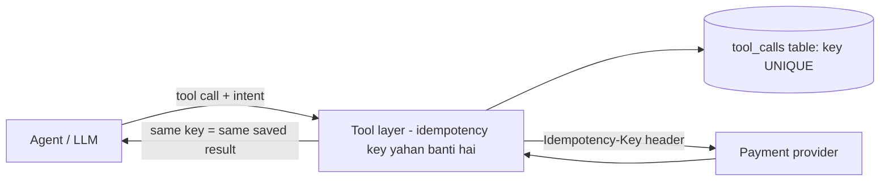

# 1. Agent Ne Payment API 3 Baar Call Kar Di - Tool Layer Mein Idempotency Kaise Daalein?

**Ek line mein:** agent ka retry rokna possible nahi hai, isliye **tool call ko dobara chalana safe** banao - har call ki ek stable identity ho, aur wahi identity provider tak jaaye.

## Retry hota kyun hai

Ek AI agent normal client se zyada retry karta hai:

- **Timeout**: provider ne 30s liya, agent ne 10s par haar maan li aur dobara call kar di. Pehli call shayad **safal** ho chuki thi.
- **Model loop**: response parse nahi hua, ya tool ne error-jaisa text bheja, to LLM ne "ek baar aur try karta hoon" decide kar liya.
- **Framework retry**: LangChain/orchestrator layer apne aap 2-3 attempts karti hai.
- **Multi-agent**: do agents ne ek hi kaam apne-apne hisaab se kar diya.

Matlab: **at-least-once** yahan bhi wahi reality hai jo queues mein hoti hai ([[19-idempotent-consumer-duplicate-events]]).

## Design: identity model ke haath mein mat do



**Galat:** LLM se idempotency key maangna. Model har retry par nayi UUID bana dega (ya bhool jaayega), aur duplicate ruk hi nahi payega.

**Sahi:** key **business intent** se derive karo, jo retry par same rahe:

```javascript
const crypto = require('node:crypto');
// intent = wahi cheez jo do baar nahi honi chahiye
const idemKey = crypto.createHash('sha256')
  .update([runId, invoiceId, amountCents, currency].join('|'))
  .digest('hex');
```

`runId` = agent ke ek task/run ka id (har retry mein same, naya task par naya). Isse "same invoice, same run" ek hi payment banega, par agle mahine ka payment alag key.

## Teen layer, teeno zaroori

**1. Tool layer mein claim karo (database decide kare, code nahi)**

```javascript
async function payInvoice({ runId, invoiceId, amountCents, currency }) {
  const key = makeKey(runId, invoiceId, amountCents, currency);

  // pehla attempt hi row banayega; baaki sab conflict par pehle wala result padhenge
  const { rows } = await db.query(
    `INSERT INTO tool_calls (idem_key, tool, status, request)
     VALUES ($1, 'pay_invoice', 'in_progress', $2)
     ON CONFLICT (idem_key) DO NOTHING
     RETURNING id`, [key, JSON.stringify({ invoiceId, amountCents })]);

  if (rows.length === 0) {                       // matlab: yeh call pehle ho chuki hai
    const prev = await db.query('SELECT status, response FROM tool_calls WHERE idem_key = $1', [key]);
    if (prev.rows[0].status === 'in_progress')
      return { status: 'pending', message: 'Yeh payment already process ho rahi hai, dobara mat bhejo.' };
    return prev.rows[0].response;                // same result, dobara charge nahi
  }

  // 2. provider ko bhi wahi key do - double safety
  const res = await stripe.paymentIntents.create(
    { amount: amountCents, currency, ... },
    { idempotencyKey: key });

  await db.query('UPDATE tool_calls SET status = $1, response = $2 WHERE idem_key = $3',
    ['done', JSON.stringify(res), key]);
  return res;
}
```

`ON CONFLICT DO NOTHING` + `UNIQUE(idem_key)` = race-free. Do parallel agent calls bhi aayein to ek hi jeetega ([[26-duplicate-email-race-condition]]).

**2. Provider ka idempotency use karo** (Stripe `Idempotency-Key`, Razorpay ka equivalent). Agar aapka DB write ke baad crash ho jaaye, tab bhi provider duplicate charge nahi karega ([[32-payment-idempotency-double-click]]).

**3. Agent ko saaf jawab do.** Tool ka response aisa ho jisse model dobara try na kare:

```json
{ "status": "already_done", "paymentId": "pi_123", "message": "Invoice INV-9 already paid. Do not retry." }
```

Error message mein "timeout, try again" likhoge to model wahi karega.

## Aur bhi cheezein jo tool layer mein honi chahiye

| Cheez | Kyun |
|---|---|
| Har tool par `runId` aur `stepId` | Tracing + idempotency key dono ke liye |
| Read vs write tools alag | Read safe hai, write ke liye hi claim-row banao |
| Timeout > provider ka p99 | Warna aap khud duplicate banwate ho ([[14-cascading-failure-recovery]]) |
| Amount/recipient limits | Model galat number nikaale to blast radius chhota rahe |
| Human approval for large amounts | High-risk action par confirmation |
| Audit log (request + response) | Baad mein sawaal aayega "ye payment kisne ki?" |

## 🧠 Remember

> Agent retry ko roka nahi jaa sakta, isliye tool call ko **dobara chalane layak** banao: key business intent se banao (model se nahi), database ke unique constraint se claim karo, wahi key provider ko bhejo, aur response mein saaf likho ki kaam ho chuka hai.

## Quick Self-Test

1. LLM se idempotency key generate karwana kyun galat hai?
2. Tool layer ne DB mein row bana di aur provider call ke baad crash ho gaya - duplicate charge kaise ruka?
3. Tool ka error message model ke retry behaviour ko kaise badal deta hai?

**Aage padho:** [[19-idempotent-consumer-duplicate-events]] [[32-payment-idempotency-double-click]] [[65-pagerduty-incident-dedup-paging]]
