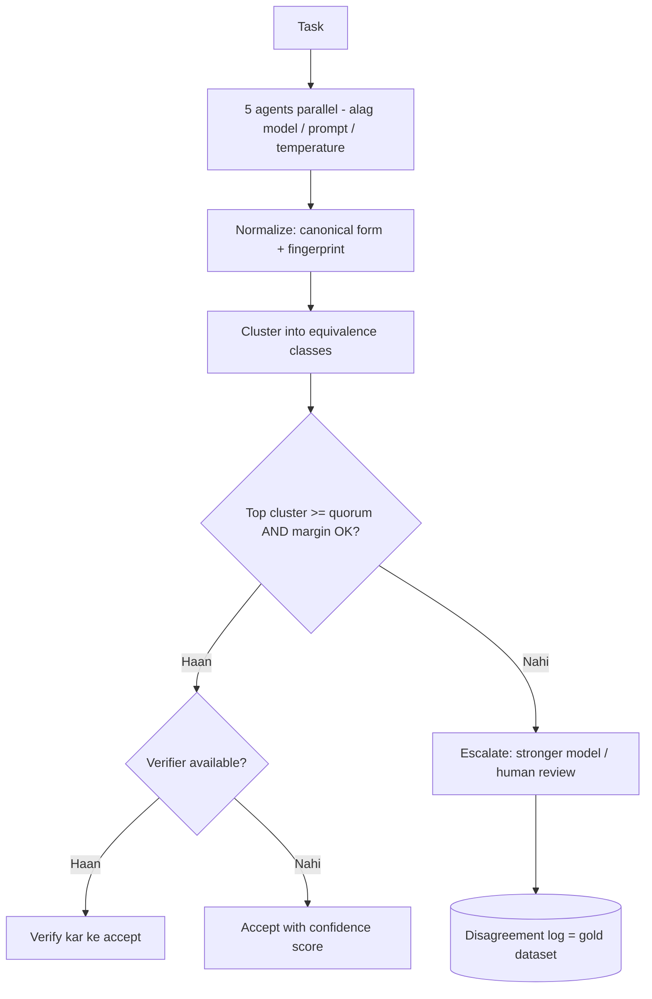

# 2. Paanch Agents Ne Wahi Task Kiya - Kaise Decide Karein Ki Unke Jawab "Agree" Karte Hain?

**Ek line mein:** "agree" ek **comparison problem** hai, voting problem nahi - pehle output ka type dekho, use **canonical form** mein laao, phir **equivalence classes** banao, aur uske baad quorum + margin se decide karo. Aur sabse zaroori: **agreement ka matlab correctness nahi hota.**

## Interviewer asli mein kya test kar raha hai

Ghalat (aur sabse common) jawab: *"Majority vote le lunga - jo 3 agents ne bola wahi sahi."*

Do sawaal turant uthte hain, aur yahi poora interview hai:

1. **"Same" kaise define kiya?** LLM ka output text hai. Do agents ne likha `"Refund of Rs 1,499 approved"` aur `"Approved refund: INR 1499.00"` - ye same hai ya alag? String compare bologe to har baar 5/5 disagreement milega.
2. **5 agents same model, same prompt** hain? To unki galtiyan **correlated** hongi - paanchon confidently ek hi galat jawab de sakte hain.

## Step 0 - Output ka type decide karta hai comparison

Ek hi "agreement" function sab jagah kaam nahi karta:

| Output | Kaise compare karein |
|---|---|
| Number / enum / boolean | Normalize karke exact match (number par tolerance, e.g. `abs(a-b) <= 0.01`) |
| Structured JSON | Field-wise compare; sirf **decision fields** dekho, `reasoning` text ignore karo |
| List / set (e.g. extracted entities) | Set comparison ya Jaccard similarity, order ignore |
| Free text answer | Semantic: embedding cosine, ya NLI **entailment** (A se B nikalta hai kya), ya LLM-as-judge pairwise |
| Code | Text mat compare karo - **chalao**. Same test inputs par same output = agree (differential testing) |
| Plan / tool calls | Wording nahi, **side-effect sequence** compare karo: kaunse tool, kis argument ke saath |

Interview line: *"Pehle main output ka schema fix karta hoon, taaki agreement measurable ho. Free-form paragraph mangwa ke usme agreement dhoondhna sabse mushkil raasta hai."*

## Step 1 - Normalize, phir compare

Structured output ke liye ek **canonical form** banao aur uska hash lo - phir grouping O(n) ho jaati hai ([[92-encoding-encryption-hashing]] wala hashing ka same idea).

```javascript
const crypto = require('node:crypto');

// sirf wahi fields jinke same hone se hum "agree" maante hain
const DECISION_FIELDS = ['action', 'amountCents', 'currency', 'accountId'];

function canonical(result) {
  const o = {};
  for (const k of DECISION_FIELDS.slice().sort()) {
    let v = result[k];
    if (typeof v === 'string') v = v.trim().toLowerCase();
    if (typeof v === 'number') v = Math.round(v);          // float noise hata do
    if (Array.isArray(v)) v = [...new Set(v.map(String))].sort();  // order ignore
    o[k] = v ?? null;
  }
  return JSON.stringify(o);
}

const fingerprint = (r) => crypto.createHash('sha1').update(canonical(r)).digest('hex');
```

Dhyan do: `reasoning` / `explanation` field comparison se **bahar** hai. Warna do agents jo same decision par pahunche hain, sirf alag shabdon ki wajah se "disagree" dikhenge.

## Step 2 - Voting nahi, clustering

Majority vote maan leta hai ki jawab exactly match hote hain. Reality mein aap **equivalence classes** banate ho - ek `equivalent(a, b)` predicate ke saath, jo exact match bhi ho sakta hai aur fuzzy (cosine > 0.9) bhi.

```javascript
// results: [{agent, value}, ...]  |  equivalent: (a, b) => boolean
function cluster(results, equivalent) {
  const groups = [];
  for (const r of results) {
    const g = groups.find((g) => equivalent(g.rep.value, r.value));
    if (g) g.members.push(r);
    else groups.push({ rep: r, members: [r] });
  }
  return groups.sort((a, b) => b.members.length - a.members.length);
}

function decide(results, equivalent, { quorum = 3, margin = 2 } = {}) {
  const groups = cluster(results, equivalent);
  const top = groups[0], second = groups[1];
  const agreementRate = top.members.length / results.length;

  if (top.members.length >= quorum &&
      top.members.length - (second?.members.length || 0) >= margin) {
    return { status: 'agreed', value: top.rep.value, agreementRate, groups };
  }
  // tie ya weak majority = system ka "I don't know" - escalate karo
  return { status: 'escalate', agreementRate, groups };
}
```

Do cheezein isme jaan-boojh kar hain:

- **`quorum`** - kam se kam kitne agents chahiye (5 mein se 3).
- **`margin`** - top aur second ke beech ka gap. `3 vs 2` almost tie hai; `4 vs 1` confident hai. Sirf "majority" dekhoge to 3-2 split bhi "agreed" lagega, jo aksar sabse khatarnak case hota hai.

## Step 3 - Flow



## Step 4 - Agreement != Correctness (poore jawab ka core)

Agar paanch agents **same model, same prompt, same context** par chale hain, to woh paanch independent opinions **nahi** hain - woh ek hi opinion ki paanch copies hain. Unki galtiyan correlated hoti hain, isliye 5/5 agreement ek **hallucination** par bhi mil sakta hai, bilkul confidently.

Isliye:

| Independence kaise badhaye | Kyun |
|---|---|
| Alag **models** (do vendors) | Training-data-level bias alag hoga |
| Alag **prompt / decomposition** | Ek hi reasoning trap mein sab nahi girenge |
| Temperature > 0 (self-consistency) | Sasta, par sabse kamzor diversity - bas sampling noise |
| Alag **tools / data source** | Ek stale cache par sab depend na karein ([[60-cache-says-100-db-says-20]]) |

Aur measurement mein honest raho: **chance agreement** ko ghatao. Agar answer space mein sirf 2 options hain, to 5 random agents ka 4/5 milna itna impressive nahi hai. Multi-rater agreement ke liye classical metric **Fleiss' kappa / Krippendorff's alpha** hai - kappa ~0 matlab agreement sirf luck se hai.

> Sahi framing: agreement ek **confidence signal** hai, truth ka proof nahi. Disagreement zyada useful hai - woh reliably batata hai ki "yahan insaan dekh le."

## Step 5 - Jahan verify kar sakte ho, wahan vote mat karo

Verification generation se sasti hoti hai. Agar checker exist karta hai to 5 agents ka vote lena waste hai:

| Task | Voting ke bajaye |
|---|---|
| Code likhna | Teeno versions par **same test suite** chalao - pass/fail hi jawab hai |
| SQL query | Sample data par chalao, result sets compare karo |
| Calculation | Deterministic code se recompute karo |
| Document se extraction | Source mein **citation/offset** maango, string wahan maujood hai ya nahi verify karo |
| API/DB action | Action lene ke baad state padh kar confirm karo ([[19-idempotent-consumer-duplicate-events]]) |

Interview mein ye line bahut strong hai: *"Main pehle poochhta hoon - is output ko verify karne ka koi sasta deterministic tareeka hai? Agar haan, to 1 agent + verifier, 5 agents + vote se behtar aur sasta hai. Voting wahan use karta hoon jahan ground truth check possible hi nahi."*

## Production reality

- **Cost aur latency 5x/1x**: parallel chalao to latency = sabse slow agent. Har agent par timeout rakho aur 4 jawaab aa gaye to aage badh jao - ek hanging agent poora request na rok de ([[14-cascading-failure-recovery]]).
- **Determinism for audit**: tie-break random mat rakho. Fixed order (model priority) ya seeded choice, aur decision ko log karo: paanchon raw outputs + clusters + chuna hua jawab. Baad mein "ye decision kyun liya" ka jawab dena padega.
- **Selective fan-out**: har request par 5 agents mat chalao. Sirf high-stakes (paisa, delete, external message) par. Low-stakes par 1 agent + validation kaafi hai ([[76-blog-when-not-to-use-ai-agents]]).
- **Monitor agreement rate**: agar ye time ke saath girta hai, to model version ya data drift ho gaya hai - ek bahut sasta early-warning signal.
- **Disagreement queue**: jin cases mein agents lade, unhe label karwao. Wahi aapka best eval dataset banta hai ([[114-blog-what-engineers-should-do-when-ai-writes-code-hinglish]]).
- **Deduplication**: agar do agents ne same side-effect wala tool call kiya, to tool layer par idempotency chahiye, warna "agreement" ke naam par kaam do baar ho jaayega - ye [[19-idempotent-consumer-duplicate-events]] aur is tab ka page 1 (idempotent tool layer) wala problem hai.

## Common galtiyan

- **String equality se compare karna** - 5 alag paragraphs, 0% agreement, system bekaar.
- **Reasoning text ko comparison mein rakhna** - same decision, fir bhi disagree.
- **Bas majority dekhna, margin nahi** - 3-2 split ko 5-0 jitna confident maan lena.
- **Same model 5 baar chalana** aur usko "independent verification" kehna.
- **LLM-as-judge ko bina calibration use karna** - judge khud biased hota hai (aksar lamba jawab, ya apne hi model ka jawab pasand karta hai). Judge ko labelled set par test karo.
- **Escalation path na hona** - disagreement par system ko chup-chaap koi ek jawab chun lena. "I don't know" ek valid output hai.

## 🧠 Remember

> Agreement decide karne ka order hai: **output type -> canonical form -> equivalence clusters -> quorum + margin -> escalate**. Aur do sach yaad rakho - correlated agents ka 5/5 agreement bhi galat ho sakta hai, aur jahan sasta verifier maujood hai wahan voting ki zaroorat hi nahi.

## Quick Self-Test

1. Do agents ne `"Rs 1,499 refund approved"` aur `"approved refund INR 1499.00"` diya. Aapka agreement function inhe same kaise batayega?
2. Paanch agents ka 5/5 agreement bhi bharosemand kyun nahi ho sakta? Independence kaise badhayenge?
3. `4 vs 1` aur `3 vs 2` split mein system ka behaviour alag kyun hona chahiye?
4. Code generation task mein voting se behtar approach kya hai, aur kyun sasti hai?
5. Aap agreement rate ko production metric ke roop mein kyun track karenge?

**Aage padho:** [[76-blog-when-not-to-use-ai-agents]] [[19-idempotent-consumer-duplicate-events]] [[60-cache-says-100-db-says-20]] [[114-blog-what-engineers-should-do-when-ai-writes-code-hinglish]]
