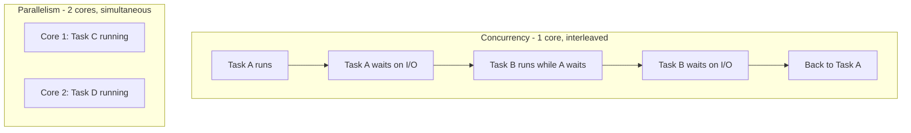

# Concurrency vs Parallelism

## 1. Story

Imagine you're a single chef in a small kitchen. Three orders come in: soup, salad, and steak.

You start the soup boiling, then while it simmers you chop vegetables for the salad, then while the vegetables rest you flip the steak. You're one person, switching between three tasks, making progress on all of them without ever doing two things in the same instant.

Now imagine two chefs in the kitchen. One cooks the soup, the other grills the steak, **at the exact same moment**.

Both kitchens get food out faster than one dish at a time. But only the second kitchen has two things physically happening simultaneously.

## 2. The Problem

Engineers use "concurrent" and "parallel" interchangeably in conversation, and it causes real design mistakes:

- A team wraps a CPU-heavy image-resizing function in `async/await` in Node.js, expects it to "run in parallel," and is confused when it's not faster — it's still using one CPU core, just switching between tasks.
- Another team assumes their single-core server "can't do concurrency," so they under-utilize it, when actually a single core can juggle thousands of concurrent I/O-bound requests just fine.

## 3. Why This Problem Exists

Both concurrency and parallelism are about "doing more than one thing," so the vocabulary blurs. But they answer two different questions:

- **Concurrency** answers: *"How do I structure a program to deal with multiple tasks that are in progress at overlapping times?"*
- **Parallelism** answers: *"How do I actually execute multiple tasks at the same physical instant?"*

## 4. The Solution (The Actual Distinction)

**Term: Concurrency** — multiple tasks make progress during overlapping time windows, by interleaving (switching between them), not necessarily executing at the same instant. Needs only one CPU core.

**Term: Parallelism** — multiple tasks execute at the literal same instant, on different CPU cores (or different machines).

> Concurrency is about **structure** (how you organize work). Parallelism is about **execution** (whether work physically overlaps in time).

## 5. Mental Model

| | One chef, juggling | Two chefs, side by side |
|---|---|---|
| Concept | Concurrency | Parallelism |
| Hardware needed | 1 core | 2+ cores |
| What happens | Fast switching between tasks | Simultaneous execution |
| Good for | I/O-bound work (waiting on network/disk) | CPU-bound work (heavy computation) |

Concurrency can exist *without* parallelism (one core, switching fast). Parallelism always implies some concurrency (multiple things are in flight), but adds true simultaneity.

## 6. How It Works

A single-threaded Node.js server handles 10,000 open connections concurrently using the **event loop**: while request A is waiting on a database response (I/O), the CPU is free, so the event loop picks up request B and starts processing it. Nothing is happening "at the same instant" — it's fast switching during idle gaps.

True parallelism requires multiple OS threads/processes running on multiple CPU cores at once — e.g. Node's `worker_threads`, a `cluster` of processes, or a language with real multi-threading (Go routines across cores, Java threads).

## 7. Flow



## 8. Code Example

```javascript
// CONCURRENCY: single thread, event loop, great for I/O-bound work
async function handleRequest(req) {
  const user = await db.findUser(req.userId);   // CPU is free while waiting
  const posts = await db.findPosts(user.id);    // another request can run here
  return { user, posts };
}
// 10,000 of these can be "in flight" on ONE core, because each await
// just parks the task and frees the CPU until the I/O completes.

// PARALLELISM: actually uses multiple cores for CPU-heavy work
const { Worker } = require('worker_threads');
function resizeImageInParallel(buffer) {
  return new Promise((resolve) => {
    const worker = new Worker('./resize-worker.js', { workerData: buffer });
    worker.on('message', resolve); // runs on a separate core, truly simultaneous
  });
}
```

## 9. Production Reality

- **I/O-bound work** (API calls, DB queries, file reads) -> concurrency (async/await, event loops) is usually enough. Adding more CPU cores does not speed this up much, because the bottleneck is waiting, not computing.
- **CPU-bound work** (image processing, video encoding, big data transforms, password hashing) -> you need real parallelism (worker threads, multiple processes, multiple machines) or the event loop itself gets blocked and *every* concurrent request stalls behind it.
- Node.js is single-threaded for your JS code, but it uses a **thread pool underneath (libuv)** for things like file I/O and DNS — so it's not "purely" single-threaded end to end; know this distinction for interviews.

## 10. Trade-offs

| | Concurrency | Parallelism |
|---|---|---|
| Hardware cost | Low (one core) | Higher (needs multiple cores/machines) |
| Complexity | Simpler mental model, but callback/await ordering bugs possible | Race conditions, shared-memory bugs, synchronization overhead |
| Speeds up | Waiting-heavy workloads | Computation-heavy workloads |

## 11. Common Mistakes

- Thinking `async/await` makes CPU-bound code faster. It doesn't — it just avoids blocking *other* requests while this one runs, but the heavy computation itself still eats one core's time linearly.
- Believing a single-threaded runtime "can't scale." It scales beautifully for I/O-bound traffic — that's the entire premise of Node.js and why it powers huge APIs.

## 12. Real-World Example

A payment API doing `await` calls to a bank's API and a database is concurrency-bound — Node.js/Python asyncio handle thousands of these per core. A video transcoding service (CPU-bound) needs real parallelism — multiple worker processes/cores, or it'll queue up and fall behind no matter how "async" the code looks.

## 13. 🧠 Remember

> Concurrency is about **structure** — juggling many tasks by switching between them. Parallelism is about **execution** — actually running many tasks at the exact same instant. You need multiple cores for parallelism; you just need smart scheduling for concurrency.

## 14. Quick Self-Test

1. If you wrap a CPU-heavy loop in `async/await` on a single-core server, will other requests speed up or slow down? Why?
2. Can a system be concurrent but not parallel? Can it be parallel but not concurrent?
3. Your API is slow because it's waiting on three downstream microservices sequentially. Is this a concurrency problem or a parallelism problem — and what's the fix?
