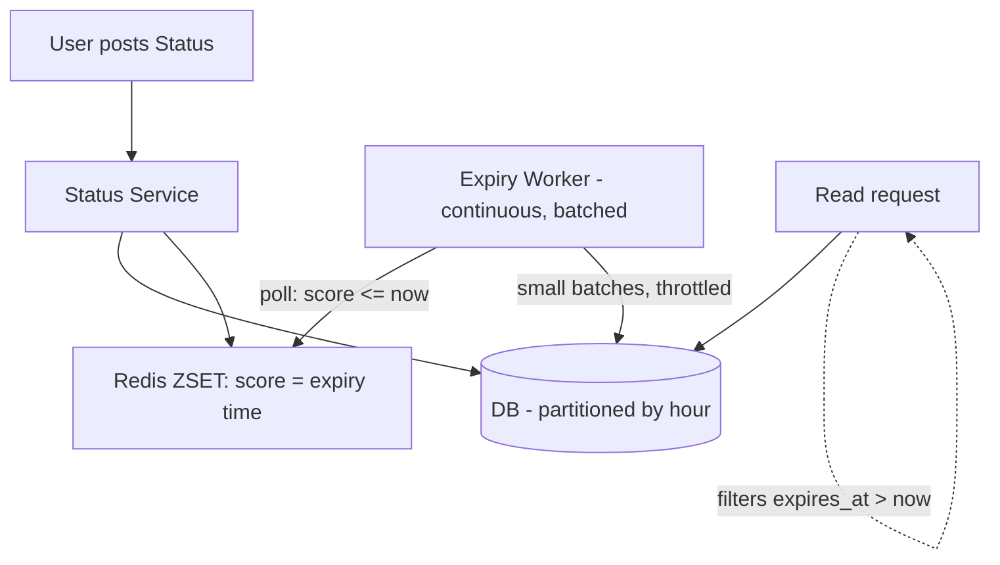

# Deleting Expired Data at Massive Scale (WhatsApp Status Example)

## 1. Story

WhatsApp Status posts disappear after 24 hours. With ~2 billion users posting statuses daily, that's potentially billions of rows that all need to "die" roughly 24 hours after they were born.

The naive engineer says: "Easy — cron job, runs every minute, `DELETE FROM statuses WHERE created_at < NOW() - INTERVAL 24 HOUR`."

## 2. The Problem

Run that query against a table with billions of rows and here's what happens:

- The `WHERE` scan (even indexed) still has to touch a huge number of matching rows every run.
- A single `DELETE` touching millions of rows takes a heavy lock, causing replication lag and blocking other writes.
- It creates a **write spike** — instead of spreading load evenly, you get a cron-triggered avalanche every minute, hammering disk I/O and the write-ahead log.
- At 2 billion posts/day, that's roughly 23,000 expirations *per second*, continuously. A periodic batch job is fighting a firehose with a bucket.

## 3. Why This Problem Exists

The mistake is framing this as "how do I delete billions of rows fast?" The real question is: **"how do I make sure I never accumulate a backlog of billions of rows that need deleting all at once?"** Deletion should be a continuous background trickle, not a scheduled event.

## 4. The Solution — Combine Four Techniques

**Technique 1 — Lazy (read-time) expiration.** Every read query filters `WHERE expires_at > NOW()`. A status that's "expired" but not yet physically deleted is invisible to users immediately — correctness doesn't depend on how fast the physical delete happens.

**Technique 2 — Time-based partitioning.** Instead of one giant table, partition storage by hour (e.g. `statuses_2026090911`, `statuses_2026090912`, ...). "Deleting" an entire expired partition is a single metadata operation (`DROP PARTITION`), not a row-by-row scan — O(1) instead of O(n).

**Technique 3 — A delay queue for precise, spread-out expiry.** When a status is created, push its ID into a Redis **sorted set** with score = expiry timestamp (or a Kafka delayed/scheduled topic). A background worker continuously pops items whose score `<= now()`, in small batches. Because creation happens continuously all day, expirations naturally spread out across the day too — no spike.

**Technique 4 — Throttled batch physical deletes.** For any leftover cleanup, delete in small batches (e.g. 500 rows) with a short sleep between batches, during off-peak hours, using an indexed range scan with `LIMIT` — never one unbounded `DELETE`.

## 5. Mental Model

> Don't fight a flood with one big dam release. Let it drain continuously through many small pipes.

Think of it like a library with a strict "24-hour loan" — instead of checking every single book overnight, the librarian just checks each book's due date **when someone tries to read it** (lazy expiration), and separately does a slow, ongoing shelf-clearing in the background — never a frantic once-a-day sweep of the whole library.

## 6. Architecture / Flow



## 7. Code Example

```sql
-- Technique 2: dropping a whole expired partition is instant, no row scan
ALTER TABLE statuses DROP PARTITION p_2026090909;  -- the 09:00 hour bucket, now > 24h old
```

```javascript
// Technique 3: Redis sorted set as a delay queue
await redis.zadd('status_expiry', expiresAtEpoch, statusId);

// Worker loop - runs continuously, small batches, never a giant sweep
async function expiryWorker() {
  while (true) {
    const now = Date.now();
    const expired = await redis.zrangebyscore('status_expiry', 0, now, 'LIMIT', 0, 500);
    if (expired.length) {
      await markHidden(expired);          // instant, cheap, correctness-critical
      await redis.zrem('status_expiry', ...expired);
      await queuePhysicalDelete(expired);  // slow path, batched, off the hot path
    }
    await sleep(1000);
  }
}
```

## 8. Production Reality

Reads must never trust "has it been physically deleted yet" — always filter by `expires_at`. This decouples user-facing correctness from the speed of your cleanup pipeline, which is exactly what lets you make cleanup slow, cheap, and throttled without ever showing an expired status to a user.

## 9. Trade-offs

| Approach | Pro | Con |
|---|---|---|
| Partition-drop | O(1) deletion, no lock contention | Requires schema pre-planning for time-based partitions |
| Redis delay queue | Spreads load evenly, precise timing | Needs reliable, idempotent workers (at-least-once delivery) |
| Lazy expiration | Zero write cost, instant correctness | "Expired but not deleted" rows briefly waste storage |

## 10. Common Mistakes

- Writing one unthrottled `DELETE` for all expired rows — this is the exact anti-pattern the story opens with, and it's the most common wrong first instinct.
- Forgetting lazy expiration and assuming deletion speed determines correctness — it shouldn't. A slow cleanup job should never mean a user sees expired content.

## 11. 🧠 Remember

> At billion-row scale, never delete in one shot — delete continuously and cheaply, ideally by dropping whole partitions instead of rows, and let "expired" be a read-time filter instead of an urgent write-time job.

## 12. Quick Self-Test

1. Why does spreading deletions across a delay queue avoid the "cron avalanche" problem that a periodic batch job creates?
2. Why is `DROP PARTITION` so much cheaper than `DELETE WHERE ...` at scale?
3. If your physical delete pipeline falls behind by 2 hours, why does the user still never see an expired status?
