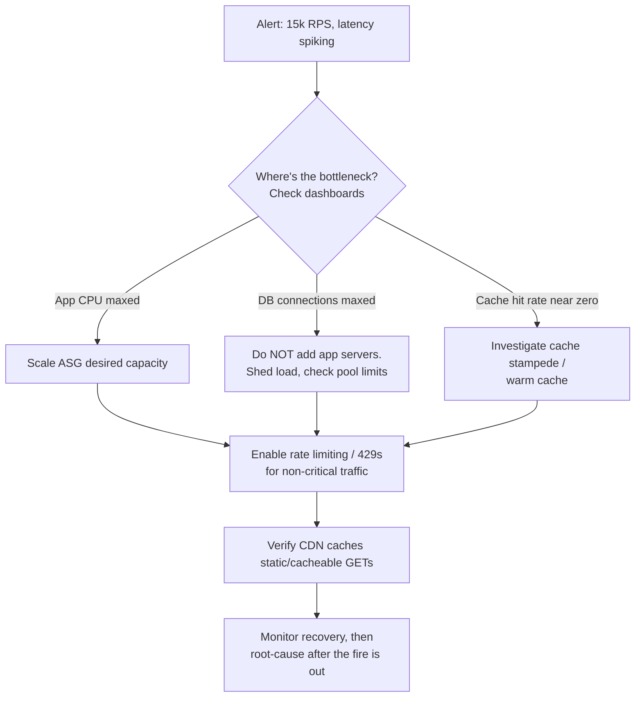

# Your API Is Choking at 15,000 RPS - You Have 15 Minutes

## 1. Story

It's 8:47 PM. A dashboard turns red. Requests per second have tripled in ten minutes, latency is climbing, error rates are ticking up, and support tickets are piling in. You're on call, alone, with 15 minutes before this turns into a full outage.

This is not a design exercise. This is triage.

## 2. The Problem

Under real incident pressure, engineers make two classic mistakes: they try to **fix the code** (deploy a hotfix, refactor a slow function) mid-fire, which is slow and risky; or they **scale the wrong layer** (add more app servers when the database is actually the bottleneck, which just sends *more* connections into an already-drowning database and makes it worse).

## 3. The Solution: A 15-Minute Incident Playbook

**Minute 0-3 — Find the actual bottleneck, don't guess.** Look at dashboards: CPU/memory on app servers, DB connection count and query latency, queue depth, cache hit rate. You cannot fix what you haven't identified.

**Minute 3-6 — Stop the bleeding (shed load).** Turn on or tighten rate limiting so you return fast `429 Too Many Requests` instead of slow, resource-consuming `500`s. If there's a feature flag for expensive functionality (recommendations, search facets, personalization), turn it off to serve a cheaper, simpler response. If a specific client/IP/bot is the source of the spike, block it at the CDN/WAF edge.

**Minute 6-10 — Add capacity where it's stateless and safe.** If the bottleneck is the app tier (CPU-bound, not DB-bound), bump your Auto Scaling Group's desired capacity manually — don't wait for reactive scaling policies. If the bottleneck is the database, adding app servers *doesn't help* — check connection pool limits instead.

**Minute 10-13 — Take pressure off the database specifically.** Verify your cache is actually being hit (a near-zero cache hit rate during a spike is a huge red flag — possible cache stampede, or cache was never warmed for this traffic pattern). Kill or deprioritize any single identifiably expensive/slow query. Make sure the CDN is serving anything cacheable (static assets, cacheable GET responses) so it never reaches your origin at all.

**Minute 13-15 — Communicate and stabilize.** Post a status update if user-facing. Confirm error rate and latency trending back down. Only *after* the fire is out do you investigate root cause properly.

## 4. Mental Model

> In an incident, the priority order is: **Stop the bleeding -> Reduce load -> Add capacity -> Root-cause later.**

Think of it like a hospital ER, not a surgery room: you stabilize the patient first (stop the bleeding), you don't start planning reconstructive surgery while they're crashing.

## 5. Flow

## 6. Production Reality

This playbook assumes some things are already true *before* the incident: your app is stateless (so adding instances actually helps), you have an autoscaling group or at least manual scale controls, you have a CDN in front of static/cacheable content, and you have dashboards that show CPU/DB/cache metrics in real time. None of these can be built during the 15 minutes — that's exactly why the trade-off discussion below matters.

## 7. Trade-offs

- **Horizontal scaling** is fast to apply but costs money and doesn't fix an underlying single point of failure like a non-scalable database.
- **Load shedding** protects the system's overall health but deliberately degrades experience for some users — an intentional, visible trade-off made under pressure, not a silent failure.

## 8. Common Mistakes

- Deploying a "quick fix" to the codebase during the incident without knowing the root cause — high risk of making things worse under pressure.
- Scaling the app tier when the real bottleneck is the database — this doesn't just fail to help, it actively worsens the database's load by allowing even more concurrent connections to pile up.

## 9. 🧠 Remember

> In a live incident: stop the bleeding first (shed load, scale what's actually stateless), find the real bottleneck with data not guesses, and postpone permanent fixes until after the fire is out.

## 10. Quick Self-Test

1. Why can adding more app servers sometimes make a database bottleneck *worse* instead of better?
2. Why is returning `429` during an overload better than letting requests queue up and eventually 500?
3. Name two things that must already exist *before* an incident for this 15-minute playbook to actually work.
