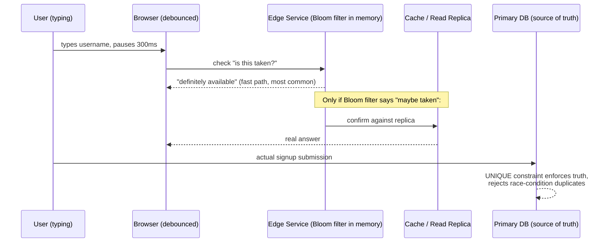

# How Gmail Checks "Username Already Taken" Instantly

## 1. Story

You start typing a Gmail address. Before you've even finished, the UI shows "That username is taken." Gmail has well over a billion accounts. How does it check against all of them, for every keystroke, from users worldwide, in milliseconds?

## 2. The Problem

The naive design: on every keystroke, fire `SELECT 1 FROM users WHERE username = ?` straight at the primary database. Even with an index, that's a network round trip plus a real query, multiplied by every keystroke, from every signup form, everywhere in the world, constantly. At Gmail's scale that's an enormous, unnecessary load on the most critical database in the company, just for a UX nicety.

## 3. The Solution — Layered, Cheapest-Check-First

**Step 1 — Debounce on the client.** Don't fire a request per keystroke; wait ~300ms after typing pauses. This alone cuts request volume dramatically.

**Step 2 — A probabilistic pre-check: the Bloom filter.**

**Term: Bloom filter** — a compact, memory-efficient data structure that can answer "have I possibly seen this before?" with zero false negatives (if it says "no," it's *definitely* not taken) but occasional false positives (if it says "maybe," it might be a false alarm). It's just a bit array plus a few hash functions — checking it costs microseconds and no database round trip at all.

A replica of this Bloom filter (containing all existing usernames) can live in memory at the edge/application layer, so the vast majority of "is it available" checks (which are usually "yes, available" for a random typed string) never even touch the database.

**Step 3 — Confirm the rare "maybe taken" case** against a fast read-replica or cache (not the primary DB) only when the Bloom filter flags a possible hit.

**Step 4 — The database's unique constraint is the actual source of truth**, enforced only at the moment of final account creation — never trust the "fast check" as the real answer.

## 4. Mental Model

> A Bloom filter is a very fast, very cheap bouncer who can instantly say "definitely not on the list" for most people, and only occasionally says "let me check the clipboard" for a few.

The instant UI feedback is just a **hint**. The database's `UNIQUE` constraint at signup time is the actual **decision**.

## 5. Architecture / Flow



## 6. Code Example

```javascript
// Ultra-fast, in-memory, no DB hit for the common case
function isProbablyTaken(username, bloomFilter) {
  return bloomFilter.has(username); // false = definitely available, no DB call needed
}

// Only escalate to a real check when the Bloom filter says "maybe"
async function checkAvailability(username) {
  if (!bloomFilter.has(username)) return { available: true };
  const exists = await readReplica.query(
    'SELECT 1 FROM users WHERE username = $1', [username]
  );
  return { available: !exists };
}
```

```sql
-- The actual source of truth, enforced atomically at signup
ALTER TABLE users ADD CONSTRAINT unique_username UNIQUE (username);
-- INSERT that violates this throws an error the app catches and
-- returns "taken" - even if the earlier check said "available"
```

## 7. Production Reality

Two users can type the same available-looking username at the exact same moment and both see "available" — the Bloom filter/cache is only a hint, and it can go briefly stale right after someone else signs up. The system must handle the resulting `UNIQUE` constraint violation gracefully at insert time and tell the second user "actually, that's taken now."

## 8. Trade-offs

- Bloom filter size vs. false-positive rate: a bigger bit array and more hash functions reduce false positives but cost more memory — tuned based on expected number of usernames.
- Slight staleness: a just-registered username might take a moment to propagate into replicas/caches everywhere, but this only ever causes a false "maybe available" that gets caught at the real insert — never actual duplicate accounts.

## 9. Common Mistakes

- Treating the instant "available" check as the actual reservation, with no atomic uniqueness enforcement at write time — this lets two concurrent signups both succeed with the same username under race conditions.
- Hitting the primary database directly for every keystroke instead of debouncing and using a cheap pre-check layer.

## 10. 🧠 Remember

> Fast uniqueness checks are UX, not truth — use a Bloom filter/cache for instant feedback, but the database's unique constraint at insert time is what actually prevents duplicate usernames.

## 11. Quick Self-Test

1. Why can a Bloom filter say "maybe taken" incorrectly, but never say "not taken" incorrectly?
2. What actually prevents two users from grabbing the same username at the exact same millisecond, given that the instant check can be wrong?
3. Why does debouncing on the client matter even though the Bloom filter check itself is nearly free?
