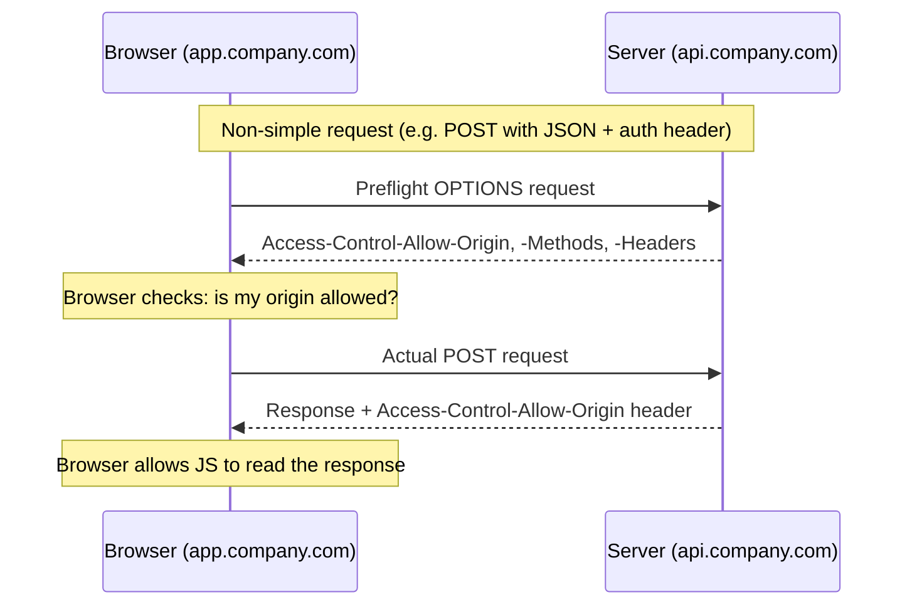

# Fixing a CORS Error Between app.company.com and api.company.com

## 1. Story

Your frontend lives at `http://app.company.com`. It calls your API at `http://api.company.com`. The browser console shows:

```
CORS error: No 'Access-Control-Allow-Origin' header is present on the requested resource.
```

The API works fine in Postman. It works fine with `curl`. It only fails from the browser.

## 2. The Problem — And Why It's Not a Networking Bug

**Term: Same-Origin Policy** — a browser security rule that blocks a script running on one origin (scheme + domain + port) from reading responses from a different origin, unless that origin explicitly grants permission. `app.company.com` and `api.company.com` are *different origins* (different subdomains), even though they're on the same top-level company domain.

This is why Postman and `curl` work fine — they aren't browsers, so they don't enforce this policy at all. The request often actually **reaches your server successfully**; the browser just refuses to let your JavaScript read the response.

## 3. The Solution

The server (`api.company.com`) must respond with headers that explicitly allow the requesting origin:

```
Access-Control-Allow-Origin: https://app.company.com
```

If the request uses cookies or `Authorization` headers for auth, you also need:

```
Access-Control-Allow-Credentials: true
```

— and in that case `Access-Control-Allow-Origin` **cannot** be `*`; it must be the exact origin, and the frontend's `fetch`/`axios` call must set `credentials: 'include'`.

For anything beyond a "simple" GET (custom headers, `PUT`/`DELETE`, `Content-Type: application/json`), the browser first sends an automatic **preflight** `OPTIONS` request to ask permission before sending the real one. Your server must respond to `OPTIONS` with `Access-Control-Allow-Methods`, `Access-Control-Allow-Headers`, and `Access-Control-Allow-Origin` — if it doesn't, the browser never even attempts the real request.

## 4. Mental Model

> CORS is the server handing the browser a signed permission slip. The browser won't let your JavaScript touch the response unless that slip explicitly names the requesting origin.

## 5. Flow



## 6. Code Example

```javascript
// Express server (api.company.com)
const cors = require('cors');

app.use(cors({
  origin: 'https://app.company.com',  // exact origin, not '*', because we use cookies
  credentials: true,
  methods: ['GET', 'POST', 'PUT', 'DELETE'],
  allowedHeaders: ['Content-Type', 'Authorization'],
}));
```

```javascript
// Frontend fetch (app.company.com) - must opt in to sending cookies
fetch('https://api.company.com/orders', {
  method: 'POST',
  credentials: 'include',
  headers: { 'Content-Type': 'application/json' },
  body: JSON.stringify({ item: 'widget' }),
});
```

## 7. Production Reality

If you support multiple frontend origins (e.g. staging, production, a mobile web view), use a dynamic origin check on the server (a whitelist function) instead of hardcoding one string. Also set `Access-Control-Max-Age` so browsers cache the preflight result and don't re-send `OPTIONS` on every single request — this matters for latency at scale.

## 8. Trade-offs

- `Access-Control-Allow-Origin: *` is simple and fine for a fully public, unauthenticated API — but browsers **flatly reject** combining `*` with credentials, so any authenticated cross-origin API must use an explicit origin.
- An explicit origin whitelist is more secure but requires maintaining that list as new frontend domains appear.

## 9. Common Mistakes

- Setting `Access-Control-Allow-Origin: *` while also trying to send cookies/auth — browsers block this combination outright, no matter what else you configure.
- Handling CORS for `GET` but forgetting that `POST` with a JSON body or custom headers triggers a preflight `OPTIONS` request that also needs a correct response.
- Assuming a CORS error means the request never reached the server — it very often did; the browser is just blocking your script from reading the result.

## 10. 🧠 Remember

> CORS errors are the browser protecting the user, not the network failing — fix them on the server by explicitly telling the browser which origins, methods, and headers are allowed, including answering the preflight OPTIONS request.

## 11. Quick Self-Test

1. Why does the same request work in Postman but fail in the browser?
2. Why can't you use `Access-Control-Allow-Origin: *` together with cookies/credentials?
3. What browser behavior triggers an automatic preflight `OPTIONS` request, and what must the server do in response?
