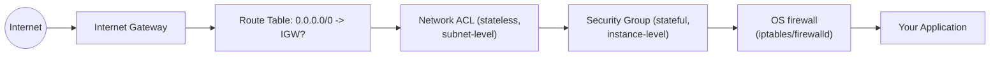

# EC2 Has a Public IP But No Internet Access

## 1. Story

You launch an EC2 instance, the AWS console proudly shows a public IP address next to it, and you SSH in and run `curl google.com`. It hangs, then times out. No internet. But... it has a public IP. What's going on?

## 2. The Problem — A Public IP Is Just an Address, Not a Path

Having a public IP means the internet *could* find your instance if traffic reached it correctly. It says nothing about whether the surrounding network configuration actually lets traffic flow in either direction. There are multiple independent layers between "has an IP" and "can talk to the internet," and a block at *any single one* produces the exact same symptom: nothing.

## 3. The Solution — Check Every Layer, Top-Down

Think of the path as layers, from the outside in:

Walk it top-down, checking each:

1. **Internet Gateway (IGW)** — is one actually attached to the VPC? Without it, nothing in the VPC can reach the public internet no matter what else is configured.
2. **Route table** — does the subnet's route table have a route for `0.0.0.0/0` pointing to the IGW? This is the single most common miss: a public IP with no corresponding route is a dead end. (This is what actually defines a subnet as "public" — not the instance having a public IP.)
3. **Network ACL (NACL)** — subnet-level, **stateless**, meaning it evaluates inbound and outbound rules independently. A NACL that allows outbound but blocks the inbound *return* traffic will silently break connections even though the outbound packet leaves fine.
4. **Security Group (SG)** — instance-level, **stateful** (return traffic for an allowed outbound connection is automatically allowed back in). Check outbound rules aren't locked down (default SGs allow all outbound, but this is often tightened later) and inbound rules allow what's needed.
5. **OS-level firewall** — `iptables`/`firewalld` running inside the instance itself can independently block traffic regardless of what AWS-level config says.
6. **DNS resolution** — sometimes "no internet" is actually "no DNS": check VPC DNS settings and whether `curl <an IP directly>` works even when `curl google.com` doesn't.
7. **Elastic IP association** — confirm the public IP shown is actually correctly associated and not stale/detached.

## 4. Mental Model

> Think of it as a chain of bouncers between your instance and the internet: the Internet Gateway (front door of the building), the route table (the signpost telling your floor how to reach that door), the NACL (a stateless bouncer at the building entrance who checks both directions separately), the Security Group (a stateful bouncer at your apartment door who remembers who you let out), and the OS firewall (a lock on the room itself). A "no" from *any* of them looks identical from inside the room.

## 5. How I'd Answer This In An Interview

"I'd check top-down: does the route table send `0.0.0.0/0` to an attached Internet Gateway; do the NACL rules allow the traffic in *both* directions since NACLs are stateless; does the Security Group allow the outbound (and inbound, if relevant) traffic since SGs are stateful; and finally whether the instance's own OS firewall is blocking it. I'd also check DNS resolution separately, since 'no internet' sometimes really means 'no DNS.'" — walking through layers methodically, rather than guessing, is what interviewers are actually listening for.

## 6. Production Reality

For instances that need **outbound-only** internet access (e.g., pulling OS updates or packages) without being publicly reachable from the internet, the correct pattern is a **private subnet + NAT Gateway**, not giving the instance a public IP at all. A public IP + IGW route is for instances that genuinely need to be reachable *from* the internet.

## 7. Trade-offs

Public subnet + IGW is simple but exposes the instance to direct internet-facing risk (must be locked down carefully at the SG/NACL/OS level). Private subnet + NAT Gateway costs a bit more and adds a hop, but keeps the instance itself unreachable from outside while still allowing it to reach out.

## 8. Common Mistakes

- Assuming "has a public IP" automatically means "has internet access" — these are two independent facts; the IP is just an address, the *route* is what makes it reachable.
- Confusing Security Groups (stateful, instance-level) with NACLs (stateless, subnet-level, need explicit rules for both directions) — a very common interview trip-up.
- Putting an instance that only needs outbound access directly in a public subnet with a public IP, instead of using a NAT Gateway from a private subnet.

## 9. 🧠 Remember

> A public IP is just an address — internet access requires the whole chain: Internet Gateway attached, route table pointing to it, NACL and Security Group both allowing the traffic in both directions, and the OS not blocking it itself.

## 10. Quick Self-Test

1. What's the practical difference between a Security Group and a Network ACL, and why does that difference matter for troubleshooting?
2. Why would an instance with a public IP still have zero internet access if the route table is missing a `0.0.0.0/0` route?
3. What's the correct architecture for an instance that needs outbound internet access but should never be reachable from outside?
