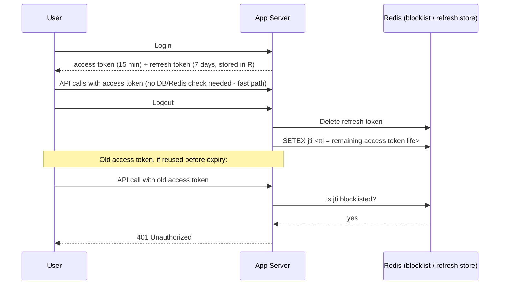

# JWT Is Stateless - So How Does Logout Actually Work?

## 1. Story

You built login with JWT. The whole pitch was: no server-side session storage, no database lookup per request — the server just verifies the token's signature and expiry, and trusts what's inside. Fast, scalable, stateless.

Then someone clicks **Logout**. And you realize: the server never "remembers" issuing this token in the first place. So how do you make it stop working?

## 2. The Problem

The entire performance benefit of JWT comes from the server **not** checking a database or session store on every request. But "invalidate this specific token right now" is inherently a stateful operation — you're asking the server to remember something it deliberately designed itself not to remember.

## 3. Why This Problem Exists

**Term: Statelessness** here specifically means "the server can verify the token's validity using only cryptography (signature) and the token's own claims (expiry), without a lookup." Statelessness was never meant to be absolute — it's a deliberate trade of *revocability* for *scalability*. Real systems need some of that revocability back, so they reintroduce a small, controlled amount of state.

## 4. The Solution — Four Real Patterns (Used Together in Practice)

**Pattern 1 — Short-lived access token + revocable refresh token (the standard production approach).** The access token (used on every API call) has a short TTL, e.g. 15 minutes. The refresh token (used only to mint new access tokens) is longer-lived but stored server-side (DB/Redis), so it **can** be revoked. On logout: delete both tokens client-side, and delete/invalidate the refresh token server-side. The stolen/old access token is still technically valid for at most 15 more minutes — an accepted, bounded risk window.

**Pattern 2 — Blocklist (denylist) in a fast store.** On logout, store the token's unique ID (`jti` claim) in Redis with a TTL equal to the token's *remaining* validity. Every request checks "is this `jti` blocklisted?" before trusting it. This reintroduces one stateful check — but it's a cheap Redis lookup, and you only ever store *revoked* tokens, not every active one.

**Pattern 3 — Token versioning ("logout everywhere").** Store a `tokenVersion` (or `lastLogoutAt`) per user in the database. Include that version as a claim in the JWT at issue time. On every request, compare the token's version against the current value stored for that user; bump the stored version on logout (or password change) to instantly invalidate *every* previously issued token for that user, without tracking individual tokens.

**Pattern 4 — Client-side only deletion (weakest, only safe with very short expiry).** Just delete the token from browser storage. It remains cryptographically valid until it naturally expires — acceptable only if that window is very short and the token was never exposed.

## 5. Mental Model

> "Stateless" is a spectrum, not an absolute. Pure stateless JWT trades away revocability for pure speed. To get revocation back, you reintroduce state — but only a *small* amount, checked cheaply, not a full session lookup for every request.

## 6. Flow



## 7. Code Example

```javascript
// On logout: blocklist the current access token's jti until it would
// have expired anyway - never store it longer than that
async function logout(req, res) {
  const { jti, exp } = req.user; // decoded from the JWT
  const ttlSeconds = exp - Math.floor(Date.now() / 1000);
  if (ttlSeconds > 0) {
    await redis.setex(`blocklist:${jti}`, ttlSeconds, '1');
  }
  await refreshTokenStore.delete(req.user.refreshTokenId);
  res.clearCookie('refreshToken');
  res.json({ message: 'Logged out' });
}

// On every request: one cheap Redis check before trusting the JWT
async function authMiddleware(req, res, next) {
  const payload = verifyJwtSignatureAndExpiry(req.headers.authorization);
  const revoked = await redis.get(`blocklist:${payload.jti}`);
  if (revoked) return res.status(401).json({ error: 'Token revoked' });
  req.user = payload;
  next();
}
```

## 8. Production Reality

The blocklist entry's TTL must match the token's *remaining* validity exactly — otherwise entries either expire too early (letting a revoked token work again) or pile up forever (defeating the point of a lightweight check). For "log out of all devices" or "invalidate everything after a password change," token versioning is architecturally cleaner than trying to blocklist every individual token a user ever had.

## 9. Trade-offs

| Approach | Revocation speed | Cost |
|---|---|---|
| Pure stateless JWT | Never (until natural expiry) | Zero — fastest, no lookups |
| Short access + revocable refresh | Bounded by access token TTL (e.g. 15 min) | Low — one store, checked only at refresh time |
| Redis blocklist | Immediate | One cheap lookup per request |
| Token versioning | Immediate, per-user, all tokens at once | One lookup per request, but simpler data model |

## 10. Common Mistakes

- Believing JWT is "fully stateless" and therefore concluding logout simply can't be done properly — leads to either ignoring the security gap or overcorrecting.
- Storing every single issued token in the database to "solve" this — this defeats the entire performance purpose of using JWT in the first place; only store *revoked* tokens, and only until they'd have expired anyway.

## 11. 🧠 Remember

> You can't truly invalidate a stateless JWT before it expires without adding some state back — the practical answer is short-lived access tokens plus a revocable refresh token (or a lightweight Redis blocklist), so you regain control without giving up JWT's scalability everywhere.

## 12. Quick Self-Test

1. Why does storing every issued token in a database defeat the purpose of using JWT?
2. Why must a blocklist entry's TTL match the token's remaining validity rather than some fixed long TTL?
3. If a user changes their password, which pattern (blocklist vs. token versioning) more cleanly invalidates every device they were logged into, and why?
