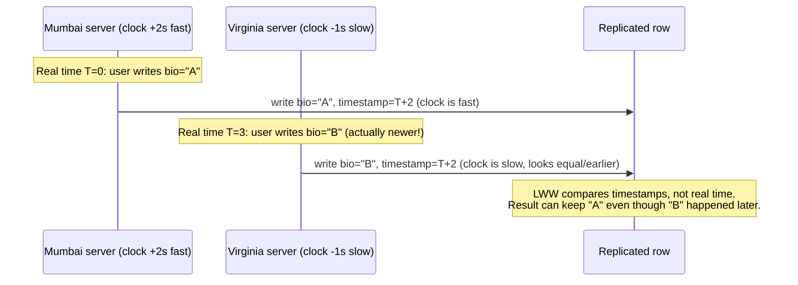

# Why the "Older" Write Wins in a Distributed Database

## 1. Story

Your app runs across two data centers — Mumbai and Virginia — both able to accept writes to the same user row (an active-active, multi-region setup). A user updates their profile bio from Mumbai. Three seconds later, they update it again from a session that happens to hit the Virginia server. You check the database afterward, and the **first** edit is what stuck — the newer one is gone. No bug in your code, no failed request, no error logged anywhere.

## 2. The Problem

In a multi-master (active-active) database, two servers can accept writes to the same row independently, with no coordination between them at write time. Something has to decide which write "wins" when they conflict. A very common, simple strategy is:

**Term: Last-Write-Wins (LWW)** — when two writes conflict, keep whichever one carries the **highest timestamp**, discard the other.

Simple — as long as the timestamps actually reflect real-world order. They often don't.

## 3. Why This Happens

Timestamps in LWW are usually the **wall-clock time** of whichever machine (client or server) handled the write. Machines' clocks are synchronized via NTP, but NTP only *minimizes* drift — it doesn't eliminate it. Cross-continent clock skew of tens of milliseconds is normal, and under network issues, VM pauses, or GC stalls, it can be much worse.

So: if Virginia's clock is running a few seconds **behind** real time, the write that objectively happened *later* gets stamped with a timestamp that looks *earlier* than Mumbai's write. LWW compares the stamps, not the real order of events — and keeps the wrong one.

> **This is one of the most important lessons in distributed systems: there is no single global "now."** Two machines can never be perfectly certain which of them did something first, purely from wall-clock time.

## 4. Mental Model

Think of two people in different time zones each writing a diary entry, each glancing at a slightly-wrong wristwatch to timestamp it. If you later sort the diary entries purely by the number written on them, you might sort them in the wrong real-world order — the watches disagreeing is invisible until you compare them to real events.

## 5. The Real Solutions

- **Logical / Lamport clocks** — instead of physical time, track a counter that increments on every event and is passed along with messages, capturing *causality* ("did this event know about that one?") rather than physical time.
- **Vector clocks** — an extension that tracks per-node counters, letting a system detect true concurrent conflicts (neither caused the other) instead of forcing a single winner.
- **CRDTs (Conflict-free Replicated Data Types)** — data structures designed to merge concurrent updates automatically and consistently, without needing to pick a "winner" at all.
- **Bounded-uncertainty physical clocks** — Google Spanner's TrueTime uses GPS + atomic clocks and explicitly tracks clock *uncertainty*, waiting out the uncertainty window before committing, to get correct global ordering from physical time itself (an unusually heavy, infrastructure-level solution).
- **Single-owner routing** — for a given key, route all writes to one designated region/leader, avoiding true multi-master conflicts for that key entirely.

## 6. Flow

## 7. Production Reality

Cassandra and DynamoDB Global Tables both use LWW by default for multi-region conflict resolution — this is a well-known, documented trade-off, not a bug in those systems. Teams building on them need to explicitly decide: is losing a rare conflicting write acceptable for this data (often yes, e.g. "last profile picture wins"), or does this field need stronger guarantees (route writes for that key to one region, or use an app-level merge strategy)?

## 8. Trade-offs

| | Last-Write-Wins | Logical/Vector Clocks or CRDTs |
|---|---|---|
| Coordination cost | None — fast, available even during partitions | Some bookkeeping overhead, more complex merge logic |
| Correctness | Can silently lose a write | Correctly captures causality or merges automatically |
| Simplicity | Very simple to implement | More moving parts |

## 9. Common Mistakes

- Assuming NTP-synced clocks are "close enough" that timestamp order always matches real event order — it's close, not exact, and exact is what LWW correctness actually needs.
- Using LWW for data where silently losing an update is unacceptable (e.g. financial balances) instead of a consensus-based or single-leader-per-key approach.

## 10. 🧠 Remember

> In distributed systems, don't trust wall-clock time to decide what happened first across machines — clock skew means the write timestamped later doesn't always happen later. Use logical clocks, causality tracking, or a single source of truth for ordering when correctness matters.

## 11. Quick Self-Test

1. Why can NTP-synced clocks still disagree enough to break "last write wins" correctness?
2. What's the difference between a physical clock timestamp and a logical (Lamport) clock value?
3. Name one alternative to LWW that avoids relying on wall-clock time for conflict resolution.
