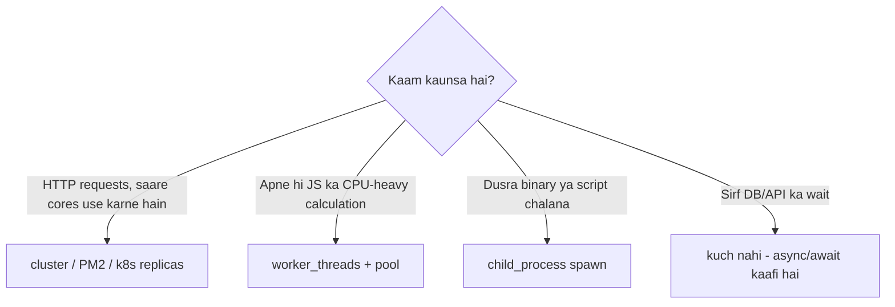

# cluster vs worker_threads vs child_process - Kaunsa Kab? (Hinglish)

> **Builds on**: [[01-concurrency-vs-parallelism]] (I/O-bound vs CPU-bound ka asli farak) aur [[104-blog-node-python-c-under-the-hood-hinglish]] (libuv ka thread pool).

## 1. Teeno Ek Line Mein

| | Kya hai | Kiske liye |
|---|---|---|
| **cluster** | Kai **processes**, sab ek hi port share karte hain | HTTP server ko saare CPU cores par scale karna |
| **worker_threads** | Ek hi process ke andar **threads**, memory share kar sakte hain | CPU-heavy kaam jo event loop ko block karta hai |
| **child_process** | Bilkul alag program/script chalana | ffmpeg, python script, koi CLI tool |

Teeno ka maqsad ek hi hai: **main event loop ko free rakhna**, par teen alag problems ke liye.

## 2. cluster - HTTP Traffic Ke Liye

Node ek thread par JS chalata hai, to 4-core machine par ek process sirf 1 core use karega. `cluster` primary process banata hai jo N workers fork karta hai; OS/primary incoming connections unme baant deta hai.

```javascript
const cluster = require('node:cluster');
const os = require('node:os');

if (cluster.isPrimary) {
  for (let i = 0; i < os.availableParallelism(); i++) cluster.fork();
  cluster.on('exit', (worker) => cluster.fork());   // mar gaya to naya utha do
} else {
  require('./server');                              // har worker apna HTTP server
}
```

**Dhyan rakhne wali baatein:**
- Workers **memory share nahi karte**. In-memory session/cache har worker mein alag hoga - isliye state Redis mein ([[80-restart-logs-everyone-out]] wali seekh).
- WebSocket/sticky session chahiye ho to load balancer par sticky routing lagana padta hai.
- Production mein aksar log **PM2 cluster mode** ya Kubernetes replicas use karte hain - wahi kaam, bahar se manage hota hai. Container world mein "1 container = 1 process, replicas badha do" zyada common hai.
- Graceful shutdown: `SIGTERM` par server close karo, in-flight requests khatam hone do, tab exit.

## 3. worker_threads - CPU-Heavy Kaam Ke Liye

Agar ek request 2 second CPU khaa rahi hai (image resize, PDF, bada JSON parse, crypto), to **saare** users wait karenge. Ye kaam thread mein bhejo:

```javascript
// main.js
const { Worker } = require('node:worker_threads');
function runHeavy(data) {
  return new Promise((resolve, reject) => {
    const w = new Worker('./heavy.js', { workerData: data });
    w.once('message', resolve);
    w.once('error', reject);
  });
}

// heavy.js
const { parentPort, workerData } = require('node:worker_threads');
parentPort.postMessage(expensiveCalculation(workerData));
```

**Points:**
- Thread banane mein cost hai - har request par naya worker mat banao, **worker pool** rakho (ya `piscina` jaisi library).
- Data by default **copy** hota hai (structured clone). Bade buffers ke liye `transferList` ya `SharedArrayBuffer` use karo, warna copy hi bottleneck ban jaayega.
- Ye asli **parallelism** hai ([[01-concurrency-vs-parallelism]]) - I/O ke liye iski zaroorat nahi, `async/await` kaafi hai.

## 4. child_process - Bahar Ka Program Chalane Ke Liye

```javascript
const { spawn } = require('node:child_process');
// spawn = stream milta hai, bade output ke liye sahi
const ff = spawn('ffmpeg', ['-i', input, '-vf', 'scale=640:-1', output]);
ff.on('close', (code) => console.log('done', code));
```

- **spawn**: streaming output, bada data - default choice.
- **exec**: output buffer mein (chhote output), aur **shell** use karta hai - user input kabhi seedha mat daalo (command injection). `execFile`/`spawn` with args array safer hai.
- **fork**: sirf Node scripts ke liye, built-in IPC channel ke saath.

## 5. Chunne Ka Simple Rule



Interview line: *"Pehle dekhta hoon kaam I/O-bound hai ya CPU-bound. I/O hai to async hi kaafi hai; CPU hai to worker_threads; aur poore server ko cores par failana hai to cluster ya replicas."*

## 6. Common Galtiyan

- **Sirf cluster laga dena** jab problem CPU-heavy single request thi - har worker mein wahi block hoga.
- **Har request par naya Worker** banana - thread creation ki cost hi kha jaayegi.
- **exec** mein user input concatenate karna - command injection.
- Cluster ke baad bhi in-memory cache/session use karte rehna - workers ke beech mismatch.

## 🧠 Remember

> cluster = kai processes, ek port, HTTP ko cores par failane ke liye; worker_threads = ek process ke andar threads, CPU-heavy kaam ke liye; child_process = bahar ka program chalane ke liye - aur agar kaam sirf I/O wait hai to teeno ki zaroorat hi nahi.

## Quick Self-Test

1. Aapki API DB ka wait kar rahi hai - kya worker_threads se fayda hoga? Kyun ya kyun nahi?
2. cluster lagane ke baad user ka session kabhi-kabhi "gayab" kyun ho jaata hai?
3. `exec` aur `spawn` mein security ka kya farak hai?
