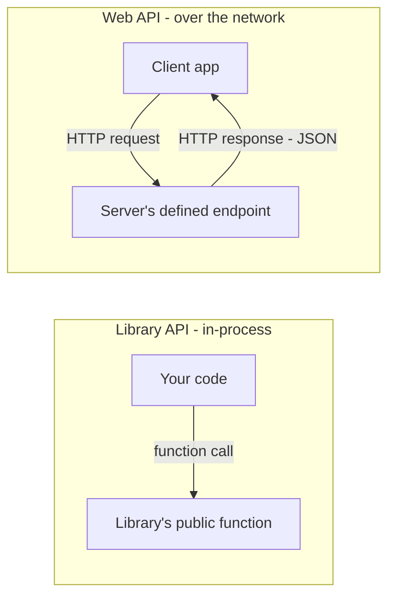

# What Exactly Is an API? (It's Not a Framework or a Library)

## 1. Story

You keep hearing "API" everywhere — "use this API," "build an API," "connect to an API." You open Express.js docs and see the word. You open the Stripe docs and see the word. You look at a Python library's docs and see the word again. Each time it seems to mean a slightly different *thing*, so you start to wonder: is an API a framework? A library? A URL? A piece of software you install?

## 2. The Problem

The confusion is understandable, because "API" isn't a specific technology — it's a **concept** that gets implemented in wildly different concrete forms, so it looks different every time you meet it.

## 3. The Solution

**Term: API (Application Programming Interface)** — a defined **contract** that says "here is how you're allowed to ask me to do something, and here is what you'll get back," without you ever needing to know how it's implemented internally.

That's it. It's not a tool. It's the *boundary* between "what you can ask for" and "how it actually gets done." That boundary shows up in many forms:

- **A library's public functions** — an in-process API. `requests.get(url)` in Python is the API of the `requests` library — you call the function, you don't need to know how it opens a TCP socket underneath.
- **A web/HTTP API** — a network contract. Stripe's REST API says "send an HTTP POST to this URL with this JSON shape, you'll get this JSON response back" — you never see their servers, database, or code.
- **An OS-level API** — system calls your program makes to the operating system kernel.
- **A hardware/driver API** — how software talks to a printer or GPU without knowing its internal electronics.

When someone says **"build an API"** they almost always mean specifically: build a network-accessible (usually HTTP) contract that other programs can call. When they say **"use this API,"** they mean: call these predefined functions/endpoints and trust the contract, don't worry about the internals.

## 4. Mental Model

> An API is a restaurant menu, not the kitchen. You (the client) order from a fixed menu (the interface) and a waiter (the interface layer) brings back your food. The kitchen can completely change its staff, recipes, and equipment (the internal implementation) as long as the menu (the contract) stays the same — you, the customer, never notice or need to care.

**Framework vs. Library vs. API — the actual distinction:**

| Term | What it actually is | Example |
|---|---|---|
| **Framework** | A structure/toolset that dictates how you build your app; it calls your code | Express, Django, Spring |
| **Library** | Reusable code you call directly, in-process, on your own terms | axios, Lodash, `requests` |
| **API** | The contract itself — what you're allowed to ask, what you'll get back | The `/v1/charges` endpoint of Stripe; the `.get()` method of a library |

A framework **helps you build** an API. A library **has** an API (its public functions). Neither one *is* an API by itself — the API is the promise, not the machinery behind it.

## 5. How It Works / Flow



## 6. Code Example

```javascript
// LIBRARY API: an in-process contract - call it directly, no network involved
const axios = require('axios');
const data = await axios.get('/local-cache'); // this call IS the library's API

// WEB API: a network contract - defined with a framework (Express), but
// Express itself is not the API - the routes YOU define are the API
app.get('/v1/users/:id', (req, res) => {
  res.json({ id: req.params.id, name: 'Priya' }); // this shape IS your API's contract
});
```

## 7. Production Reality

An API is a **promise to your callers**. Once other teams or external customers depend on it, changing the response shape or removing a field silently breaks every consumer without warning. This is why production APIs use:

- **Versioning** (`/v1/`, `/v2/`) so you can change the contract without breaking existing callers.
- **Documentation** (OpenAPI/Swagger) so the contract is explicit and machine-readable.
- **Backward compatibility** discipline — adding fields is usually safe, removing or renaming them isn't.

## 8. Trade-offs / Styles

REST, GraphQL, and gRPC are just different **styles** of exposing a web API — different shapes for the same underlying concept (a contract between client and server). REST is simple and cache-friendly; GraphQL lets clients ask for exactly the fields they need; gRPC is fast and strongly-typed, common between internal microservices.

## 9. Common Mistakes

- Calling Express.js itself "an API" — Express is a **framework** that helps you *build* an API. The actual API is the specific set of routes and response shapes you define with it.
- Changing an existing endpoint's response shape without versioning, silently breaking every client that was relying on the old contract.

## 10. 🔗 Connection to Other Concepts

This directly connects to [[07-cors-error-fix]] — CORS is entirely about a browser deciding whether it's allowed to call a **web API** across origins; the "API" there is exactly this contract concept. It also connects to [[09-jwt-logout-invalidation]] — the JWT itself is part of an API's authentication contract.

## 11. 🧠 Remember

> An API is a contract, not a technology. A framework helps you build one, a library is code you call directly, but the API itself is simply the agreed-upon way to ask for something without needing to know how it's made.

## 12. Quick Self-Test

1. Is Express.js an API? Why or why not?
2. What's the mechanical difference between calling a library's API and calling a web API?
3. Why does changing an API's response shape without versioning break things for everyone who depends on it?
