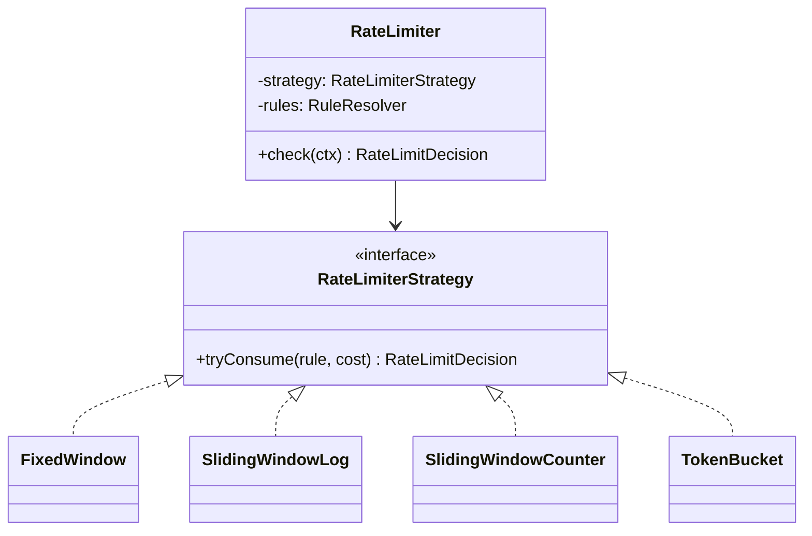

# LLD: Rate Limiter Class Design (System Design Se Alag)

> **Builds on**: [[79-blog-rate-limiting]] (algorithms ka overview) aur [[106-rate-limiting-at-the-edge-hinglish]] (limit kahan lagni chahiye). **HLD version ke liye System Design tab dekho** -- wahan poora Rate Limiter system design hai. Ye lesson sirf **class design** round ke liye hai.

## 1. Pehle Framing: Ye Wo Sawaal Nahi Hai Jo Aap Soch Rahe Hain

"Design a rate limiter" do bilkul alag rounds mein, same words ke saath poocha jaata hai:

| | System Design (HLD) | LLD / Class Design |
|---|---|---|
| Asal sawaal | "100M users ke liye limit kahan enforce hogi?" | "`RateLimiter` class ka code dikhao" |
| Aap discuss karte ho | edge vs gateway vs service, Redis cluster, hot keys | interface, strategy, state, clock, return type, testability |
| Output | boxes aur arrows | classes aur methods |
| Galti | code likhne lag jaana | "Redis sharding karunga" bolkar time khatam karna |

Interviewer bole *"show me the classes"* -- tab Redis topology off-topic hai.

## 2. Requirements (2 Minute, Skip Mat Karo)

- Limit **kiske** liye -- user, IP, API key, endpoint? (Answer: identity **caller** decide karega, library nahi.)
- Multiple rules ek saath? (`100/min per user` **aur** `10/sec per IP`)
- Burst allowed? (Ye seedha algorithm choose karwata hai.)
- State kahan -- ek process ki memory ya shared Redis?

## 3. Core Interface: Boolean Return Mat Karo

`allow(): boolean` likhne wala candidate turant pakda jaata hai. Caller ko HTTP response banane ke liye teen cheezein chahiye: kitna bacha, kab reset hoga, aur kitni der baad retry kare (`429` + `Retry-After`).

```ts
export interface RateLimitDecision {
  allowed: boolean;
  limit: number;           // X-RateLimit-Limit
  remaining: number;       // X-RateLimit-Remaining
  resetAfterMs: number;    // X-RateLimit-Reset
  retryAfterMs: number;    // 0 jab allowed, warna client kitna ruke
}

export interface RateLimitRule {
  key: string;             // "user:42:POST /orders"
  limit: number;
  windowMs: number;
  burst?: number;          // token bucket ke liye
}

export interface RateLimiterStrategy {
  // cost = ek request kitne units khaa rahi hai (bulk API = 10, normal = 1)
  tryConsume(rule: RateLimitRule, cost?: number): Promise<RateLimitDecision>;
}
```

`tryConsume` async kyun jab in-memory version sync hai? Kyunki kal yahi interface Redis-backed implementation ko bhi fit karna chahiye. **Async interface sync implementation ko allow karta hai, ulta nahi hota.**

## 4. Strategy Pattern: Chaar Algorithms, Ek Interface



Yahan Strategy apni jagah **genuinely earn** karta hai ([[71-parking-lot-lld-review]] ki seekh: pattern tab daalo jab variation asli ho):

| Strategy | Memory per key | Boundary burst | Kab use karein |
|---|---|---|---|
| **Fixed window** | 1 counter | Haan -- border par 2x nikal jaata hai | Simplest, internal APIs |
| **Sliding window log** | N timestamps | Nahi -- exact | Low-volume strict limits (OTP, login) |
| **Sliding window counter** | 2 counters | Lagbhag nahi (approximation) | Default production choice |
| **Token bucket** | 2 numbers | Controlled burst **by design** | Public APIs, burst allowed |

Fixed window ka boundary problem concretely: limit `100/min`. User 11:00:59 par 100 requests maarta hai, 11:01:00 par 100 aur -- do second mein 200. Sliding window isliye exist karta hai.

## 5. Poora Token Bucket

Bucket mein `capacity` tokens aate hain, constant rate se refill hote hain, har request ek token khaati hai. Khaali -> reject. Bhara tha -> burst allowed.

Asli trick: hum timer **nahi** chalate. Tokens **lazily** calculate karte hain jab request aati hai -- 1M keys par per-key interval suicide hai.

```ts
type Bucket = { tokens: number; lastRefillMs: number };

export class TokenBucketStrategy implements RateLimiterStrategy {
  private buckets = new Map<string, Bucket>();

  constructor(private readonly clock: Clock) {}

  async tryConsume(rule: RateLimitRule, cost = 1): Promise<RateLimitDecision> {
    const capacity = rule.burst ?? rule.limit;
    const refillPerMs = rule.limit / rule.windowMs;   // 100/60000 tokens per ms
    const now = this.clock.now();

    let b = this.buckets.get(rule.key);
    if (!b) {
      b = { tokens: capacity, lastRefillMs: now };    // naya caller full bucket se
      this.buckets.set(rule.key, b);
    }

    // Lazy refill: pichhle touch se ab tak kitne tokens bane
    b.tokens = Math.min(capacity, b.tokens + Math.max(0, now - b.lastRefillMs) * refillPerMs);
    b.lastRefillMs = now;

    const resetAfterMs = Math.ceil((capacity - b.tokens) / refillPerMs);
    if (b.tokens >= cost) {
      b.tokens -= cost;
      return { allowed: true, limit: capacity, remaining: Math.floor(b.tokens), resetAfterMs, retryAfterMs: 0 };
    }
    // Reject par token deduct NAHI karte -- warna retry karta client kabhi recover nahi karega
    return {
      allowed: false, limit: capacity, remaining: 0, resetAfterMs,
      retryAfterMs: Math.ceil((cost - b.tokens) / refillPerMs),
    };
  }
}
```

## 6. Clock Injection: Sabse Achcha Answer, Sabse Zyada Miss Kiya Jaane Wala

Interviewer poochega: *"Is class ko test kaise karoge?"*

Agar code mein `Date.now()` directly likha hai, to "100 requests per minute" test karne ke liye test ko **ek minute sona padega** -- ya aap `setTimeout` wala flaky test likhoge jo CI par random fail hoga.

Fix ek line ka hai: time ko dependency bana do.

```ts
export interface Clock { now(): number; }
export const systemClock: Clock = { now: () => Date.now() };

export class FakeClock implements Clock {
  constructor(private t = 0) {}
  now() { return this.t; }
  advance(ms: number) { this.t += ms; }   // test time instantly aage
}
```

```ts
const clock = new FakeClock();
const limiter = new TokenBucketStrategy(clock);
const rule = { key: 'user:1', limit: 10, windowMs: 1000 };

for (let i = 0; i < 10; i++) expect((await limiter.tryConsume(rule)).allowed).toBe(true);
expect((await limiter.tryConsume(rule)).allowed).toBe(false);   // bucket khaali
clock.advance(500);                                             // aadha second "beeta"
expect((await limiter.tryConsume(rule)).allowed).toBe(true);     // 5 tokens refill
```

Deterministic aur instant. General principle: **time, randomness aur ID generation -- teenon inject karo, warna class untestable hai.**

## 7. State Kahan Rahegi?

```
Request -> [Pod A: Map]    Pod A ko pata nahi Pod B ne kya count kiya
        -> [Pod B: Map]    4 pods, limit 100 -> effective limit 400
```

In-memory `Map` sirf ek process ka sach hai. Isliye storage bhi interface ke peeche:

```ts
export interface RateLimitStore {
  // Atomic hona ZAROORI hai -- network par read-modify-write ek race hai
  consume(key: string, cost: number, rule: RateLimitRule, now: number): Promise<Bucket>;
}
```

- **MemoryStore**: Node single-threaded, aur `tryConsume` mein koi `await` nahi -- ek process ke andar atomic. Multi-pod par galat.
- **RedisStore**: `GET` -> calculate -> `SET` teen round trips hain aur beech mein race -- wahi check-then-act problem [[26-duplicate-email-race-condition]] wali. Fix: **Lua script** jo Redis ke andar atomically chale. Aur Redis down ho to **fail-open** (traffic jaane do) aksar sahi hai -- limiter khud outage ka reason nahi banna chahiye ([[83-redis-down-database-stampede]]).

Chhota par asli point: `Map` mein har naye user ki key add hoti rahegi -- idle buckets evict karne padenge, wahi [[119-lld-lru-cache]] wala LRU/TTL kaam.

## 8. Per-User Aur Per-Endpoint Rules

Ek caller par aksar multiple rules lagte hain. Design: rules resolve karo, **sab** check karo, sabse strict jeete.

```ts
interface RuleResolver { resolve(ctx: RequestContext): RateLimitRule[]; }

export class RateLimiter {
  constructor(private strategy: RateLimiterStrategy, private rules: RuleResolver) {}

  async check(ctx: RequestContext): Promise<RateLimitDecision> {
    const decisions = await Promise.all(
      this.rules.resolve(ctx).map((r) => this.strategy.tryConsume(r, ctx.cost ?? 1)),
    );
    const denied = decisions.filter((d) => !d.allowed);
    // Koi bhi rule reject kare to request reject -- aur sabse lamba retryAfter batao
    if (denied.length) return denied.sort((a, b) => b.retryAfterMs - a.retryAfterMs)[0];
    return decisions.sort((a, b) => a.remaining - b.remaining)[0];   // tightest headroom
  }
}
```

Subtle bug jo interviewer dhoondta hai: rule #1 pass hua aur #2 reject -- rule #1 ka token already consume ho gaya, "wasted". Strictly correct design pehle sabko *peek* karega, phir commit. Practically log ise accept kar lete hain, par **dekha hai ye bolna zaroori hai**.

## 9. Common Galtiyan

- `allow(): boolean` return karna -> client ko `Retry-After` nahi de paayenge.
- `Date.now()` hard-code karna -> test ko sleep karna padega, CI flaky.
- Millions keys par sliding window **log** use karna -> per key N timestamps, memory blast.
- Reject par token deduct karna -> retry karta client kabhi recover nahi karega.
- Idle keys ka cleanup na karna -> unbounded `Map`.
- LLD round mein Redis cluster topology discuss karna, classes nahi dikhana.
- Limit sirf app layer par rakhna jab actual flood edge par rokna chahiye tha ([[106-rate-limiting-at-the-edge-hinglish]]).

## 10. 🧠 Remember

> Class-design round mein rate limiter ka asli jawab algorithm nahi hai (wo swappable strategy hai) -- asli jawab hai inject kiya hua `Clock` taaki test deterministic ho, decision object taaki `Retry-After` de sako, aur interface ke peeche chhupaayi gayi state taaki memory se Redis par ja sako.

## 11. Quick Self-Test

1. Fixed window ke boundary par limit se double traffic kaise nikal jaata hai -- numbers ke saath.
2. `Clock` inject karne se kaunsa test possible ho jaata hai jo pehle nahi tha?
3. `tryConsume` ko async kyun banaya jab in-memory implementation sync hai?
4. Reject hone par token deduct karna kyun galat hai?
5. Redis store mein `GET` -> calculate -> `SET` kyun galat hai, aur fix kya?
6. Ek caller par do rules hain, ek pass aur doosra fail -- kya problem hai?
