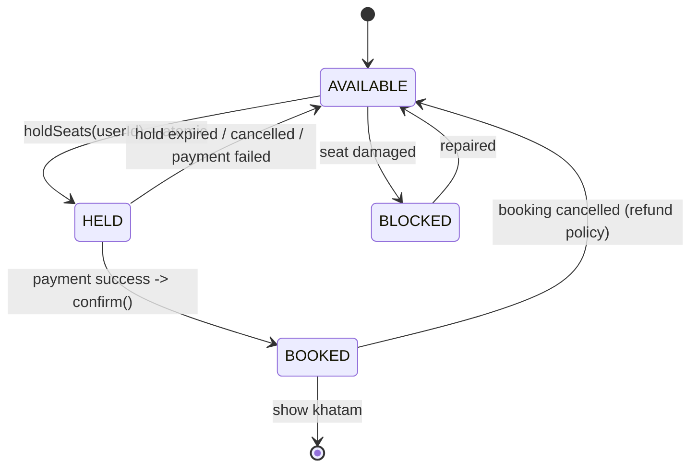

# LLD: BookMyShow Seat Booking (Concurrency Wala Asli Sawaal)

> **Builds on**: [[71-parking-lot-lld-review]] (shared resource allocation atomic hona chahiye) aur [[32-payment-idempotency-double-click]] (payment + double-charge). Traffic shape ke liye [[111-fair-queue-flash-sale-bots-hinglish]].

## 1. Story

Friday 12:00 AM, nayi film ki booking khuli. 40,000 log ek saath app kholte hain. Ek show ke 180 seats hain.

Rohit aur Priya exactly same moment par seat **H7** par tap karte hain. Dono ko "Proceed to payment" dikhta hai. Dono ka paisa kat jaata hai. Theatre par pata chalta hai ki H7 ek hi hai.

Ye question entities ke baare mein **nahi** hai -- entities 5 minute ka kaam hai. Interviewer poore time ek hi cheez dekh raha hai: *do users ek hi seat par click karte hain to aapka design kya karta hai?*

## 2. Entities (Jaldi Nikaalo, Yahan Ruko Nahi)

```ts
class Movie   { id!: string; title!: string; durationMin!: number; }
class Theatre { id!: string; name!: string; city!: string; screens!: Screen[]; }
class Screen  { id!: string; theatreId!: string; seats!: Seat[]; }     // physical layout
class Seat    { id!: string; screenId!: string; row!: string; number!: number;
                type!: 'REGULAR' | 'PREMIUM' | 'RECLINER'; }
class Show    { id!: string; movieId!: string; screenId!: string; startsAt!: Date; }

// Sabse important entity -- aur yahi candidates bhool jaate hain
class ShowSeat {
  id!: string; showId!: string; seatId!: string;
  status!: SeatStatus;
  price!: number;              // pricing show-level hai (weekend/evening alag)
  heldBy!: string | null;
  holdExpiresAt!: Date | null;
  version!: number;            // optimistic locking -- Section 5
}

class Booking { id!: string; showId!: string; userId!: string;
                showSeatIds!: string[]; status!: BookingStatus; amount!: number; }
```

**Pehla design insight jo bolna chahiye:** `Seat` aur `ShowSeat` alag hain. Seat H7 theatre mein ek hai, par 6 PM show mein booked aur 9 PM show mein free ho sakti hai. Jo candidate `Seat.isBooked` boolean rakhta hai, wo pehle minute mein galat model bana deta hai.

## 3. Hold-Then-Confirm Model

Booking **ek step nahi** hai. Teen hain, aur beech mein ek insaan payment page par 3 minute laga raha hai.

```
1. HOLD      seats 7 minute ke liye apne naam par -- atomic, fast
2. PAY       payment gateway -- slow, external, fail ho sakta hai
3. CONFIRM   payment success -> hold ko permanent booking banao
```

Hold ke bina do options, dono bure:
- **Pehle payment, phir seat assign**: paisa kat gaya aur seat chali gayi -> refund + angry customer.
- **Pehle book, phir payment maango**: user tab band kar de -> seat permanently blocked, paisa aaya hi nahi.

Hold = **expiry wala reservation**. Seat temporarily meri hai, par paisa na doon to wapas pool mein.

## 4. Seat State Machine



Illegal transitions jo code ko reject karni chahiye: `AVAILABLE -> BOOKED` (hold skip karke), `BOOKED -> HELD`, `BLOCKED -> HELD`. Ye teen explicitly bolna interviewer ko signal deta hai ki state machine complete hai.

## 5. Asli Jawab: Optimistic Locking, Lamba Transaction Nahi

Naye candidate ka pehla instinct:

```ts
// GALAT -- ye production mein database gira dega
await db.transaction(async (tx) => {
  await tx.query('SELECT * FROM show_seats WHERE id = ANY($1) FOR UPDATE', [ids]);
  await paymentGateway.charge(card, amount);   // <-- 3 se 30 second, external network
  await tx.query('UPDATE show_seats SET status = $1 WHERE id = ANY($2)', ['BOOKED', ids]);
});
```

Kyun disaster hai: transaction **payment gateway ke across** khula hai. 40,000 concurrent users = 40,000 open transactions, har ek rows par lock liye baitha. Connection pool khatam ([[103-n-plus-1-vs-connection-pool-hinglish]]) -- 20 connections 20 users ne payment page par baithkar hog kar liye. Gateway timeout hua to locks kab chhutenge? **DB row lock milliseconds ke liye bana hai, minutes ke liye nahi.**

> Rule: database transaction ke andar kabhi external network call na karo.

Sahi approach -- hold ek chhota atomic UPDATE hai jo apni hi condition check karta hai:

```sql
UPDATE show_seats
   SET status = 'HELD', held_by = $userId, hold_expires_at = $expiry, version = version + 1
 WHERE id = ANY($seatIds)
   AND (status = 'AVAILABLE'
        OR (status = 'HELD' AND hold_expires_at < now()))   -- expired hold reclaim
```

Yahi **optimistic locking** hai: lock lete nahi, *assume* karte hain ki kuch nahi badla, aur `WHERE` clause se verify karte hain. `rowCount` sach batata hai. Rohit aur Priya dono ye UPDATE chalaate hain; database row-level atomicity guarantee karta hai, to ek ko `rowCount = 1` milta hai aur doosre ko `0`. Koi explicit lock nahi, koi lamba transaction nahi.

## 6. `holdSeats` Poora Code

```ts
const HOLD_TTL_MS = 7 * 60 * 1000;   // payment ke liye kaafi, inventory ke liye tolerable

export class SeatHoldError extends Error {
  constructor(public readonly takenSeatIds: string[]) { super('SEATS_NO_LONGER_AVAILABLE'); }
}

export class BookingService {
  constructor(private db: Db, private clock: Clock, private holdQueue: DelayQueue) {}

  async holdSeats(showId: string, seatIds: string[], userId: string): Promise<Hold> {
    if (seatIds.length === 0 || seatIds.length > 10) throw new Error('INVALID_SEAT_COUNT');
    const now = this.clock.now();
    const expiresAt = new Date(now + HOLD_TTL_MS);
    // Deterministic order -- same seats par do requests ko same sequence mile (deadlock risk kam)
    const ids = [...new Set(seatIds)].sort();

    // Ek hi statement. Ya saari seats, ya ek bhi nahi.
    const { rows } = await this.db.query<{ id: string }>(
      `UPDATE show_seats
          SET status = 'HELD', held_by = $1, hold_expires_at = $2, version = version + 1
        WHERE show_id = $3 AND id = ANY($4::uuid[])
          AND (status = 'AVAILABLE' OR (status = 'HELD' AND hold_expires_at < $5))
        RETURNING id`,
      [userId, expiresAt, showId, ids, new Date(now)],
    );

    if (rows.length !== ids.length) {
      // Partial success bekaar hai -- 4 chahiye thi, 3 se kaam nahi chalega.
      // Jo mili unko turant chhodo, warna wo 7 minute block rahengi.
      const got = rows.map((r) => r.id);
      if (got.length) await this.releaseSeats(got, userId);
      throw new SeatHoldError(ids.filter((id) => !got.includes(id)));
    }

    const hold = await this.db.insertHold({ id: randomUUID(), showId, seatIds: ids, userId, expiresAt });
    await this.holdQueue.enqueue('expire-hold', { holdId: hold.id }, { delayMs: HOLD_TTL_MS });
    return hold;
  }

  async confirm(holdId: string, paymentRef: string): Promise<Booking> {
    // Payment ALREADY ho chuka -- ye method sirf state badalta hai, external call nahi karta
    return this.db.transaction(async (tx) => {
      const hold = await tx.getHoldForUpdate(holdId);
      // Payment ke beech hold expire ho gaya? Honest answer: auto-refund + saaf error.
      if (!hold || hold.expiresAt.getTime() < this.clock.now()) throw new Error('HOLD_EXPIRED');

      const { rowCount } = await tx.query(
        `UPDATE show_seats SET status = 'BOOKED', version = version + 1
          WHERE id = ANY($1::uuid[]) AND status = 'HELD' AND held_by = $2`,
        [hold.seatIds, hold.userId],
      );
      if (rowCount !== hold.seatIds.length) throw new Error('HOLD_NO_LONGER_VALID');
      // idempotencyKey = holdId -> double-click par do booking nahi banegi
      return tx.insertBooking({ id: randomUUID(), holdId, ...hold, status: 'CONFIRMED', paymentRef });
    });
  }
}
```

`confirm()` ke andar koi payment call nahi hai -- wo pehle ho chuka. Ye transaction 2 rows likhta hai aur millisecond mein khatam.

## 7. Hold Ko Expire Kaun Karta Hai?

| Mechanism | Kaam | Kamzori |
|---|---|---|
| **Lazy / passive** | `WHERE hold_expires_at < now()` -> agla khareedar khud reclaim karta hai | Jo seat koi dobara nahi maangta wo UI par "unavailable" dikhti rahegi |
| **Active** | delayed job (BullMQ `delay`, SQS delay) 7 minute baad status `AVAILABLE` kar de | Worker down, job lost ho sakti hai |

Correctness **lazy** se aati hai (wo kabhi galat nahi hota), UI ki accuracy **active** se. Lazy ko source of truth banao, active ko cleanup. Scheduling ki asli complexity -- missed jobs, retries, millions of timers -- [[98-job-scheduler-millions-hinglish]] mein hai, timezone/DST trap [[67-dst-scheduled-jobs]] mein.

Active expiry bhi atomic hona chahiye, warna confirmed booking tod degi:

```sql
UPDATE show_seats SET status = 'AVAILABLE', held_by = NULL, hold_expires_at = NULL
 WHERE id = ANY($1) AND status = 'HELD' AND held_by = $2 AND hold_expires_at < now()
-- status = 'HELD' ka check hi BOOKED seat ko bachata hai
```

## 8. Production Reality

- **Payment webhook se confirm karo**, browser redirect se nahi. User tab band kare to bhi paisa aaya hai. Webhook duplicate aa sakta hai -> `holdId` ko idempotency key banao ([[19-idempotent-consumer-duplicate-events]], [[32-payment-idempotency-double-click]]).
- **Seat map read-heavy hai, write-heavy nahi.** 40,000 log layout dekh rahe hain -- Redis mein cache karo, 1-2 second staleness accept karo.
- **Stale UI inevitable hai.** User ka seat map 3 second purana hoga. `holdSeats` hi authority hai, UI nahi.
- **Counter column mat banao.** `shows.available_count` jaisa ek row saare writes ka contention point ban jaayega; per-seat rows par contention 180 rows par bantta hai.
- **Bots**: popular show par aadha traffic scalpers. Per-user hold limit (max 10 seats, 1 active hold) + fair queue ([[111-fair-queue-flash-sale-bots-hinglish]], [[120-lld-rate-limiter-class-design]]).

## 9. Honest Trade-off (Ye Zaroor Boliye)

Hold ka seedha matlab: **kuch seats kuch minute ke liye un logon ko unavailable dikhengi jo actually khareedne wale the, kyunki koi aur unhe hold karke payment page par baitha hai -- aur chhod bhi sakta hai.**

Ye bug nahi, deliberate business choice hai. Hold ke bina double-booking hoti hai; uska cost = refund + support ticket + theatre par tamasha + brand damage. Hold ke saath kuch minute ki artificial scarcity hoti hai; cost = kuch users ko "sold out" dikha jo nahi tha. Industry doosra option chunti hai.

TTL isi trade-off ka dial hai: **chhota TTL** (3 min) = inventory jaldi free par slow payment wale fail honge; **bada TTL** (15 min) = payment comfortable par sold-out illusion lamba. 5-10 minute standard hai, aur UI par countdown timer isliye zaroori hai.

## 10. Common Galtiyan

- `Seat.isBooked` boolean rakhna -> ek seat multiple shows mein hai, model hi toot gaya.
- Payment call DB transaction ke andar -> pool exhaustion, lambe locks.
- Partial hold accept karna -> user ko 2 of 4 seats, aur 2 seats blocked.
- Hold expiry ke liye sirf background job par bharosa -> job miss hui to seat hamesha blocked.
- Expiry UPDATE mein `status = 'HELD'` check bhool jaana -> confirmed booking release ho gayi.
- "Redis distributed lock lagaunga" kehna jab DB ka ek conditional UPDATE kaafi tha ([[44-distributed-locking-with-redis]] -- lock tab chahiye jab resource DB ke bahar ho).

## 11. 🧠 Remember

> Seat booking ek atomic operation nahi, do hain -- ek millisecond ka conditional UPDATE jo seat ko expiry ke saath HOLD karta hai, aur uske baad payment, transaction ke bahar; aur ye maan lena ki kuch seats kuch minute ke liye jhooth-much unavailable dikhengi, double-booking se kaafi sasta hai.

## 12. Quick Self-Test

1. `Seat` aur `ShowSeat` alag kyun? Ek concrete example jahan merge karne se bug aayega.
2. Payment call DB transaction ke andar rakhne se 40,000 concurrent users par exactly kya tootega?
3. Optimistic locking mein `rowCount = 0` ka business meaning kya hai, aur user ko kya dikhaayenge?
4. Hold expire karne ke liye lazy check aur background job -- dono kyun chahiye?
5. Expiry UPDATE se `status = 'HELD'` condition hata dein to kaunsa serious bug aayega?
6. Hold TTL 3 se 15 minute karne par kaunse do metrics ulti direction mein jaayenge?
