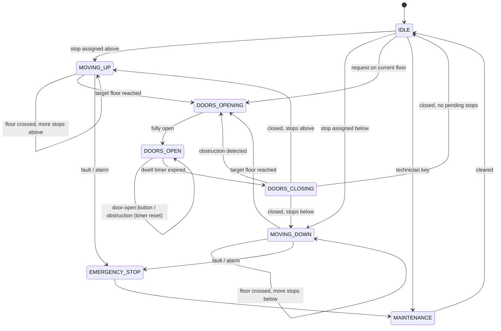

# LLD: Elevator System Design Karo

> **Builds on**: [[71-parking-lot-lld-review]] (state modelling aur strategy kab laani hai) aur [[121-lld-bookmyshow-seat-booking]] (state machine se illegal transitions band karna).

## 1. Story

20-floor office building, 9:15 AM, lobby mein 60 log, building mein 4 lifts.

Aap 5th floor par button dabate ho. Ek lift aati hai -- jo 18th floor par thi, neeche aa rahi thi, aapke 5th ko **paar karke** lobby gayi, phir wapas upar chali, aur 5th par dobara rukti hai.

Aap sochte ho: *"ye lift pagal hai."* Wo pagal nahi hai -- uska **scheduling policy** ghatiya hai. Elevator question mein yahi asli content hai.

## 2. Ye Question Kis Baare Mein Hai

Candidates `Elevator`, `Button`, `Floor` classes bana dete hain aur samajhte hain kaam ho gaya. Interviewer do cheezein dekh raha hai:

1. **State machine** -- complete hai? koi illegal transition reachable hai?
2. **Scheduling policy** -- request kis lift ko do, aur ek lift apne stops kis order mein serve kare?

Baaki sab 5 minute ka boilerplate hai. Ye question ek **state machine + ek scheduling policy** hai, aur kuch nahi.

## 3. Entities

```ts
enum Direction { UP = 'UP', DOWN = 'DOWN', IDLE = 'IDLE' }
enum DoorState { OPEN = 'OPEN', CLOSING = 'CLOSING', CLOSED = 'CLOSED' }

// Do bilkul alag requests -- Section 7 mein kyun matter karta hai
type Request =
  | { kind: 'HALL'; floor: number; direction: Direction.UP | Direction.DOWN }  // bahar ka button
  | { kind: 'CAR'; floor: number; carId: string };                            // andar ka button

class Elevator {
  id!: string;
  currentFloor = 0;
  state: ElevatorState = 'IDLE';
  direction = Direction.IDLE;
  door = DoorState.CLOSED;
  capacityKg!: number;
  // Do sets, direction ke hisaab se -- yahi SCAN ka dil hai
  upStops = new Set<number>();
  downStops = new Set<number>();
}

class ElevatorController {   // requests ko lifts par baantta hai
  constructor(private cars: Elevator[], private strategy: DispatchStrategy) {}
}
```

Ek chhoti par important baat: **`IDLE` ko `Direction` enum mein rakhna debatable hai** -- idle ek movement state hai, direction nahi. Kuch designs `direction: Direction | null` rakhte hain. Ye bolna dikhata hai ki aap modelling soch rahe ho, ratta nahi maar rahe.

## 4. State Machine



**Illegal transitions jo explicitly bolni chahiye** -- interviewer isi par marks deta hai:

| Illegal | Kyun |
|---|---|
| `MOVING_UP -> DOORS_OPEN` | Chalti lift mein darwaza nahi khulega. Beech mein rukna zaroori hai. |
| `DOORS_OPEN -> MOVING_*` | `DOORS_CLOSING -> CLOSED` se guzarna hi padega. Safety invariant. |
| `MOVING_UP -> MOVING_DOWN` | Direction sirf stop ke baad badalti hai, chalte-chalte nahi. |
| `MAINTENANCE -> MOVING_*` | Pehle `IDLE` par aao, tab dispatch eligible. |

> Har safety-critical system ka asli design uski **illegal** transitions mein hai, legal transitions mein nahi.

## 5. Scheduling Strategies Compare

Sawaal: `HALL` request aayi -- floor 5, UP. Kis lift ko do?

| Strategy | Kaise | Problem |
|---|---|---|
| **FCFS** | Requests queue mein, ek-ek pura karo | Lift 1 -> 20 -> 2 -> 19 bhaagti rahegi, beech ke floors cross karke bhi nahi rukti. Mechanically bhi ghiss jaati hai. |
| **Nearest car** | Jo lift floor-distance mein sabse paas | **Direction ignore karta hai** -- paas wali lift ulti ja rahi ho to poora round trip wait. Plus starvation: top floor kabhi serve nahi hota jab traffic middle mein hai. |
| **SCAN / elevator algorithm** | Ek direction mein chalte raho, raaste ke saare same-direction stops serve karo, phir reverse | Implement complex, reverse ka decision carefully handle karna padta hai |
| **LOOK** | SCAN ka optimization: us direction ke aakhri stop tak jao, poore end tak nahi | Wahi complexity |

**Asli lifts SCAN/LOOK chalaati hain** -- OS disk scheduling mein bhi yahi algorithm hai (same problem, same solution).

### Direction, Distance Se Zyada Important Kyun Hai

Request: **floor 5, UP**.

```
  Lift A: floor 6, MOVING_DOWN ---> 1      distance = 1
  Lift B: floor 2, MOVING_UP   ---> 10     distance = 3

  Nearest-car chunega A  |  SCAN chunega B
```

A ko kya karna padega: 1 tak neeche, passengers utaro, reverse, phir 5 tak upar -- effective wait **9 floors ka travel**. B kya karega: 3, 4, 5 -- aur wo already UP ja raha hai, to user ko seedha 10 tak le jaayega -- effective wait **3 floors**.

> Jo lift aapki taraf, aapki hi direction mein aa rahi hai, wo paas wali ulti-direction lift se hamesha better hai. Yahi SCAN ka poora insight hai.

## 6. Code: Pluggable Dispatch Strategy

```ts
export interface DispatchStrategy {
  pick(cars: Elevator[], req: Extract<Request, { kind: 'HALL' }>): Elevator | null;
}

// Baseline -- simple, aur isse compare karna aasan
export const nearestCar: DispatchStrategy = {
  pick(cars, req) {
    return cars
      .filter((c) => c.state !== 'MAINTENANCE' && c.state !== 'EMERGENCY_STOP')
      .sort((a, b) => Math.abs(a.currentFloor - req.floor) - Math.abs(b.currentFloor - req.floor))[0]
      ?? null;
  },
};

// Jo interviewer sunna chahta hai: direction-aware cost function
export const scanDispatch: DispatchStrategy = {
  pick(cars, req) {
    const scored = cars
      .filter((c) => c.state !== 'MAINTENANCE' && c.state !== 'EMERGENCY_STOP')
      .map((c) => ({ car: c, cost: estimateCost(c, req) }))
      .sort((a, b) => a.cost - b.cost);
    return scored[0]?.car ?? null;
  },
};

const REVERSAL_PENALTY = 1000;   // tune karne ki cheez, fixed truth nahi

function estimateCost(car: Elevator, req: { floor: number; direction: Direction }): number {
  const gap = Math.abs(car.currentFloor - req.floor);
  if (car.direction === Direction.IDLE) return gap;   // free lift -- sirf distance

  const movingToward =
    (car.direction === Direction.UP && req.floor >= car.currentFloor) ||
    (car.direction === Direction.DOWN && req.floor <= car.currentFloor);
  const sameDirection = car.direction === req.direction;

  if (movingToward && sameDirection) return gap;                      // free pickup
  if (movingToward && !sameDirection) return gap + REVERSAL_PENALTY;  // ek reversal
  return gap + REVERSAL_PENALTY * 2;                                  // door ja rahi hai
}

export class ElevatorController {
  constructor(private cars: Elevator[], private strategy: DispatchStrategy) {}

  // Bahar ka button: kaunsi lift aaye, ye CONTROLLER decide karta hai
  handleHallRequest(req: Extract<Request, { kind: 'HALL' }>): Elevator | null {
    const car = this.strategy.pick(this.cars, req);
    if (!car) return null;        // saari lifts out of service -> UI par batao
    addStop(car, req.floor);
    return car;
  }

  // Andar ka button: lift already decided -- koi dispatch decision nahi
  handleCarRequest(req: Extract<Request, { kind: 'CAR' }>): void {
    const car = this.cars.find((c) => c.id === req.carId);
    if (!car) throw new Error('UNKNOWN_CAR');
    addStop(car, req.floor);
  }
}

// Stop ko sahi "sweep" mein daalna -- yahi SCAN ko kaam karne deta hai
function addStop(car: Elevator, floor: number): void {
  if (floor === car.currentFloor && car.door !== DoorState.CLOSED) return;
  if (floor > car.currentFloor) car.upStops.add(floor);
  else if (floor < car.currentFloor) car.downStops.add(floor);
  if (car.direction === Direction.IDLE) {
    car.direction = floor > car.currentFloor ? Direction.UP : Direction.DOWN;
  }
}

// Har stop par: isi direction mein aur stop bacha hai? haan -> chalo, nahi -> reverse
export function nextStop(car: Elevator): number | null {
  const up = [...car.upStops].sort((a, b) => a - b);
  const down = [...car.downStops].sort((a, b) => b - a);
  if (car.direction === Direction.DOWN) return down[0] ?? up[0] ?? null;
  return up[0] ?? down[0] ?? null;
}
```

`REVERSAL_PENALTY` ek constant rakhna hi design decision hai: wo batata hai "ek reversal kitne floors ke barabar bura hai." Real systems ise travel time, door dwell aur current load se calculate karte hain.

## 7. Wo Sawaal Jo Candidates Ko Alag Karte Hain

### HALL (bahar) vs CAR (andar) Request

| | HALL button | CAR button |
|---|---|---|
| Information | floor **+ direction** | sirf floor |
| Kaun handle karta hai | **Controller** -- lift choose karni hai | **Wo hi lift** -- choice nahi hai |
| Cancel kab | koi lift us floor par us direction mein ruke | wo lift us floor par ruke |

Subtle consequence: ek HALL request ko **do lifts serve kar sakti hain** -- dono us floor se us direction mein guzren to request dono se clear honi chahiye, warna ek lift khaali floor par rukegi ("ghost stop"). Ye real buildings mein hota hai, aur ise bolna strong signal hai.

### 1 Lift vs 8 Lifts

| | 1 lift | 8 lifts |
|---|---|---|
| Problem | **Sequencing** -- stops ka order | **Assignment** -- kis lift ko |
| Strategy | Pure SCAN kaafi, dispatch ka sawaal hi nahi | Cost function + load balancing |
| Nayi cheezein | -- | idle lifts ki **parking** (lobby par), **zoning** (1-4 = floors 1-10, 5-8 = 11-20), peak-hour modes |
| Failure | ek lift down = building down | graceful degradation, baaki 7 chalti rahengi |

8 lifts par **morning up-peak** vs **evening down-peak** aata hai -- real systems traffic pattern detect karke policy badalte hain (9 AM: idle lifts lobby par parked; 6 PM: upar distributed).

### Door Timing

`DOORS_OPEN` ek **dwell timer** se chalta hai, aur wo reset hona chahiye jab obstruction sensor trigger ho, "door open" button dabe, ya accessibility mode on ho. `CLOSING -> OPENING` (obstruction) wali transition bahut log miss karte hain. Dwell typically 3-5 second; bahut chhota = log phas jaate hain, bahut bada = throughput gir jaata hai.

Code mein timer ko **inject** karo, hard-code nahi -- wahi `Clock` injection jo [[120-lld-rate-limiter-class-design]] mein thi. `setTimeout` directly use karoge to door-timing test real seconds lega aur CI par flaky hoga.

## 8. Honest Note: Interviewer Actually Kya Chahta Hai

Ye **optimal scheduling algorithm** ka test nahi hai -- optimal elevator dispatch ek research problem hai, 45 minute mein nahi hoga. Interviewer teen cheezein dekhta hai:

1. **State machine complete hai** -- door, movement, maintenance, emergency; koi illegal transition reachable nahi.
2. **Aap HALL aur CAR ka farak samajhte ho** -- ye bahut candidates miss karte hain.
3. **Aapne direction ko distance se zyada important bataya** -- yahi dikhata hai ki aapne socha hai.

"FCFS se shuru karta hoon, par wo raaste wale floors par nahi rukta, isliye SCAN; aur multiple lifts ke liye direction-aware cost function" -- bol diya to core answer ho gaya. Baaki bonus hai.

## 9. Common Galtiyan

- Sirf ek `targetFloor` rakhna, stops ka set nahi -> lift ek baar mein ek hi person serve karegi.
- HALL aur CAR ko same treat karna -> direction information kho gayi, SCAN kaam hi nahi karega.
- `MOVING -> DOORS_OPEN` allow kar dena -> safety violation, interviewer turant pakdega.
- `DOORS_CLOSING -> DOORS_OPENING` (obstruction) transition miss karna.
- Nearest-car ko final answer bolkar ruk jaana, direction discuss na karna.
- Capacity/overload sensor bhool jaana -> full lift ko bhi stops assign hote rahenge.
- Pattern ke naam gina dena actual cost function dikhane se pehle ([[71-parking-lot-lld-review]] wali hi galti).

## 10. 🧠 Remember

> Elevator question ek state machine plus ek scheduling policy hai -- state machine se illegal transitions band karo (chalti lift ka darwaza kabhi nahi khulta), aur policy mein yaad rakho ki jo lift aapki taraf aapki hi direction mein aa rahi hai wo paas wali ulti-direction lift se hamesha better hai.

## 11. Quick Self-Test

1. `MOVING_UP -> DOORS_OPEN` illegal kyun hai, aur sahi path kya hai?
2. HALL aur CAR request mein kaunsi ek extra information ka farak hai, aur usse scheduling mein kya badalta hai?
3. Floor 5 UP request; Lift A floor 6 par DOWN, Lift B floor 2 par UP -- kaunsi bheji jaaye aur kyun?
4. Nearest-car strategy mein starvation kaise ho sakta hai?
5. 1 lift se 8 lifts par jaane se problem ka nature kaise badal jaata hai?
6. `DOORS_CLOSING` se wapas `DOORS_OPENING` kaunse teen events par jaana chahiye?
