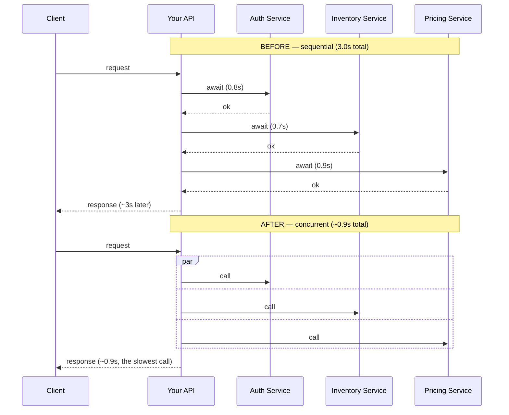

# Your API Takes 3 Seconds, But Every Metric Is Healthy

## 1. Story

An endpoint takes 3 seconds to respond. You check the dashboards: CPU is at 20%, memory at 30%, the database reports healthy with fast query times. You add more servers. Still 3 seconds. You spend a day optimizing the code — tightening loops, removing redundant logic. Still 3 seconds, to the millisecond.

## 2. The Problem

Every obvious lever you pulled targets **computation**: more servers (more compute capacity), leaner code (less compute work), a healthy database (fast data access). None of them touched the actual bottleneck, because none of them measure the one thing that's actually happening: **waiting**.

CPU and memory graphs only show you what's happening *while your code is running*. They show nothing about time your code spends **parked**, waiting for a network response from somewhere else.

## 3. Why This Is Hiding "In Plain Sight"

Recall [[01-concurrency-vs-parallelism]]: I/O-bound work means the CPU is free while waiting — that's *precisely* why this bottleneck produces 20% CPU. The server isn't struggling; it's idle, patiently waiting on a network call. Waiting produces no CPU spike, no memory pressure, and no database slowdown — so every standard resource dashboard reports "healthy" while the user still waits 3 full seconds.

The most common concrete cause: your endpoint calls several downstream dependencies (other internal services, or a third-party API) **sequentially** — `await`-ing one, then the next, then the next — instead of running the independent ones concurrently.

```
Auth service:      800ms  ┐
Inventory service:  700ms  ├─ awaited one after another = 3000ms total
Pricing service:    900ms  │
Recommendations:    600ms  ┘
```

## 4. The Solution

**If the calls are independent** (none needs another's result), run them concurrently instead of sequentially — total time becomes the *slowest single call*, not the *sum* of all of them.

**If one specific external dependency is unavoidably slow** (e.g. a third-party fraud-check API), consider:
- **Caching** its result if it doesn't need to be fetched fresh on every request.
- **A strict timeout + circuit breaker**, so a flaky dependency can't silently become "your" latency indefinitely.
- **Making it asynchronous** — return a fast initial response and complete the slow part via a webhook or a polling endpoint, instead of blocking the user for the full duration.

## 5. Mental Model

> Three seconds of *waiting* looks identical to three seconds of *computing* from the outside — but they need completely different fixes. If your resource graphs are all green, you're not computing. You're waiting on somebody else.

## 6. Flow



## 7. Code Example

```javascript
// BEFORE: sequential - total time = sum of every call
async function getOrderSummary(userId) {
  const auth = await authService.verify(userId);       // 0.8s
  const inventory = await inventoryService.get(userId); // 0.7s
  const pricing = await pricingService.get(userId);     // 0.9s
  return { auth, inventory, pricing };                  // ~2.4s+ total
}

// AFTER: concurrent - total time = the slowest single call
async function getOrderSummary(userId) {
  const [auth, inventory, pricing] = await Promise.all([
    authService.verify(userId),
    inventoryService.get(userId),
    pricingService.get(userId),
  ]);
  return { auth, inventory, pricing }; // ~0.9s total
}
```

## 8. Production Reality

This exact bug survives both horizontal scaling and code optimization sprints indefinitely, because neither lever touches it — which is exactly why teams often burn days chasing the wrong fix. The tool that actually makes it visible is **distributed tracing** (a timeline/Gantt view of every downstream call's start and end time for one request) — not a CPU/memory dashboard.

## 9. Trade-offs

- Running calls concurrently increases the **peak simultaneous load** each request places on downstream services (all N calls fire at once instead of trickling in) — worth confirming those services can handle that burst.
- Caching introduces staleness risk.
- Async/webhook patterns add complexity: the client now has to poll or receive a callback instead of getting one synchronous answer.

## 10. Common Mistakes

- Treating "scale more" and "optimize the code" as the only two categories of performance problem, and never considering the third, very common one: sequential I/O-bound waiting on external dependencies.
- Not having distributed tracing in place, so this exact class of bug is invisible until someone manually reads through logs correlating timestamps.

## 11. 🔗 Connection to Other Concepts

This is a direct, concrete application of [[01-concurrency-vs-parallelism]]: independent I/O-bound work that should overlap concurrently but is instead running one-after-another. It also connects to [[02-debugging-random-500-errors]]'s checklist item "check downstream dependencies" — the same instinct applies here even though this isn't an error, just unexplained latency.

## 12. 🧠 Remember

> If CPU, memory, and the database are all healthy but the response is still slow, you're not computing — you're waiting. Look at what your request is calling in sequence, not what it's calculating.

## 13. Quick Self-Test

1. Why does adding more servers not fix a single request's 3-second latency?
2. Why does optimizing your own code not help if the bottleneck is a downstream call?
3. If three independent downstream calls each take about 1 second, what's the fastest total time you could achieve, and how?
