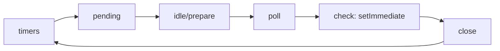

# Event Loop Ke Phases Aur Microtasks (Asli Order)

> **Connects to**: [[01-concurrency-vs-parallelism]] (ek core, kai tasks), [[109-cluster-worker-threads-child-process-hinglish]] (jab ek loop kaafi na ho) aur [[58-less-traffic-more-cpu]] (ek sync block poore server ko kaise girata hai).

## 1. Ye Sawaal Har Interview Mein Aata Hai, Aur Galat Jaata Hai

"Event loop kaise kaam karta hai?" -- 90% log jawab dete hain: *"Node single-threaded hai, async kaam queue mein jaata hai, loop uthata rehta hai."*

Ye galat nahi hai, par ye **ek queue** ka model hai. Asli Node mein **kai queues** hain, ek fixed order mein, aur unke beech ek alag microtask queue hai jo har baar drain hoti hai. Jab tak ye picture clear nahi hai, aap `setTimeout` vs `setImmediate` vs `nextTick` ka output guess karte reh jaayenge.

## 2. Chhe Phases, Isi Order Mein

Ek loop iteration (libuv ise "tick" bolta hai) in phases se guzarta hai:

| # | Phase | Isme kya chalta hai |
|---|---|---|
| 1 | **timers** | `setTimeout` / `setInterval` ke callbacks jinka time poora ho gaya |
| 2 | **pending callbacks** | OS-level deferred callbacks, jaise TCP error (`ECONNREFUSED`) |
| 3 | **idle, prepare** | Sirf libuv ka internal kaam -- aapka code yahan nahi aata |
| 4 | **poll** | **Naya I/O** -- socket readable, file read done, incoming HTTP request. Loop yahan **block** ho ke wait karta hai |
| 5 | **check** | `setImmediate` ke callbacks |
| 6 | **close callbacks** | `socket.on('close')`, `server.close()` wale callbacks |

Yaad rakhne ka sentence: **T-P-I-P-C-C** -- *timers, pending, idle, poll, check, close.*

Sabse zyada time **poll** mein jaata hai, kyunki ek HTTP server ka 99% kaam yahi hai: naye requests aur DB responses ka intezaar.



## 3. Microtask Queue -- Yahi Interview Decide Karta Hai

Phases **macrotasks** hain. Inke beech mein, aur **har ek callback ke baad**, Node do microtask queues poori drain karta hai, isi priority mein:

1. **`process.nextTick` queue** -- sabse pehle, poori khaali hone tak.
2. **Promise microtask queue** -- `.then` / `.catch` / `.finally` / `await` ke resume points.

Important: microtasks "beech mein" nahi, **beech mein aur pehle bhi** chalte hain. Synchronous code khatam hone ke turant baad, loop ke kisi bhi phase mein ghusne se pehle, ye queues drain hoti hain.

Mental model:

> Phases ek chaar manzil ki building ke floors hain. Microtask queue woh seedhi hai jise aapko **har floor change par poori** utarna padta hai. Jab tak seedhi khaali nahi hogi, agla floor shuru nahi hoga.

## 4. Pehle Predict Karo, Phir Chalao

```javascript
// file: order.js  -- chalane se pehle output likh lo
console.log('1 sync start');

setTimeout(() => console.log('5 setTimeout 0'), 0);
setImmediate(() => console.log('6 setImmediate'));

process.nextTick(() => {
  console.log('3 nextTick');
  process.nextTick(() => console.log('3.5 nested nextTick'));
});

Promise.resolve().then(() => console.log('4 promise then'));

console.log('2 sync end');
```

Output:

```
1 sync start
2 sync end
3 nextTick
3.5 nested nextTick      <- nested nextTick bhi promise se PEHLE
4 promise then
5 setTimeout 0           <- ya 6 pehle, neeche padho
6 setImmediate
```

Do seekh:

- `3.5` promise se pehle aaya kyunki nextTick queue **recursively** drain hoti hai -- jo naye nextTick us dauran add hue, wo bhi usi drain mein nikal jaate hain. Promise queue ko turn hi baad mein milta hai.
- **Honest baat**: main module mein `setTimeout(0)` aur `setImmediate` ka order **guaranteed nahi** hai. `0` ko Node `1` ms bana deta hai, aur process startup ka time 1 ms se kam ya zyada ho sakta hai -- isliye race hai. Node docs isi ko "non-deterministic" kehte hain.

Deterministic version: kisi bhi I/O callback ke **andar** `setImmediate` hamesha pehle chalega, kyunki hum poll phase mein hain aur **check** usi iteration mein agla phase hai, jabki timers ko next iteration ka wait karna padega.

```javascript
const fs = require('node:fs');
fs.readFile(__filename, () => {       // hum ab poll phase ke andar hain
  setTimeout(() => console.log('timeout'), 0);
  setImmediate(() => console.log('immediate'));
});
// Output: immediate, phir timeout -- hamesha.
```

## 5. Do Naam Jo Jhooth Bolte Hain

**`setTimeout(fn, 0)` 0 ms nahi hai.** Node ise minimum `1` ms banata hai, aur wo bhi "at least 1 ms" hai, "exactly" nahi. Callback tab chalega jab loop **timers phase tak pahunchega** aur usse pehle koi lamba sync kaam ya poll block na ho. 10 ms ka timer load ke time 300 ms baad bhi fire ho sakta hai -- timers **deadline** nahi, **earliest eligible time** dete hain.

**`setImmediate` immediate nahi hai.** Wo check phase mein chalta hai, yaani **current poll phase khatam hone ke baad**. Naam ulta hai: `setImmediate` deta hai *"abhi wale I/O cycle ke baad"*, aur `process.nextTick` deta hai *"literally agle instruction ke baad"*. Node ke docs khud kehte hain ki naam aapas mein badle hone chahiye the.

## 6. nextTick Starvation -- Isko Chalao Aur Dekho

Kyunki nextTick queue **poori** drain hoti hai aur usme add karna uske andar se allowed hai, ek recursive nextTick loop ko hamesha ke liye bhookha rakh sakta hai:

```javascript
setTimeout(() => console.log('main kabhi nahi chalunga'), 10);

function spin() {
  process.nextTick(spin);     // queue kabhi khaali nahi hogi
}
spin();
// CPU 100%, timer kabhi fire nahi hota, HTTP server naye request accept nahi karega
```

Yahi code `setImmediate(spin)` ke saath likho -- server zinda rahega, timer bhi fire hoga, kyunki `setImmediate` har iteration mein **sirf ek round** chalta hai aur loop ko poll phase mein jaane deta hai.

> Rule: lamba ya recursive kaam chahiye to `setImmediate` use karo, `process.nextTick` kabhi nahi.

## 7. Production Reality: Ek Sync Block Sabko Rok Deta Hai

Event loop ek hi thread par aapka JS chalata hai. Iska seedha matlab: ek request ka 400 ms ka synchronous kaam (bada `JSON.parse`, sync crypto, `readFileSync`, regex backtracking) us 400 ms mein **saare** connections ko rok deta hai -- jo requests queue mein hain unki latency 400 ms badh jaati hai. Yahi [[58-less-traffic-more-cpu]] aur [[13-hidden-latency-bottleneck]] wali kahani ka engine hai.

Isko guess mat karo, **naapo**:

```javascript
const { monitorEventLoopDelay } = require('node:perf_hooks');
const h = monitorEventLoopDelay({ resolution: 10 });   // ms
h.enable();

setInterval(() => {
  // nanoseconds aate hain -> ms mein badlo
  console.log({ p50: h.mean / 1e6, p99: h.percentile(99) / 1e6, max: h.max / 1e6 });
  h.reset();
}, 10_000).unref();
```

Interpretation:
- p99 delay **< 10-20 ms**: loop healthy hai.
- p99 **100 ms+**: koi handler CPU block kar raha hai. Ab `--cpu-prof` ya clinic/0x se flamegraph lo, ya kaam `worker_threads` mein bhejo ([[109-cluster-worker-threads-child-process-hinglish]]).

Ye metric Prometheus mein export karna chahiye -- latency alert se pehle event loop delay chadhta hai, yaani ye ek **leading indicator** hai.

## 8. Common Galtiyan

- **"Node single-threaded hai to parallel kuch nahi hota"** -- aapka JS single-threaded hai, par file I/O, DNS aur `crypto.pbkdf2` libuv ke **thread pool** (default 4 threads, `UV_THREADPOOL_SIZE`) mein chalte hain.
- **`process.nextTick` ko "thoda defer karna" samajhna** -- wo defer nahi, **priority jump** hai.
- **Timer ko schedule guarantee maanna** -- cron-level accuracy ke liye event loop par bharosa mat karo.
- **`async` lagane se CPU kaam non-blocking ho jaata hai** -- nahi. `await` tabhi yield karta hai jab neeche asli async operation ho; pure CPU loop par `async` sirf naam ka hai ([[01-concurrency-vs-parallelism]]).

## 9. Interview Mein Kaise Bolna Hai

*"Loop chhe phases mein ghoomta hai -- timers, pending callbacks, idle/prepare, poll, check, close. Mera server ka zyada time poll mein jaata hai. In phases ke beech aur har callback ke baad do microtask queues drain hoti hain: pehle `process.nextTick`, phir promises -- isliye `nextTick` hamesha `.then` se pehle chalta hai. `setTimeout(0)` actually 1 ms minimum hai aur deadline nahi deta, `setImmediate` check phase mein chalta hai yaani current I/O cycle ke baad. Main event loop delay `monitorEventLoopDelay` se monitor karta hoon, kyunki p99 delay latency se pehle chadhta hai."*

## 🧠 Remember

> Phases ek fixed circle mein ghoomte hain -- timers, pending, idle, poll, check, close -- aur har phase ke beech microtask queue poori khaali hoti hai: pehle `nextTick`, phir promises. Isi wajah se `nextTick` sabse jaldi chalta hai, `setTimeout(0)` kabhi 0 ms nahi hota, aur `setImmediate` kabhi immediate nahi hota.

## Quick Self-Test

1. Ek callback ke andar aap `process.nextTick` aur `Promise.resolve().then` dono register karte hain -- kaun pehle chalega aur kyun?
2. `setImmediate` aur `setTimeout(fn, 0)` mein se kaun pehle chalega -- main module mein, aur `fs.readFile` callback ke andar? Dono jawab alag kyun hain?
3. Recursive `process.nextTick` server ko kaise maar deta hai, aur `setImmediate` se wahi kaam safe kyun ho jaata hai?
4. p99 event loop delay 250 ms aa raha hai par CPU sirf 40% hai -- aapka pehla shak kya hoga?
