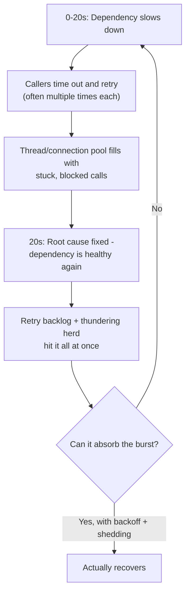

# The Root Cause Is Fixed. Why Won't the System Recover?

## 1. Story

Your payment gateway (a downstream dependency) has a network blip and slows down for 20 seconds. Alerts fire. You escalate. The provider confirms and fixes it. The root cause is gone.

But your own service's error rate and latency stay elevated for several more minutes — sometimes worse than during the original 20-second blip. Traffic is completely normal; there's no new spike. So what's actually keeping it down?

## 2. The Problem

Fixing the trigger stops **new** damage. It does nothing to undo the side effects your own system already created *during* those 20 seconds — and those side effects can be self-sustaining, meaning they keep the system unhealthy on their own, independent of whether the original cause is still present.

## 3. The Hidden Culprits (Often Several at Once)

**Term: Retry storm** — during the slowdown, calls to the dependency timed out and were retried, sometimes multiple times per original request. That backlog of retries doesn't vanish the instant the dependency recovers — it's still queued up, still hammering the now-healthy service, keeping it artificially saturated in a loop it can't easily escape.

**Thread / connection pool exhaustion** — every call to the slow dependency held a thread or connection for the *full* 20 seconds (blocking). A limited-size pool fills up fast under that condition and, even after the dependency speeds back up, has to drain a backlog far deeper than normal, one request at a time — recovering far more slowly than the outage that caused it.

**Term: Thundering herd** — everyone who was failing or waiting retries at roughly the same moment the dependency becomes healthy again, producing an instant burst well above normal traffic, right when the system is least able to absorb it. This burst can be enough to re-trigger the exact same slowdown, making it look like "it never actually recovered."

**A poorly designed circuit breaker** — if the breaker's half-open trial requests hit the fresh flood of retries and backlog, they fail, sending the breaker back to "open" — round and round, extending the outage far past the original cause.

## 4. Mental Model

> A fire being extinguished doesn't mean the smoke clears instantly. The backlog and the panic (retries) it left behind are now their own separate fire — and it needs its own extinguishing, not just confirmation that the match is out.

## 5. Flow



## 6. The Solution — Recovery Needs Its Own Design, Not Just a Root-Cause Fix

- **Exponential backoff with jitter** on retries — spreads retry attempts out over time instead of every client retrying at the exact same instant, which is what directly causes a thundering herd.
- **Circuit breakers** — fail fast during an outage instead of piling up blocked/retrying calls in the first place, then probe recovery cautiously with a small trickle of test traffic before fully reopening (rather than an all-at-once flood).
- **Bounded queues + backpressure** — a queue that can grow without limit during an incident just delays the pain; return a fast `503`/`429` once capacity is exceeded instead of endlessly queuing work that will time out anyway.
- **The Bulkhead pattern** — give each downstream dependency its own separate, bounded thread/connection pool, so one slow dependency exhausting its pool can't also starve unrelated, healthy code paths that share the same pool.
- **Deliberate load shedding during recovery** — intentionally drop or delay some requests rather than trying to process the full backlog plus fresh traffic simultaneously, which can prolong recovery indefinitely.

## 7. Code Example

```javascript
// Exponential backoff WITH jitter - prevents every client retrying in lockstep
async function callWithBackoff(fn, attempt = 0) {
  try {
    return await fn();
  } catch (err) {
    if (attempt >= 5) throw err;
    const base = Math.min(1000 * 2 ** attempt, 30000);
    const jitter = Math.random() * base * 0.5; // spreads retries out over time
    await sleep(base + jitter);
    return callWithBackoff(fn, attempt + 1);
  }
}

// Circuit breaker sketch: fail fast, then trickle-test before fully reopening
class CircuitBreaker {
  state = 'closed'; // closed -> open -> half-open -> closed
  failures = 0;
  async call(fn) {
    if (this.state === 'open') throw new Error('circuit open - failing fast');
    try {
      const result = await fn();
      if (this.state === 'half-open') this.state = 'closed'; // trial succeeded
      this.failures = 0;
      return result;
    } catch (err) {
      this.failures++;
      if (this.failures >= 5) this.state = 'open';
      throw err;
    }
  }
}
```

## 8. Production Reality

This is exactly why "root cause identified and fixed" and "service fully recovered" are tracked as two **separate** milestones in real incident timelines. Teams often have to actively intervene during recovery — temporarily blocking or shedding traffic, manually draining queues, ramping allowed traffic back up gradually — to actually end an incident, even though the original trigger is long gone.

## 9. Trade-offs

Circuit breakers and backoff add real complexity, and a misconfigured breaker (too sensitive or too lax) can create its own failure modes. Deliberate load shedding during recovery intentionally sacrifices some requests' experience to protect the system as a whole — a conscious, visible trade-off, not a silent bug.

## 10. Common Mistakes

- Assuming "root cause fixed" means "incident over," and standing down right as the phase that actually needs the most careful handling — the self-inflicted backlog and thundering herd — begins.
- Using plain exponential backoff without jitter, which still causes every client to retry in near-lockstep, reproducing the thundering herd anyway.
- Sharing one thread/connection pool across multiple downstream dependencies, so one slow dependency can starve calls to completely unrelated, healthy services.

## 11. 🔗 Connection to Other Concepts

This builds directly on the load-shedding ideas from [[04-handling-traffic-spike-15k-rps]] and the "check downstream dependencies" step from [[02-debugging-random-500-errors]] — but adds a new dimension: the danger isn't just the dependency being slow, it's the system's own reaction to that slowness outliving the slowness itself.

## 12. 🧠 Remember

> Fixing the root cause stops new damage, but the retries and backlog created during the outage can keep the system down long after — recovery needs backoff, circuit breakers, and deliberate load shedding, not just a fixed root cause.

## 13. Quick Self-Test

1. Why can a system stay unhealthy even after the original slow dependency is fully fixed?
2. What is a "thundering herd" in this context, and what specifically causes it?
3. Why does jitter make exponential backoff meaningfully better, not just cosmetically different?
4. What problem does the Bulkhead pattern solve that a circuit breaker alone doesn't?
