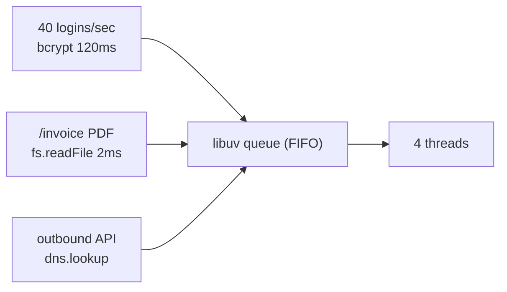

# libuv Thread Pool: Node Mein Actually Async Kya Hai

> **Connects to**: [[01-concurrency-vs-parallelism]] (I/O-bound vs CPU-bound), [[109-cluster-worker-threads-child-process-hinglish]] (jab 4 threads kaafi nahi), [[58-less-traffic-more-cpu]] (same traffic, zyada cost), [[13-hidden-latency-bottleneck]] (latency wahan nahi hoti jahan aap dhoondh rahe ho). | [[137-event-loop-phases-and-microtasks]] (event loop phases)

## 1. Story

Monday subah 9:30 baje. Office login time. Aapka `POST /login` p99 400ms se 2.8s par chala gaya -- theek hai, login spike hai, samajh aata hai.

Par ek cheez samajh nahi aa rahi: `GET /health` bhi 1.2s le raha hai. Aur `GET /invoice/:id/pdf` timeout de raha hai. In dono ka login se **koi lena-dena nahi** hai. Ek sirf ek JSON return karta hai, dusra disk se file padhta hai.

Aapne DB dashboard khola. DB bilkul relaxed -- 4% CPU, koi slow query nahi. Aapne Node ka CPU dekha -- 70%, poora pin nahi hua. Event loop lag check kiya -- 12ms, bura nahi.

To phir ek unrelated endpoint kahan atka hua hai?

## 2. The Problem: "Node Toh Async Hai Na?"

Yahi sabse bada Node misconception hai:

> "Node non-blocking hai, sab kuch async hai, isliye ek slow kaam dusre kaam ko affect nahi karta."

Aadha sach hai. Asli picture ye hai -- Node ke andar **do bilkul alag mechanism** hain, aur log dono ko "async" keh dete hain:

| Kaam | Kaise hota hai | Thread lagta hai? | Limit |
|---|---|---|---|
| TCP/HTTP socket read-write | OS event notification (`epoll` Linux, `kqueue` BSD/macOS, IOCP Windows) | **Nahi** | OS fd limit (hazaaron) |
| DB query, Redis call, outbound HTTP | wahi -- ye sab socket hain | **Nahi** | wahi |
| `fs.readFile`, `fs.stat`, `fs.writeFile` | libuv **thread pool** | Haan | **4 by default** |
| `dns.lookup` (`getaddrinfo`) | libuv thread pool | Haan | **4** |
| `zlib.gzip` async | libuv thread pool | Haan | **4** |
| `crypto.pbkdf2`, `scrypt`, `randomBytes`, `generateKeyPair`, `bcrypt` addon | libuv thread pool | Haan | **4** |

Ye hi aapka bug hai. 10,000 concurrent DB queries bilkul theek chalengi. Par **5 concurrent password hashes** mein se ek queue mein khada rahega -- aur uske peeche aapka PDF ka `fs.readFile` bhi.

## 3. Why Network I/O Ko Thread Nahi Chahiye

Socket ke liye OS khud ek "mujhe batana jab data aaye" API deta hai. Node ek hi thread se OS ko kehta hai: "in 5000 sockets par nazar rakho, jo ready ho uska naam bata do." Ye `epoll_wait()` ek call hai, aur poll phase mein return karti hai ready fd ki list. Isliye 5000 connections ke liye 5000 threads nahi chahiye -- **zero extra threads** chahiye.

File read ke liye POSIX aisa koi bharosemand interface deta hi nahi (`O_NONBLOCK` regular file par mostly jhooth bolta hai -- padhne ke liye block hi karega). To libuv ke paas ek hi option bacha: **ek real thread lo, usme blocking `pread()` maaro, khatam hone par event loop ko batao.** Aur CPU-heavy crypto ka to sawal hi nahi -- KDF ka matlab hi hai ki CPU jalana hai, to wo bhi usi pool par bhej diya gaya.

```
                   +-- socket? --> epoll/kqueue (OS) -- no thread, bahut saare parallel
   aapka await ----|
                   +-- fs/dns/zlib/crypto? --> libuv thread pool [T1][T2][T3][T4]
                                                        ^
                                                 sirf 4 -- baaki queue mein
```

## 4. Demo: 4 Threads Ko Aankhon Se Dekho

Ye file chalao. 8 `pbkdf2` ek saath firing, par pool mein 4 hi seat hain.

```javascript
// threadpool-demo.js
const crypto = require('node:crypto');

const N = 8;
const start = Date.now();

for (let i = 1; i <= N; i++) {
  crypto.pbkdf2('password', 'salt', 300000, 64, 'sha512', () => {
    console.log(`task ${i} done at ${Date.now() - start}ms`);
  });
}
```

```
$ node threadpool-demo.js
task 2 done at 431ms
task 1 done at 436ms
task 3 done at 438ms
task 4 done at 440ms      <-- pehla batch, 4 tasks
task 5 done at 861ms
task 6 done at 869ms
task 7 done at 871ms
task 8 done at 874ms      <-- dusra batch, exact double time
```

**Dekho kya hua:** task 5 ka kaam 0ms par submit hua tha, par usne 431ms **queue mein khade** hoke bitaye. Aapke code mein kahin bhi `pbkdf2` 431ms slow nahi hua -- sirf uske shuru hone ka wait tha.

Ab pool bada karo:

```bash
# Linux/macOS
UV_THREADPOOL_SIZE=8 node threadpool-demo.js
# Windows PowerShell
$env:UV_THREADPOOL_SIZE=8; node threadpool-demo.js
```

```
task 3 done at 452ms
task 1 done at 455ms
... saare 8 ~455ms par
```

Aath tasks, ek hi batch. Shape badal gaya.

> **Catch:** ye sirf tab hua kyunki machine par 8+ cores the. 4-core machine par 8 threads banane se bhi total time wahi rahega -- 8 threads 4 cores ke liye ladengi. Thread pool badhane se **CPU paida nahi hota**. Ye exactly [[01-concurrency-vs-parallelism]] ka farak hai: concurrency badh gayi, parallelism nahi.

## 5. Production Trap: Login Spike PDF Ko Tod Deta Hai

Ab story ka asli mechanism:

```javascript
// auth.service.js -- bcrypt bhi usi pool par chalta hai
const bcrypt = require('bcrypt');
app.post('/login', async (req, res) => {
  const user = await users.findByEmail(req.body.email);    // socket -- pool free
  const ok = await bcrypt.compare(req.body.password, user.hash); // POOL SEAT, ~120ms
  res.json({ token: ok ? sign(user) : null });
});

// invoice.service.js
app.get('/invoice/:id/pdf', async (req, res) => {
  const tpl = await fs.promises.readFile('./templates/invoice.html'); // POOL SEAT
  res.type('pdf').send(await render(tpl, req.params.id));
});
```

Do alag files, do alag teams, do alag features -- **ek shared resource jiska naam kisi code mein likha hi nahi hai.**

9:30 baje 40 logins/second aate hain. Har ek 120ms pool seat kha raha hai. Capacity = 4 threads / 0.12s = ~33 hash per second. Demand 40. Queue banna shuru -- aur queue **FIFO** hai, usme aapka invoice template read bhi lag gaya.



### Isko Misdiagnose Kyun Kiya Jaata Hai

Symptom bilkul "slow database" jaisa dikhta hai, isliye 2 ghante DB par waste hote hain:

| Aap dekhte ho | Aap sochte ho | Sach |
|---|---|---|
| `await` 400ms le raha hai | DB/API slow hai | kaam shuru hi 400ms baad hua |
| CPU 100% pin nahi hai | "CPU problem nahi hai" | 4 threads 8 cores par 50% hi dikhayenge |
| event loop lag normal hai | "event loop block nahi hai" | sahi -- block *pool* mein hai, loop mein nahi |
| ek endpoint slow, baaki bhi slow | "poora server down ja raha hai" | ek shared pool |
| DB metrics clean | "to code slow hai" | code fast hai, wait upar hai |

**Ye signature yaad rakho:** DB bolta hai "main fast hoon", Node bolta hai "mera event loop free hai", phir bhi latency hai -> **pool dekho**. Yahi [[13-hidden-latency-bottleneck]] ka point hai -- latency us layer mein thi jiska koi dashboard hi nahi tha.

## 6. Kaise Confirm Karein

Guess mat karo, naap lo. Sabse saaf signal: queue wait time.

```javascript
// pool-probe.js -- ek sasta canary
const { performance } = require('node:perf_hooks');
const fs = require('node:fs');

setInterval(() => {
  const t = performance.now();
  fs.stat(__filename, () => {
    const waited = performance.now() - t;
    // stat 1ms ka kaam hai. 1ms se bahut zyada = queue wait.
    if (waited > 50) console.warn(`[threadpool] stat took ${waited.toFixed(0)}ms -- pool saturated`);
  });
}, 1000);
```

Behtar: proper observability. `perf_hooks` ka `PerformanceObserver` `'fs'`/`'dns'` entries de deta hai, aur `--cpu-prof` ya `0x` flame graph mein aap `pbkdf2`/`bcrypt` ko threads par baithe dekh lenge. Checklist ke tarah soche to ye [[20-sudden-latency-spike-checklist]] mein "shared resource saturation" bucket hai.

## 7. Fixes -- Order Mein

**1. Pool ko cores ke barabar karo (5 minute ka fix).**

```javascript
// server.js -- SABSE PEHLI line, kisi bhi require se pehle
process.env.UV_THREADPOOL_SIZE = String(require('node:os').availableParallelism());
// ya behtar: shell/Dockerfile/k8s env mein set karo
```

Important: pool **pehle use par ek hi baar** banta hai. Agar kisi module ne already ek `fs` async call kar diya, aapka change ignore ho jaayega. Isliye env variable hi safest hai (`ENV UV_THREADPOOL_SIZE=8` Dockerfile mein). Max 1024, par cores se zyada CPU-bound kaam ke liye bekaar hai.

**2. Hashing ko request path se hata do (asli fix).** Login par bcrypt se bacha nahi ja sakta -- par aap cost control kar sakte ho: bcrypt rounds ko naapo (10-12 typical, 14 nahi), aur login ke aage [[106-rate-limiting-at-the-edge-hinglish]] jaisa throttle lagao taaki credential-stuffing bot aapka pool na kha jaaye. Bulk hashing (migration, seed script) kabhi API process mein mat chalao -- alag worker service.

**3. Agar hashing hi aapka core kaam hai, to pool ke bajaye `worker_threads`.** Pool shared hai aur aapke control mein nahi; worker pool (e.g. `piscina`) aapka hai -- usme aap size, queue limit aur backpressure decide karte ho. Ye [[109-cluster-worker-threads-child-process-hinglish]] ka natural next step hai.

**4. DNS ko pool se nikaalo.** Har outbound HTTP call `dns.lookup` karta hai -> `getaddrinfo` -> **thread pool**. Ek slow DNS server aapke saare fs reads ko bhookha rakh sakta hai.

```javascript
const dns = require('node:dns');
// c-ares, UDP socket par -- thread pool ko chhuta hi nahi
dns.promises.resolve4('api.payments.com').then(console.log);

// Node 22+: default resolver ko c-ares par bhej do
dns.setDefaultResultOrder('ipv4first');
```

Practical mein: ek **DNS cache** lagao (`cacheable-lookup`) -- isse lookups 99% kam ho jaate hain, jo pool ke liye `dns.resolve` se bhi bada fayda hai.

**5. Sync API ko API process mein mat chalao.** `fs.readFileSync`, `crypto.pbkdf2Sync`, `zlib.gzipSync` pool use hi nahi karte -- wo seedha **event loop** block karte hain, jo isse bhi bura hai. Config boot par sync padh lena theek hai; per-request kabhi nahi.

## 8. Trade-offs

| Decision | Fayda | Keemat |
|---|---|---|
| `UV_THREADPOOL_SIZE` = cores | fs/crypto queueing khatam | cores se zyada rakha to context switching, memory per thread (~1MB stack) |
| `dns.resolve` over `dns.lookup` | pool bacha | `/etc/hosts` ignore hota hai -- local/k8s DNS setup mein surprise |
| worker pool (piscina) | isolation, apna backpressure | message passing ka copy cost, extra code |
| bcrypt rounds kam karna | sasta hash | kamzor hash -- security trade-off, halka mat lo |

## 9. Common Mistakes

- **`UV_THREADPOOL_SIZE=128` likh dena** "zyada better hai" sochkar. CPU-bound kaam ke liye cores se zyada threads sirf sabko equally slow karti hain.
- Isko runtime par `process.env` se set karna **pehle async fs/crypto call ke baad** -- chup-chaap ignore.
- Yakeen karna ki "DB fast hai, to problem DB nahi hai." Aapka `await` DB ke *paas pahunchne* se pehle hi ruk sakta hai.
- `worker_threads` lagana jab problem sirf 4-thread pool thi -- ek env variable kaafi tha.
- Yeh maan lena ki thread pool HTTP concurrency bhi limit karta hai. Nahi -- aapke 10,000 sockets epoll par hain, mazey mein hain.

## 10. Interview Mein Kaise Bole

*"Node mein 'async' ke do matlab hain. Network I/O genuinely OS-level async hai -- epoll/kqueue, koi thread nahi, isliye hazaaron connections sasta hain. Par filesystem, `dns.lookup`, zlib aur crypto KDFs libuv ke thread pool par chalte hain jo default 4 hai. Isliye ek login spike, jisme har request bcrypt kar rahi hai, un endpoints ko slow kar sakta hai jo sirf file padhte hain -- ek shared pool, FIFO queue. Isko main `fs.stat` jaise sasta operation time karke confirm karta hoon: agar 1ms ka kaam 300ms le raha hai to wait queue mein hai. Fix: pool ko cores ke barabar karo, DNS cache lagao, aur heavy CPU kaam ko apne worker pool mein bhejo."*

## 🧠 Remember

> Network I/O Node mein sach mein async hai -- OS dekhta hai, koi thread nahi lagti. Par `fs`, `dns.lookup`, `zlib` aur `crypto` KDFs sirf **4 shared threads** par chalte hain, aur unka queue wait bilkul "slow database" jaisa dikhta hai -- isliye jab DB clean ho aur event loop free ho, phir bhi latency ho, to thread pool dekho.

## Quick Self-Test

1. 5000 concurrent DB queries theek chalti hain par 8 concurrent `pbkdf2` queue ban jaati hai -- kyun? Dono to `await` hi hain.
2. Aapka `/health` endpoint sirf `res.json({ok:true})` karta hai. Login spike mein ye slow kaise ho sakta hai?
3. `UV_THREADPOOL_SIZE=64` 4-core machine par kya kar dega, aur kyun fayda nahi hoga?
4. `dns.lookup` aur `dns.resolve4` mein thread pool ke hisaab se kya farak hai, aur `resolve` apnane ki ek keemat kya hai?
5. Event loop lag metric normal dikh raha hai par requests slow hain. Isse aap kya **rule out** kar sakte ho, aur kya nahi?
