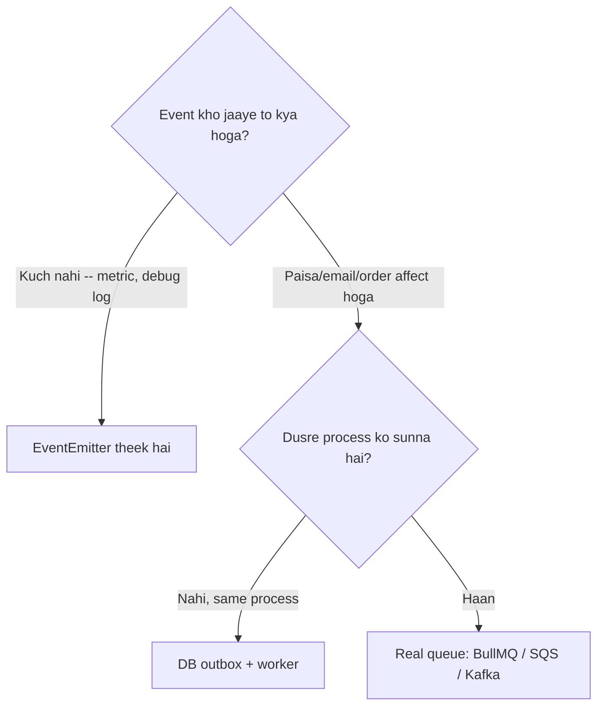

# EventEmitter Aur Listener Leaks

> **Connects to**: [[22-nodejs-memory-leak-debugging]] (`MaxListenersExceededWarning` wahan ek clue tha -- yahan uska poora mechanism hai) aur [[02-debugging-random-500-errors]] (wo 500 jo sirf traffic ke saath aata hai). | [[144-garbage-collection-and-memory]] (GC and retained memory)

## 1. Story

Ek order service hai. Team ne "decoupling" ke liye ek in-process EventEmitter lagaya: order create ho, to email bhejo, analytics ko batao, warehouse ko batao -- controller ko in teeno ke baare mein jaanne ki zaroorat nahi.

Design sabko achha laga. Deploy ho gaya. Do ghante baad logs mein ye aaya:

```
(node:4812) MaxListenersExceededWarning: Possible EventEmitter memory leak detected.
11 order.created listeners added to [EventEmitter]. Use emitter.setMaxListeners() to increase limit
```

Senior dev ne commit kiya:

```javascript
bus.setMaxListeners(100);   // "warning gaya"
```

Warning chala gaya. Chaar ghante baad process 1.8GB par OOM-kill ho gaya. Aur usse pehle ek aur mazedaar cheez hui: **ek hi order ka email 60 baar gaya.**

## 2. Pehle Basics -- Par Us Hisse Par Jo Interview Mein Poocha Jaata Hai

```javascript
const { EventEmitter } = require('node:events');
const bus = new EventEmitter();

const onCreated = (order) => console.log('created', order.id);

bus.on('order.created', onCreated);     // har emit par chalega
bus.once('order.created', onCreated);   // sirf ek baar, phir khud hat jaata hai
bus.off('order.created', onCreated);    // hatao -- WAHI function reference chahiye
bus.emit('order.created', { id: 'o_1' }); // true agar koi listener tha, warna false
```

| | Kab use karo | Leak ka risk |
|---|---|---|
| `on` | lambi umar ka subscriber (boot par ek baar) | **Haan** -- aapko hataana padega |
| `once` | ek specific jawab ka intezaar | Nahi -- fire hone par khud hat jaata hai |
| `off` / `removeListener` | cleanup | -- |

**Sabse common bug yahan hai:** `off` ko **exactly wahi function reference** chahiye jo `on` ko diya tha.

```javascript
bus.on('tick', () => doWork());
bus.off('tick', () => doWork());   // ye kuch nahi hataata -- naya anonymous function hai
```

Anonymous arrow `on` mein daalne ka matlab hai: **aap us listener ko ab kabhi hata nahi sakte.**

## 3. `emit` Synchronous Hai -- Aur Ye Logon Ko Chaunkata Hai

`emit` kaam queue nahi karta. Ye listeners ko **usi call stack par, usi order mein jisme add hue the**, seedha call kar deta hai. Sochne ka tareeka: `emit` ek `for` loop hai jisme function calls hain -- bas.

```javascript
const bus = new EventEmitter();
bus.on('ping', () => { for (let i = 0; i < 2e9; i++); console.log('slow listener done'); });

console.log('before');
bus.emit('ping');          // yahan blocking -- poora event loop ruka hua
console.log('after');
// before -> slow listener done -> after
```

Iske do bade natije:

**(a) Ek slow listener aapki request ko slow karta hai.** Log sochte hain "event emit kar diya, ab fire-and-forget ho gaya." Nahi. Agar listener ne 200ms CPU khaya, aapka HTTP handler 200ms slow hua.

**(b) Async listener ki rejection kahin nahi jaati.**

```javascript
bus.on('order.created', async (order) => {
  await sendEmail(order);     // SMTP down -> reject
});
bus.emit('order.created', o); // emit ko promise dikhta hi nahi -> unhandledRejection
```

`emit` listener ka return value ignore karta hai. To ye ek silent failure hai: email gaya nahi, koi error log nahi, response 200. Yahi wo category hai jisse [[02-debugging-random-500-errors]] wale "kuch requests chup-chaap galat behave karti hain" paida hote hain.

Fix do hain -- listener ke andar khud try/catch, ya emitter ko bolo ki rejections pakad le:

```javascript
const bus = new EventEmitter({ captureRejections: true });
// async listener reject hua -> 'error' event fire hoga
bus.on('error', (err) => logger.error({ err }, 'bus listener failed'));
```

## 4. Asli Leak: Long-Lived Emitter + Per-Request Listener

Story ka bug exactly ye tha:

```javascript
// bus.js -- module-level, poore process ki umar tak zinda
const { EventEmitter } = require('node:events');
module.exports = new EventEmitter();

// orders.controller.js
const bus = require('./bus');

app.post('/orders', async (req, res) => {
  const order = await orders.create(req.body);

  // BUG: har request ek naya listener add karti hai, kabhi hataya nahi jaata
  bus.on('order.created', (o) => {
    if (o.id === order.id) res.json(o);     // closure mein `res` aur `order` phanse hue
  });

  bus.emit('order.created', order);
});
```

Yahan **do** problem ek saath hain:

**1. Memory leak.** `bus` kabhi garbage collect nahi hoga (module-level hai), aur uska internal listener array har request par ek entry badhata hai. Har closure apne `res` ko capture karti hai -- aur `res` socket, headers, buffers sab pakdta hai. Ye bilkul [[22-nodejs-memory-leak-debugging]] ka Step 3 hai: heap snapshot ka retainer chain `EventEmitter._events['order.created']` -> array -> closure -> `ServerResponse` dikhayega.

**2. O(n^2) behaviour.** 60th request ke `emit` par 60 listeners chalte hain. Har purana listener bhi call hota hai (bas `if` fail karta hai) -- aur agar `if` guard na hota, ek order ka email 60 baar jaata. Story mein wahi hua.

**Warning ka asli matlab:**

> `MaxListenersExceededWarning` ye nahi keh raha ki "10 listeners bahut zyada hain." Ye keh raha hai: **"ek long-lived emitter par listener count badh raha hai, shayad aap add kar rahe ho aur hata nahi rahe."** 10 ek heuristic hai, limit nahi.

Isliye `setMaxListeners(100)` fix nahi, **smoke detector ki battery nikaalna** hai. Ha, legit cases hote hain (ek genuine 30-subscriber bus) -- tab number badhana theek hai, par **tab** jab aapne verify kar liya ho ki count boot par stable hota hai, request ke saath nahi badhta.

### Rule

> **Jisne listener add kiya, wahi usse hataane ka maalik hai.** Agar add karne ki life (ek request) emitter ki life (poora process) se chhoti hai, to cleanup likhna aapka kaam hai -- warna leak pakka hai.

### Fix 1: Yahan EventEmitter hi galat tool tha

```javascript
app.post('/orders', async (req, res) => {
  const order = await orders.create(req.body);
  bus.emit('order.created', order);   // emit karo, sunno mat
  res.json(order);                    // response seedha
});

// listeners boot par, ek hi baar register hote hain
bus.on('order.created', emailSubscriber);
bus.on('order.created', analyticsSubscriber);
```

Listeners **boot-time, fixed count**. Yahi normal shape hai.

### Fix 2: Agar sach mein per-request intezaar karna hai -- `once` promise

```javascript
const { once } = require('node:events');

// `once` ek promise deta hai aur fire/reject par listener khud hata deta hai
const [payment] = await once(bus, `payment.${orderId}`);
```

### Fix 3: `AbortSignal` se guaranteed cleanup

```javascript
const { once } = require('node:events');

app.get('/orders/:id/stream', async (req, res) => {
  const ac = new AbortController();
  // client ne connection kaat diya -> listener hat jaayega
  res.on('close', () => ac.abort());

  try {
    const [update] = await once(bus, `order.${req.params.id}`, { signal: ac.signal });
    res.json(update);
  } catch (err) {
    if (err.name === 'AbortError') return;    // normal -- client chala gaya
    throw err;
  }
});
```

Plain `emitter.on` `signal` option support nahi karta, to manual listener ke liye ye pattern likhna padta hai:

```javascript
const handler = (o) => push(o);
bus.on('order.created', handler);
signal.addEventListener('abort', () => bus.off('order.created', handler), { once: true });
```

## 5. `error` Event: Koi Listener Nahi = Process Crash

Ye Node ka ek deliberate design choice hai, bug nahi:

```javascript
const bus = new EventEmitter();
bus.emit('error', new Error('boom'));
// Uncaught Error: boom  -> process exit code 1
```

`EventEmitter` ka `'error'` special-cased hai: agar us event ka koi listener nahi hai, emitter error ko **throw** karta hai -- uncaughtException -> process khatam.

**Kyun?** Kyunki chup-chaap ignore kiya gaya I/O error se bura kuch nahi hai. Ek socket ya stream jisne error diya aur kisi ne na suna, wo corrupt state mein aage chalti rahegi. Node ne decide kiya: **loud crash > silent corruption**.

Practically iska matlab:

```javascript
// har stream/socket/emitter par error listener lagao -- warna wo aapka process gira sakta hai
const rs = fs.createReadStream('big.csv');
rs.on('error', (err) => logger.error({ err }, 'read failed'));

// Express mein: response stream bhi error de sakti hai
res.on('error', (err) => logger.warn({ err }, 'client gaya'));
```

Aur `process.on('uncaughtException')` ko "fix" ki tarah use mat karo -- us point par aapka state unknown hai. Log karo, metric badhao, **graceful exit** karo, process manager restart kar dega.

## 6. Jab In-Process EventEmitter Bilkul Galat Tool Hai

EventEmitter ek **function call ka alternate syntax** hai -- message broker nahi. Wo ye sab **nahi** karta:

| Chahiye | EventEmitter deta hai? |
|---|---|
| Durability (restart ke baad event bacha rahe) | **Nahi** -- sab memory mein, process mara to gaya |
| Retry / dead-letter | **Nahi** |
| Cross-process / cross-pod delivery | **Nahi** -- 3 pods hain to emit sirf us ek pod mein hua |
| Backpressure | **Nahi** -- emit sync hai, queue hi nahi hai |
| At-least-once guarantee | **Nahi** -- listener throw kiya, event gaya |
| Observability (lag, depth) | **Nahi** |

To ye line kaafi bolti hai:

> Agar event ka kho jaana **business problem** hai, to EventEmitter galat tool hai. Aapko ek real queue chahiye (BullMQ/Redis, SQS, Kafka) -- ya kam se kam DB mein ek outbox row jo background worker padhe.

Aur ek bahut common production trap: cluster/k8s mein aap `bus.emit('cache.invalidate')` likhte ho aur **sirf ek pod** ka cache saaf hota hai -- baaki pods stale data serve karte rehte hain ([[109-cluster-worker-threads-child-process-hinglish]] wali "workers memory share nahi karte" seekh). Us kaam ke liye Redis pub/sub chahiye, local emitter nahi.

### Decision



## 7. Common Mistakes

- `setMaxListeners` se warning dabana, root cause dhoondhne ke bajaye.
- `on` mein anonymous arrow function daalna, phir realize karna ki use hata hi nahi sakte.
- Request handler ke andar module-level emitter par listener add karna.
- Ye maan lena ki `emit` async/fire-and-forget hai -- wo seedha synchronous function call hai.
- `async` listener likhna bina try/catch ya `captureRejections` ke -- failures chup-chaap gayab.
- Streams/sockets par `error` listener na lagana, phir "random crash" se confused hona.
- EventEmitter ko microservice-style event bus samajh lena -- wo ek process ke bahar jaata hi nahi.

## 🧠 Remember

> `emit` ek synchronous function call hai, message send nahi -- aur jisne listener add kiya usi ko hataana padta hai, warna ek long-lived emitter par per-request `on` memory aur duplicate work dono leak karta hai. `MaxListenersExceededWarning` leak ka alarm hai, badhane wala number nahi.

## Quick Self-Test

1. `bus.on('x', () => f())` ke baad `bus.off('x', () => f())` kyun kuch nahi hataata?
2. Ek handler `bus.emit('order.created', o)` karke turant `res.json()` karta hai. Response slow kaise ho sakta hai?
3. `MaxListenersExceededWarning` actually kya bata rahi hai, aur `setMaxListeners(100)` kab sach mein sahi jawab hai?
4. `error` event ka koi listener na ho to Node process kyun giraata hai -- aur wo design choice better kaise hai?
5. Aapka app 4 pods par chal raha hai aur `bus.emit('cache.invalidate')` karta hai. Kya hoga, aur sahi tool kya hai?
