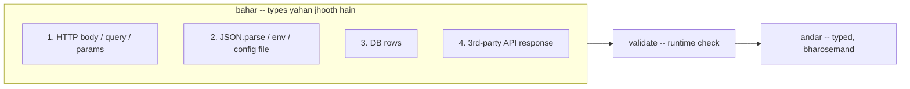

# TypeScript Runtime Boundary Par: Types Jhooth Bol Sakte Hain

> **Connects to**: [[02-debugging-random-500-errors]] (wo 500 jo sirf kuch requests mein aata hai -- yahan uski ek badi wajah hai) aur [[50-slow-query-500m-rows]] (DB se jo wapas aata hai, usko aap maante ho -- yahan wo maan hi tod rahe hain).

## 1. Story

Interview mein ek line bahut sunne ko milti hai:

> "Humne TypeScript use kiya, isliye type errors production mein aate hi nahi."

Aapke paas ek clean TS Express API hai. Full `strict` mode. Zero `any`. CI green. Phir Sentry par ye aata hai:

```
TypeError: Cannot read properties of undefined (reading 'toLowerCase')
  at createUser (/app/dist/users.service.js:14:31)
```

Aap us line par jaate ho:

```typescript
async function createUser(body: unknown) {
  const user = body as CreateUserDto;      // line 11
  const email = user.email.toLowerCase();  // line 14 -- yahan crash
  ...
}
```

Compiler ne ek shabd nahi bola. Kyunki aapne usse jhooth bolne ko kaha, aur usne maan liya.

## 2. The Problem: Types Erased Ho Jaate Hain

TypeScript ka pehla principle yahi hai, aur ye teen mein se do candidates miss karte hain: **compile ke baad types ka namo-nishaan nahi bachta.**

```typescript
// TS -- ye likhte ho
interface User { id: number; email: string; }
const user = req.body as User;
```

```javascript
// JS -- ye chalta hai
const user = req.body;      // bas. koi check nahi.
```

`as User` ek **runtime check nahi** hai. Wo compiler se ek vaada hai: *"tu mat poochh, main guarantee deta hoon ki ye User hai."* Compiler aapka poora code us vaade ke bharose check karta hai -- aur agar vaada jhootha nikla, wo bachaane nahi aayega, kyunki usne apna kaam program chalne se pehle khatam kar diya tha.

To itna bhejna kaafi hai:

```bash
curl -X POST localhost:3000/users -H 'content-type: application/json' -d '{"emial":"a@b.com"}'
```

Typo `emial`. `user.email` -> `undefined` -> 500. Ye [[02-debugging-random-500-errors]] ka classic pattern hai: 99% requests theek, ek galat shaped client crash karta rehta hai, aur error **jahan paida hua wahan nahi, teen line baad** dikhta hai.

> **Yaad rakho:** TypeScript ek **compile-time** tool hai. Runtime data ke saamne wo bilkul bebas hai.

## 3. Chaar Boundaries Jahan Types Jhooth Hote Hain

Apne system ko do hisson mein baanto: **andar** (aapka code, jahan compiler sach jaanta hai) aur **bahar** (duniya). Jahan data andar aata hai, wahan type ek *umeed* hai, fact nahi.



**1. HTTP body, query, params.** Express mein `req.body` ka type `any` hai. Aur `req.query.page` **kabhi `number` nahi hota** -- wo `string | string[] | undefined` hai, chahe aapka interface `page: number` likhe:

```typescript
const page = req.query.page as unknown as number;
const offset = (page - 1) * 20;   // "?page=abc" -> NaN -> OFFSET NaN -> DB error
```

**2. `JSON.parse`.** Signature `JSON.parse(text: string): any` hai, aur `any` zeher ki tarah failta hai -- jahan jaayega, checking band. Config file, Redis se padha cached object, Kafka message -- sab yahi.

**3. DB rows.** `db.query<User>(...)` mein `<User>` sirf ek **generic label** hai, validation nahi -- driver ne jo diya wo waise hi aa jaata hai.

**4. Third-party API.** Unka gateway kal `amount` ko number se string kar dega, aur aapko release notes padhne ka mauka nahi milega.

## 4. The Fix: Boundary Par Runtime Validation (zod)

Rule simple hai: **data jahan andar ghusta hai, wahan ek hi baar validate karo. Uske baad compiler par bharosa karo.**

```typescript
// users.schema.ts
import { z } from 'zod';

export const CreateUserSchema = z.object({
  email: z.string().email(),
  age: z.coerce.number().int().min(13).max(120),   // "25" -> 25, string se aata hai na
  role: z.enum(['admin', 'editor', 'viewer']).default('viewer'),
  name: z.string().trim().min(1).max(100),
});

// SINGLE SOURCE OF TRUTH: TS type schema se nikla hai, alag se likha nahi
export type CreateUser = z.infer<typeof CreateUserSchema>;
```

`z.infer` wala hissa sabse zaroori hai. Agar aap `interface CreateUser` alag likhte aur schema alag, to dono kabhi drift kar jaate aur aap wapas wahi jhooth bolne lagte. Ek jagah, dono kaam.

Ek hi reusable middleware, taaki ye 40 handlers mein copy na ho (422 = shape theek tha, values galat -- [[18-http-status-codes-400-404-409-422]]):

```typescript
// validate.ts
import { ZodSchema } from 'zod';
import { RequestHandler } from 'express';

export const validateBody = <T>(schema: ZodSchema<T>): RequestHandler => (req, res, next) => {
  const r = schema.safeParse(req.body);
  if (!r.success) {
    return res.status(422).json({
      error: 'validation_failed',
      details: r.error.issues.map((i) => ({ path: i.path.join('.'), message: i.message })),
    });
  }
  req.body = r.data;          // sanitized + coerced data aage jaata hai
  next();
};

app.post('/users', validateBody(CreateUserSchema), createUser);
// controller ke andar req.body sach mein CreateUser hai -- naam ka nahi, check kiya hua
```

`safeParse` vs `parse`: `parse` throw karta hai (global error handler pakdega), `safeParse` result object deta hai. Boundary par `safeParse` behtar -- response shape aapke control mein rehta hai.

Yahi cheez **outbound** aur **config** par bhi karo, warna third-party ka breaking change aapke andar 5 layer gehra crash karega:

```typescript
const charge = ChargeResponseSchema.parse(await (await fetch(url)).json());
export const env = Env.parse(process.env);   // galat config = boot par crash, 3 ghante baad nahi
```

## 5. Ek Gotcha Jo Interview Mein Impress Karta Hai: `pg` + BIGINT

Ye wala yaad rakho, kyunki bahut log phaste hain:

```typescript
interface Order { id: string; total_cents: number; item_count: number; }

const { rows } = await pool.query<Order>('SELECT id, total_cents, COUNT(*) AS item_count FROM ... ');
const total = rows[0].total_cents * 2;
```

Agar `total_cents` Postgres mein `BIGINT` (int8) hai, to `pg` use **string** deta hai -- `"4500"`, `4500` nahi. `COUNT(*)` bhi `bigint` hai, wo bhi string. `NUMERIC`/`DECIMAL` bhi string.

```javascript
"4500" * 2        // 9000  -- chalega, aapko lagega sab theek hai
"4500" + 100      // "4500100"  <-- aur yahan silently galat paisa
```

**Kyun?** JS ka `number` IEEE-754 double hai -- 2^53 se bade integer safely represent nahi kar sakta. `pg` ne decide kiya: chup-chaap precision todne se behtar hai string dena, aap khud decide karo. Ye honest design hai -- aur aapka `interface Order` ise chhupa deta hai.

```typescript
// (a) string maano aur BigInt se kaam karo -- paise ke liye yahi sahi
const total = BigInt(rows[0].total_cents);

// (b) driver ko parser do -- par 2^53 se bada aaya to precision chup-chaap gayab
import pgTypes from 'pg-types';
pgTypes.setTypeParser(20, (v) => parseInt(v, 10));   // 20 = int8 OID

// (c) row ko bhi boundary maano aur validate karo
const OrderRow = z.object({ id: z.string().uuid(), total_cents: z.coerce.number().int() });
```

## 6. TS Features Jo Backend Interview Mein Actually Kaam Aate Hain

### `unknown` vs `any` -- aur `catch (e: unknown)`

```typescript
const a: any = JSON.parse(s);
a.foo.bar.baz;          // compiler chup -- checking band ho gayi

const u: unknown = JSON.parse(s);
u.foo;                  // compile error -- sahi! pehle narrow karo
```

`any` kehta hai "check karna band kar do." `unknown` kehta hai "mujhe pata nahi, **tu saabit kar.**" Boundary par hamesha `unknown`. Isi wajah se `catch` mein bhi `unknown` correct hai (`useUnknownInCatchVariables`, `strict` ke saath on) -- kyunki JS mein kuch bhi throw ho sakta hai, `Error` hona guarantee nahi:

```typescript
try {
  await charge(order);
} catch (e: unknown) {
  if (e instanceof PaymentDeclinedError) return res.status(402).json({ reason: e.code });
  if (e instanceof Error) logger.error({ err: e }, 'charge failed');
  else logger.error({ raw: String(e) }, 'non-Error thrown');   // string/null bhi throw ho sakta hai
  throw e;
}
```

`catch (e: any)` likhke `e.response.data.message` padhna wo bug hai jo *error handler ke andar* crash karta hai -- aur phir aap asli error kabhi nahi dekh paate.

### Discriminated unions -- state machines aur result types

```typescript
type OrderState =
  | { status: 'draft'; items: Item[] }
  | { status: 'paid'; items: Item[]; paymentId: string; paidAt: Date }
  | { status: 'cancelled'; reason: string; cancelledAt: Date };

function receipt(o: OrderState) {
  switch (o.status) {
    case 'paid':      return o.paymentId;      // sirf is branch mein exist karta hai
    case 'cancelled': return o.reason;         // o.paymentId likhte to compile error
    case 'draft':     return null;
  }
}
```

Ye bahut powerful hai: **impossible state likhna hi mushkil ho jaata hai.** Ek flat interface jisme `paymentId?: string` aur `cancelReason?: string` dono optional hain, "paid + cancelled" ko allow kar deta hai -- union nahi karta. `default: assertNever(o)` lagao, phir naya status add karne par compiler khud saari jagah dhoondh ke dikha dega. Result type bhi isi shape se banta hai -- `{ ok: true; value: T } | { ok: false; error: E }`, jisme caller ko `ok` check karna **padta** hai.

### `strictNullChecks` -- sabse zyada paisa yahi bachata hai

```typescript
const u = await repo.findById(id);   // strictNullChecks off: type `User`, prod mein crash
return u.email;                      // strictNullChecks on: "'u' is possibly 'null'" -- compile error

const u2 = await repo.findById(id);  // User | null
if (!u2) throw new NotFoundError(id);
return u2.email;                     // ab narrow hoke User hai
```

Node backend ka top runtime error "undefined ki property padhna" hai -- `strictNullChecks` usi class ko compile-time par le aata hai. Legacy codebase migrate kar rahe ho to `strict: true` pehla target.

### Type guards -- apna narrowing khud likho

```typescript
function isAdmin(u: User): u is AdminUser {        // return type hi guard hai
  return u.role === 'admin';
}
if (isAdmin(user)) user.permissions.forEach(...);  // yahan AdminUser hai
```

Dhyan: `u is AdminUser` bhi ek **vaada** hai -- function ka logic galat ho to compiler phir jhooth maan lega. Guard chhota aur obvious rakho.

## 7. Trade-offs -- Honestly

| | Fayda | Keemat |
|---|---|---|
| Har boundary par zod | runtime safety, ek source of truth, saaf 422 errors | thoda CPU per request, schema maintain karna |
| `as` cast | fast, zero code | compiler se jhooth -- crash boundary se door hoga |
| `pg` type parser override | code saaf | 2^53 se bade value par silent precision loss |
| Bahut deep nested schema | sab validate | hot path par naapo -- bade payload par parse cost dikhta hai |

Overengineering se bacho: **internal function ke beech** har call par validate karne ki zaroorat nahi -- wahan compiler sach jaanta hai. Validate wahan karo jahan data **system mein ghusta** hai. Yahi poori lesson ka budget hai.

## 8. Common Mistakes

- `req.body as CreateUserDto` -- type assertion ko validation samajh lena; `JSON.parse()` ka result seedha typed variable mein daal dena.
- `req.query.page` ko `number` maan lena. Wo hamesha string ya undefined hai.
- Interface aur zod schema alag-alag maintain karna -- drift pakka. `z.infer` use karo.
- `catch (e: any)` phir `e.response.data.message` -- non-Error throw hua to error handler khud crash.
- `pool.query<User>()` ke generic ko runtime guarantee samajhna, ya `BIGINT`/`NUMERIC` ko number maan ke `+` se paisa concatenate kar dena.
- `strictNullChecks` ko "bahut shor karta hai" bolke off karna.

## 9. Interview Mein Kaise Bole

*"TypeScript compile-time tool hai -- types erase ho jaate hain, to `as` ya `JSON.parse` koi runtime check nahi deta. Isliye main chaar boundaries par runtime validation lagata hoon: HTTP input, JSON.parse/env, DB rows, aur third-party responses. zod se schema likhta hoon aur TS type `z.infer` se nikaalta hoon, taaki ek hi source of truth ho. Uske andar compiler par poora bharosa -- discriminated unions se state machine, `unknown` boundary par, `strictNullChecks` on. Simple rule: TypeScript meri apni galtiyan pakadta hai, duniya ka bheja hua data nahi."*

## 🧠 Remember

> Types compile par mit jaate hain, to `as User` ek vaada hai jise runtime kabhi check nahi karta -- TypeScript aapke andar ki galtiyan pakadta hai, duniya ka bheja hua data nahi. Boundary par validate karo (HTTP, JSON.parse, DB rows, 3rd-party), `z.infer` se ek source of truth rakho, aur andar compiler par bharosa karo.

## Quick Self-Test

1. `const u = req.body as User` compile hone ke baad JS mein kya banta hai, aur isse kya guarantee milti hai?
2. Aapka interface `page: number` kehta hai par `?page=abc` aaya. Error kahan par dikhega, aur wo asli jagah se kitni door hogi?
3. `any` aur `unknown` mein practical farak kya hai, aur `catch (e: unknown)` kyun correct choice hai?
4. `pool.query<Order>()` ke baad `rows[0].total_cents + 100` galat jawab de sakta hai -- kyun?
5. Ek flat interface jisme `paymentId?` aur `cancelReason?` dono optional hain, uske mukable discriminated union kya extra rok leta hai?
