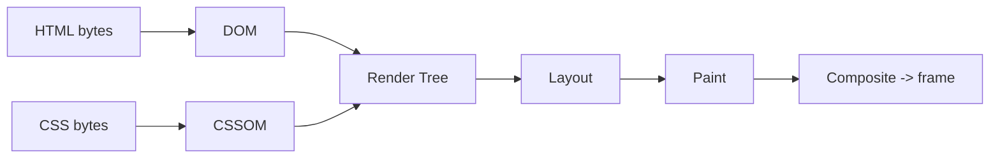

# Browser Rendering Pipeline: HTML Se Pixel Tak

> **Connects to**: [[51-fast-api-slow-page]] (80ms API, 4.8s page -- ye lesson us timeline ka *browser* wala hissa kholta hai), [[33-react-performance-at-scale]] (render ke baad UI slow kyun hota hai) aur [[137-event-loop-phases-and-microtasks]] (browser ka bhi ek hi main thread hai).

## 1. Aapka Server Fast Hai, Phir Bhi Screen Khaali Hai

Aapne API 40 ms mein de di. HTML gzip ke baad 12 KB. CDN se serve ho raha hai. Phir bhi user 2.5 second tak **safed screen** dekhta hai, aur QA bolta hai "page load slow hai".

Backend engineer ki galti yahan ek hi hoti hai: hum maan lete hain ki **response bhej dena = page dikh jaana**. Nahi. Response bhejna *shuru* hai. Uske baad browser ek pipeline chalata hai, aur us pipeline mein aapka HTML/CSS/JS ka order decide karta hai ki pixel kab banega.

Jab tak ye pipeline samajh mein nahi aata, "slow page" ek jaadu lagta hai. Samajh aane ke baad ye ek debuggable system ban jaata hai -- bilkul request pipeline ki tarah.

## 2. Chhe Stages, Isi Order Mein

```
bytes -> DOM -> CSSOM -> Render Tree -> Layout -> Paint -> Composite
```

| # | Stage | Kya hota hai | Output |
|---|---|---|---|
| 1 | **Parse HTML -> DOM** | Bytes -> tokens -> nodes -> tree. Incremental hai: jo mila usko parse karta jaata hai | DOM tree |
| 2 | **Parse CSS -> CSSOM** | Saari stylesheets ka ek tree, cascade resolve ho ke | CSSOM tree |
| 3 | **Render Tree** | DOM + CSSOM ka merge, **sirf visible nodes** | Render tree |
| 4 | **Layout (reflow)** | Har box ki geometry: x, y, width, height | Box positions |
| 5 | **Paint** | Pixels banana -- text, color, border, shadow -- layers mein | Paint records |
| 6 | **Composite** | Layers ko GPU par jod ke screen par bhejna | Ek frame |

Do important baatein jo zyadatar log miss karte hain:

**Render tree mein `display: none` wala node nahi aata** -- wo DOM mein hai, par uski geometry calculate hi nahi hoti. `visibility: hidden` wala node **aata hai** (jagah leta hai, bas dikhta nahi). Isliye ye dono performance ke hisaab se alag cheezein hain.

**Layout aur Paint main thread par hote hain.** Composite GPU par ho sakta hai. Ye ek line poore CSS performance ka base hai -- Section 5 mein isi par sab khada hai.



## 3. Script Parser Ko Kyun Rok Deta Hai

HTML parser upar se neeche chalta hai. Jab wo ye dekhta hai:

```html
<head>
  <script src="/analytics.js"></script>   <!-- 300 KB, slow CDN -->
</head>
```

...to parser **ruk jaata hai**: download, parse, execute -- phir aage. Us poore time mein DOM aage nahi badhta, matlab `<body>` ka content exist hi nahi karta, matlab kuch dikh bhi nahi sakta.

Wajah logical hai: classic script `document.write()` kar sakta hai, DOM ko beech mein badal sakta hai. Browser ko nahi pata script kya karega, isliye wo safe side leta hai -- parsing rok deta hai.

### async vs defer

| Attribute | Download | Execute kab | Parsing rukti hai? | Order guaranteed? |
|---|---|---|---|---|
| (kuch nahi) | blocking | turant, wahin | **Haan** | Haan |
| `async` | parallel | jaise hi download khatam ho -- parsing beech mein rok ke | Execute ke waqt haan | **Nahi** (jo pehle aaya) |
| `defer` | parallel | poora HTML parse hone ke baad, `DOMContentLoaded` se pehle | Nahi | **Haan** (document order) |
| `type="module"` | parallel | `defer` jaisa by default | Nahi | Haan |

Practical rule:

- App ka JS, jisko DOM chahiye aur order matter karta hai -> **`defer`**.
- Independent third-party tag (analytics, ads) -> **`async`**.
- Kuch bhi `<head>` mein plain `<script src>` -> almost always ek bug.

> Modern bundlers (Vite, Next) `type="module"` ya `defer` khud lagate hain, isliye React app mein ye problem kam dikhti hai. Par legacy pages, server-rendered EJS/JSP templates aur "ek chhota script add kar do" wale patches mein yahi #1 blank-screen reason hai.

## 4. CSS Render-Blocking Hai -- Aur Ye Feature Hai, Bug Nahi

CSS parsing ko **nahi** rokta (DOM banta rehta hai), par **render** ko rokta hai. Browser render tree nahi banayega jab tak saari blocking stylesheets aa na jaayein.

Kyun? Imagine browser CSS ka wait na kare: user ko 200 ms ke liye Times New Roman, black-on-white, unstyled page dikhega, phir sab kuch jump karega. Isko **FOUC** (Flash Of Unstyled Content) kehte hain. Browser ne decide kiya: thoda zyada wait, par ek hi sahi paint. Aur yahi [[149-core-web-vitals]] wale CLS score ko bachata hai.

Iska matlab: **CSS file ka size aur uska latency seedha aapke first paint ka floor hai.** 400 KB CSS = 400 KB ka wait, chahe 2 KB hi use ho raha ho.

Teen asli lever:

```html
<!-- 1. Critical CSS inline -- above-the-fold ka style, ek round-trip bachta hai -->
<style>body{margin:0;font:16px/1.5 system-ui}.hero{min-height:60vh}</style>

<!-- 2. Non-critical CSS ko non-blocking banao -->
<link rel="stylesheet" href="/print.css" media="print">
<link rel="stylesheet" href="/wide.css" media="(min-width:1024px)">

<!-- 3. Jo chahiye hi chahiye, usko early batao -->
<link rel="preload" href="/fonts/inter.woff2" as="font" type="font/woff2" crossorigin>
```

`media` attribute ka trick samajh lo: browser wo file download to karta hai, par jab media match nahi karta to **render block nahi karta**. Phone par `(min-width:1024px)` wali CSS aapka paint nahi rokegi.

## 5. Reflow vs Repaint vs Composite -- Asli Performance Yahin Decide Hoti Hai

Pipeline ek baar chal ke khatam nahi hoti. Har style change browser ko pipeline ke **kisi point se aage** dobara chalane par majboor karta hai. Kitna peeche se shuru hota hai -- wahi cost hai.

| Aap kya badalte ho | Pipeline kahan se chalti hai | Cost |
|---|---|---|
| `width`, `height`, `top`, `left`, `margin`, `padding`, `font-size`, DOM node add/remove | **Layout** -> Paint -> Composite | Sabse mehnga (**reflow**) |
| `color`, `background-color`, `box-shadow`, `border-radius`, `visibility` | Paint -> Composite | Medium (**repaint**) |
| `transform`, `opacity`, `filter` (apni layer par) | **Sirf Composite** | Sabse sasta, GPU par |

Yahi se wo famous advice aati hai: **animate `transform` and `opacity`, kabhi `top`/`left`/`width` nahi.**

```css
/* [X] Har frame par layout: 60fps par 60 reflows, poore subtree ke liye */
.card { transition: left 300ms, width 300ms; }

/* [OK] Layout/paint dono skip -- GPU bas layer ko shift kar deta hai */
.card { transition: transform 300ms, opacity 300ms; }
.card.moved { transform: translateX(240px); }
```

Reflow ki asli dikkat uska **scope** hai: ek element ki width badalne se uske siblings, parent aur aage ka poora flow dobara calculate ho sakta hai. Ek 2000-node page par wo 16.6 ms ka frame budget aaram se tod deta hai, aur user ko wahi "janky scroll" dikhta hai jo [[33-react-performance-at-scale]] mein long tasks ki shakal mein aata hai.

## 6. Layout Thrashing -- Ye Loop Dekh Ke Pehchano

Browser smart hai: wo style changes ko **batch** karta hai aur layout ko frame ke end tak defer karta hai. Par agar aap layout wali value **padh** lo, to browser ko majboori mein abhi calculate karna padta hai -- isko **forced synchronous layout** kehte hain.

```javascript
// [X] Layout thrashing: 200 items = 200 forced layouts
const cards = document.querySelectorAll('.card');
cards.forEach((card) => {
  const h = card.offsetHeight;          // READ  -> pending writes ke saath layout abhi chalao
  card.style.height = (h + 10) + 'px';  // WRITE -> layout invalid kar diya
});                                     // agla READ phir layout force karega... loop
```

Pattern: read -> write -> read -> write. Har read pichhle write ki wajah se layout dobara chalu karta hai. 200 items par ye ek 300 ms+ long task ban jaata hai.

```javascript
// [OK] Pehle saari reads, phir saari writes -- ek hi layout pass
const cards = [...document.querySelectorAll('.card')];
const heights = cards.map((c) => c.offsetHeight);                         // sab READ
cards.forEach((c, i) => { c.style.height = (heights[i] + 10) + 'px'; });  // sab WRITE
```

Layout force karne wali common properties (DevTools inhe "Recalculate Style / Layout" dikhata hai):

`offsetTop/Left/Width/Height`, `clientTop/Left/Width/Height`, `scrollTop/scrollHeight`, `getBoundingClientRect()`, `getComputedStyle()`.

Aur agar read-write ko alag frames mein chahiye:

```javascript
requestAnimationFrame(() => {
  const rect = el.getBoundingClientRect();            // read (frame start)
  requestAnimationFrame(() => {
    el.style.transform = `translateY(${rect.top}px)`; // write (next frame)
  });
});
```

## 7. Production Reality

**Naapo, guess mat karo.** Chrome DevTools -> Performance -> record. Us flame chart mein dhoondo:

- Purple **Layout** / **Recalculate Style** blocks -- reflow ka signature.
- Green **Paint** / **Composite Layers**.
- Lal triangle wale **Long Tasks** (>50 ms) -- yahi INP kharab karte hain.
- `"Forced reflow while executing JavaScript took Nms"` warning -- seedha Section 6 ka bug.

**Ek hi main thread hai.** Browser ka main thread JS, style, layout aur paint sab karta hai. Isliye ek 400 ms ka `JSON.parse` ya ek bhaari `.filter()` **scroll ko bhi rok deta hai** -- bilkul waise hi jaise Node mein ek sync block saare requests rok deta hai ([[137-event-loop-phases-and-microtasks]]). Mental model same hai, bas thread doosra hai.

**Do CSS properties jo asli production mein kaam aati hain:**

```css
/* Lambi list -- off-screen items ka layout+paint skip, bada LCP/INP win */
.row { content-visibility: auto; contain-intrinsic-size: 0 72px; }

/* Browser ko pehle se batao ki ye element animate hoga -> apni layer mil jaati hai */
.modal { will-change: transform; }
```

`will-change` ko har element par mat lagao -- har layer GPU memory leti hai. Sirf us element par, aur ideally animation ke aaspaas.

**Images ko dimensions do.** `width`/`height` ya `aspect-ratio` ke bina image aane par layout dobara chalta hai aur neeche ka content kood jaata hai -- CLS. Detail [[149-core-web-vitals]] mein.

## 8. Common Galtiyan

- **"CSS blocking hai to defer kar doon"** -- above-the-fold CSS defer karne se FOUC aur CLS dono aate hain. Critical CSS inline karo, baaki ko `media` se non-blocking banao.
- **`async` ko "behtar defer" samajhna** -- `async` order guarantee nahi karta aur execute karte waqt parsing rok deta hai. App bundles ke liye `defer`.
- **Reflow ko "React ka problem" maan lena** -- React batching karta hai, par `offsetHeight` aap padhte ho (`useLayoutEffect`, measure hooks). Thrashing framework-agnostic hai.
- **`display:none` aur `visibility:hidden` ko same maanna** -- pehla render tree se nikaal deta hai, doosra nahi.
- **Sirf laptop par test karna** -- mid-range phone par layout/paint 4-6x mehnga hai. DevTools mein CPU 4x throttling on karo.

## 9. Interview Mein Kaise Bolna Hai

*"Response aane ke baad browser HTML ko DOM banata hai, CSS ko CSSOM, dono ko mila ke render tree -- sirf visible nodes. Phir layout geometry nikalta hai, paint pixels banata hai, aur composite layers ko GPU par jodta hai. `<head>` mein plain script parser ko rok deta hai, isliye app JS par `defer` aur third-party par `async` lagate hain. CSS render-blocking by design hai -- FOUC se bachne ke liye -- to critical CSS inline karke baaki ko `media` se non-blocking kar dete hain. Performance ka main rule: `width`/`top` animate karna layout dobara chalata hai, `transform`/`opacity` sirf composite -- isliye wahi animate karte hain. Aur jo bug sabse zyada milta hai wo layout thrashing hai: loop mein `offsetHeight` padhna aur style likhna; fix hai saari reads pehle, saari writes baad mein."*

## 🧠 Remember

> Pipeline hai DOM + CSSOM -> render tree -> layout -> paint -> composite, aur poora frontend performance ek hi sawaal par tika hai: "mera change pipeline ko kitna peeche se chalu karega?" `transform`/`opacity` sirf composite chalate hain, `width`/`top` poora layout -- aur loop mein `offsetHeight` padhna layout ko har baar zabardasti chalu karwa deta hai.

## Quick Self-Test

1. `<head>` mein plain `<script src>` kya exactly rokta hai -- download, parsing, ya render? `defer` lagane se kya badalta hai aur `async` se kya?
2. CSS ko render-blocking rakhna browser ka deliberate design decision kyun hai, aur aap us blocking ko kam kaise karoge bina FOUC laaye?
3. `transform: translateX(200px)` aur `left: 200px` -- dono element ko hila dete hain, phir frame cost mein itna farak kyun?
4. Ye loop kyun slow hai aur aap ise kaise theek karoge: `items.forEach(i => { const h = i.offsetHeight; i.style.height = h + 10 + 'px'; })`
5. `display: none` aur `visibility: hidden` mein render tree ke hisaab se kya farak hai, aur kis case mein geometry calculate hoti hai?
