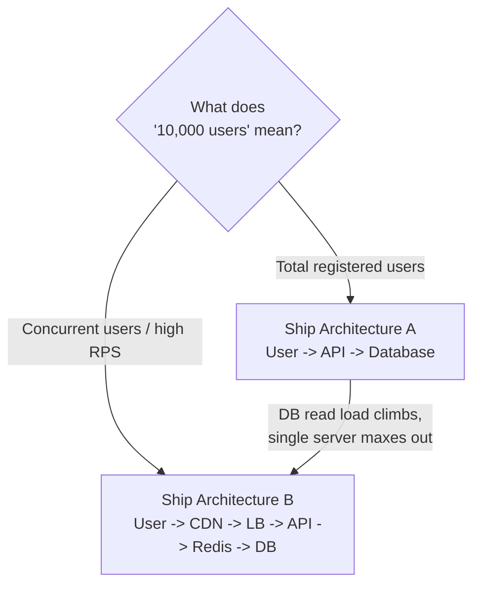

# Which Architecture Would You Ship: Simple or Scalable?

## 1. Story

You're given two options for a product expecting 10,000 users.

**Architecture A**: `User -> API -> Database`. Simple, cheap, easy to maintain.

**Architecture B**: `User -> CDN -> Load Balancer -> API -> Redis -> Database`. Scalable, fast, complex.

Which one do you ship?

## 2. The Problem

Most people answer this by gut feeling — "B looks more professional/scalable, ship B" or "A is simpler, always start simple, ship A." Both answers, given *without asking a question first*, are actually wrong, because the question is missing the one number that decides everything.

## 3. The Missing Question: What Does "10,000 Users" Actually Mean?

"10,000 users" is ambiguous in a way that changes the entire answer:

- **10,000 total registered users** (lifetime signups) — even with generous usage, this could easily mean single-digit to low-double-digit requests per second at peak. A single well-configured server and a managed database handle this without breaking a sweat.
- **10,000 concurrent users** (all active at the same moment) — this is a very different load profile, likely hundreds to low-thousands of requests per second, where a single API instance and a single database connection pool genuinely start to strain.
- **10,000 requests per second** — this is Architecture B territory almost regardless of user count; a single API server cannot realistically absorb this alone.

**The correct first move in this interview isn't picking A or B — it's asking which of these three "10,000 users" actually means.** That single clarifying question is often what separates a strong system design answer from a guess.

## 4. The Solution — Reasoned By Actual Requirement

**If it's 10,000 total users** (the common, realistic reading for an early-stage product): ship **Architecture A**. A single API server plus a managed database (with its own built-in redundancy) can handle this comfortably. Architecture B's CDN, load balancer, and Redis cache all solve problems — origin overload, single-server capacity limits, repeated expensive database reads — that **don't exist yet** at this scale. Building them anyway means paying real cost (money, operational complexity, more failure points, slower iteration speed) for a problem you don't have.

**If it's 10,000 concurrent users or a high request rate**: ship **Architecture B**. At that load, a single API instance is a real bottleneck (needs a load balancer to spread traffic across multiple instances — see [[06-ec2-autoscaling]]), repeated database reads for the same data become expensive at volume (needs Redis), and static/cacheable content should never hit your origin server at all (needs a CDN).

## 5. Mental Model

> Ship the architecture that matches **today's actual, clarified requirement**, with a clear, cheap path to add the next piece (cache, load balancer, CDN) the moment a specific metric proves you need it — not the architecture that looks more impressive in a diagram.

## 6. Flow

## 7. How I'd Answer This In an Interview

1. Ask the clarifying question first: "Is that 10,000 total signups, concurrent users, or requests per second? That changes my answer."
2. State the default: for a modest total-user count, the simpler architecture is not just acceptable, it's *correct* — over-building adds cost and complexity without a matching benefit yet.
3. Name the specific, measurable triggers that would justify migrating to the more complex design: sustained high database CPU/read latency, API response times degrading under real concurrent load, a single point of failure becoming an unacceptable business risk.
4. Show you know each piece of Architecture B and *why* it exists — CDN offloads static/cacheable traffic from origin, the load balancer distributes load across multiple API instances and provides failover (ties to [[06-ec2-autoscaling]] and [[12-multi-az-availability]]), Redis absorbs repeated reads so the database isn't hit for the same data over and over.

## 8. Production Reality

Real companies rarely start with Architecture B on day one — they start closer to A and add pieces of B incrementally, each addition justified by an actual, observed bottleneck (a slow endpoint, a database under load, a traffic spike that caused an incident). Building the full "scalable" stack pre-emptively is a common and expensive mistake for early-stage products.

## 9. Trade-offs

| | Architecture A | Architecture B |
|---|---|---|
| Cost | Low | Higher (CDN, LB, cache all cost money and ops time) |
| Time to ship | Fast | Slower — more moving parts to build and configure |
| Failure points | Fewer, but a single API/DB instance is a single point of failure | More components, but redundancy at each layer |
| Right for | Low-to-moderate actual load | Genuinely high concurrent load / traffic |

## 10. Common Mistakes

- **Resume-driven design**: choosing the more complex, "impressive-looking" architecture regardless of the actual requirement, because it sounds more senior.
- **The opposite mistake**: staying on Architecture A well past the point where real metrics (not guesses) clearly show it's failing — simplicity is only a virtue until the evidence says otherwise.
- Answering with a firm "A" or "B" immediately, without asking what the given scale number actually represents.

## 11. 🔗 Connection to Other Concepts

The load balancer and multi-instance scaling in Architecture B is exactly what [[06-ec2-autoscaling]] and [[12-multi-az-availability]] describe in depth — this question is really asking "when do you actually need that machinery?"

## 12. 🧠 Remember

> Ship the simplest architecture that satisfies today's actual, clarified requirements — add caching, load balancing, and a CDN only when a specific metric proves you need them, not because a diagram looks more serious.

## 13. Quick Self-Test

1. Why is "10,000 users" alone not enough information to answer this question definitively?
2. What's the first thing you should do when given an ambiguous scale number in a system design interview?
3. Name two concrete, measurable signals that would tell you it's time to move from Architecture A to Architecture B.
