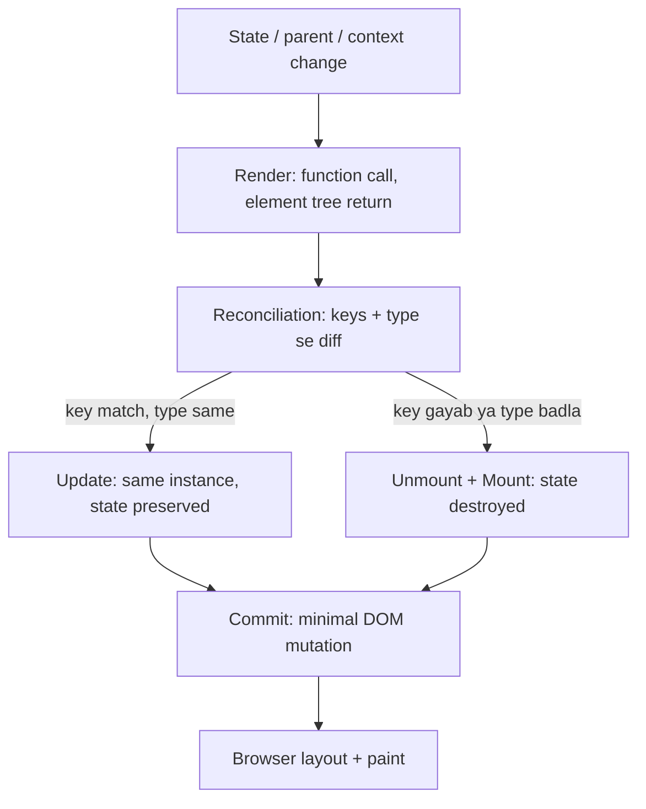

# React Reconciliation Aur Keys: Re-render Kab Hota Hai

> **Connects to**: [[100-react-interview-7-points-hinglish]] (point 2 ka deep dive), [[33-react-performance-at-scale]] (perf triage) aur [[138-closures-and-scope-real-bugs]] (har render ka apna scope hota hai).

## 1. Code Review Wali Scene

PR aata hai. Comment: *"Profiler mein ye row component 40 baar re-render ho raha hai, `React.memo` laga do."*

Memo lag gaya. Profiler mein numbers thode kam hue. Lekin asli bug jo QA ne file kiya tha -- *"list se ek item delete karne par doosre item ke input ka text badal jaata hai"* -- wo waise hi hai.

Kyunki wo bug re-render ka nahi tha. Wo **reconciliation** ka tha.

Ye lesson wahi teen cheezein alag karta hai jinhe log ek maan lete hain.

## 2. Teen Alag Cheezein: Render, Reconciliation, Commit

Backend wala analogy jo seedha fit hota hai -- `terraform plan` aur `terraform apply`:

| React | Kya hota hai | Browser ko touch karta hai? | Cost |
|---|---|---|---|
| **Render** | React aapke function ko call karta hai, aapka function ek element tree **return** karta hai (plain objects, DOM nahi) | Nahi | Aapke function ki JS cost |
| **Reconciliation** | React naye tree ko purane tree se **diff** karta hai, ek change-list banata hai | Nahi | Tree size ke proportional diff |
| **Commit** | Us change-list ko DOM par **apply** karta hai, phir browser layout + paint karta hai | **Haan** | Asli mehenga hissa |

Render = `plan`. Commit = `apply`.

Isi liye ye line interview mein important hai:

> "Re-render" apne aap mein performance problem **nahi** hai. Problem tab hai jab render mein mehenga kaam ho, ya commit mein bada DOM change nikle.

Agar aapka component re-render hua aur naya tree purane ke barabar nikla, React commit phase mein **kuch bhi** DOM change nahi karta. 40 re-renders ka matlab 40 DOM updates nahi hai.

Backend mein aap exactly yahi distinction roz use karte ho: query chalana sasta hai, `UPDATE` se 10,000 rows likhna mehenga hai.

## 3. Render Kab Trigger Hota Hai

Sirf teen wajah:

1. Component ka apna **state** badla (`setState` ke baad, aur naya value `Object.is` se purane se different ho).
2. Uska **parent** re-render hua.
3. Jo **context** ye component padh raha hai, uski value badli.

Note karo list mein kya **nahi** hai: "props badle". Props badalna ek *result* hai parent ke re-render ka, trigger nahi. Yahi wo rule hai jo log ulta samajhte hain:

```tsx
function Parent() {
  const [count, setCount] = useState(0);
  return (
    <>
      <button onClick={() => setCount((c) => c + 1)}>{count}</button>
      <ExpensiveChild />   {/* koi prop nahi, phir bhi har click par re-render */}
    </>
  );
}
```

`ExpensiveChild` ko ek bhi prop nahi mila, uska state nahi badla -- phir bhi har click par uska function call hoga. **Default behaviour: parent re-render hua to saara subtree re-render hota hai, props dekhe bina.** React props ko compare karne ki koshish bhi nahi karta, jab tak aap `React.memo` se na bolo.

Do sasti techniques memo se pehle:

```tsx
// (a) state ko neeche push karo -- counter apna component ban gaya
function Parent() {
  return (<><Counter /><ExpensiveChild /></>);
}

// (b) children as props -- ExpensiveChild ka element Parent ke bahar bana,
// isliye Counter re-render hone par bhi wahi (same reference) element reuse hota hai
function Shell({ children }: { children: React.ReactNode }) {
  const [count, setCount] = useState(0);
  return (<><button onClick={() => setCount((c) => c + 1)}>{count}</button>{children}</>);
}
<Shell><ExpensiveChild /></Shell>
```

## 4. Keys: Asli Bug

Ab wo QA bug. Ek list jisme har row ke andar ek input hai:

```tsx
type Todo = { id: string; label: string };

function TodoRow({ label }: { label: string }) {
  const [note, setNote] = useState('');          // local state, row ke andar
  return (
    <li>
      <span>{label}</span>
      <input value={note} onChange={(e) => setNote(e.target.value)} />
    </li>
  );
}

function TodoList({ todos }: { todos: Todo[] }) {
  return (
    <ul>
      {todos.map((t, i) => (
        <TodoRow key={i} label={t.label} />      {/* BUG: index as key */}
      ))}
    </ul>
  );
}
```

User flow:

1. List hai `[Milk, Bank, Call]`.
2. User "Bank" wale row ke input mein likhta hai `3pm branch`.
3. User "Milk" delete karta hai.

Ab list hai `[Bank, Call]`, aur keys hain `0, 1`.

React positions ko nahi, **keys** ko match karta hai:

| Key | Pehle kis item ka tha | Uska state (`note`) | Ab kaunsa label mila |
|---|---|---|---|
| `0` | Milk | `''` | **Bank** |
| `1` | Bank | `'3pm branch'` | **Call** |
| `2` | Call | `''` | (gayab -- unmount) |

Result: `3pm branch` ab **Call** ke saath dikh raha hai. Delete Milk ka hua, state Bank ka kharab hua, galat text Call par chipak gaya.

Yahi bug checkbox ke saath hota hai (galat row tick dikhti hai), CSS animation ke saath (galat row fade hoti hai), aur uncontrolled input ke saath bhi -- kyunki React us DOM node ko bhi reuse kar leta hai, aur DOM node ke andar typed value DOM ki apni state hai.

Fix:

```tsx
{todos.map((t) => <TodoRow key={t.id} label={t.label} />)}
```

Ab React dekhta hai: key `milk` gayab hai -> us instance ko **unmount** karo (uska state bhi gaya, jo sahi hai). Keys `bank` aur `call` dono maujood hain -> unke instances, unka state, unke DOM nodes jaise the waise rakho, bas naya label de do.

**Mental model:** `key` ek **primary key** hai, row number nahi. Index key ka matlab hai "is list ko row number se identify karo" -- aur aap backend mein kabhi `UPDATE ... WHERE row_number = 2` nahi likhte.

Teen baatein jo log miss karte hain:

- `key` **prop nahi hai**. Child ke andar `props.key` nahi milta. Ye React ke liye identity hint hai.
- Key sirf **siblings ke beech** unique honi chahiye, globally nahi.
- `key={Math.random()}` sabse bura "fix" hai: har render par nayi key -> har render par poora remount -> state gaya, focus gaya, DOM churn maximum.

Index key kab theek hai? Jab list **append-only** ho (kabhi reorder/filter/delete na ho) **aur** items ke andar koi state, input, focus ya animation na ho. Ye condition itni naazuk hai ki default `id` rakhna hi sasta hai.

## 5. Element Type Badla To State Mar Jaata Hai

Reconciliation ka doosra rule: **same position par element ka type badla, to React diff karna chhod deta hai** -- purana subtree unmount, naya mount. Saara internal state khatam.

```tsx
function Panel({ wide }: { wide: boolean }) {
  return wide
    ? <div className="wide"><Editor /></div>
    : <section><Editor /></section>;   // div -> section: Editor remount, draft gaya
}
```

`Editor` dono branches mein same component hai, par uska parent `div` se `section` ban gaya. Position same, type different -> poora subtree naya. User ka adha likha draft gayab.

Fix: type same rakho, attribute badlo.

```tsx
return <div className={wide ? 'wide' : 'narrow'}><Editor /></div>;
```

Yahi wajah hai ki conditional wrapper (ek `<Suspense>`, ek `<ErrorBoundary>`, ya ek extra `<div>` jo sirf kabhi aata hai) chupke se state reset kar deta hai.

## 6. Ulta Istemaal: Jaan-Boojh Kar Remount

Jo cheez accidentally state todti hai, wahi deliberately sabse saaf reset tool hai.

```tsx
// user badla -> poora form naya, saara draft/validation/dirty state clean
<UserProfileForm key={userId} user={user} />
```

Iska alternative kya hota hai? Ek `useEffect` jo props badalne par 6 `setState` call karta hai -- aur aap hamesha ek field reset karna bhool jaate ho. Key badalna ek line mein **saara** state reset karta hai, kyunki React component ko mount-from-scratch karta hai (aur `useState(initial)` ka initial value **sirf** mount par use hota hai -- re-render par ignore hota hai, remount par phir chalta hai).

Same trick: `<ErrorBoundary key={route}>` route change par error state clear karne ke liye.

## 7. Memo Kab Jawab Hai, Kab Nahi

Ab seedhi baat ([[33-react-performance-at-scale]] mein poori triage hai):

**Memo kaam karta hai jab:**
- Parent bahut baar re-render hota hai, aur child ke props **actually** nahi badalte.
- Child ka render ya uska subtree mehenga hai (measure kiya hua, guess nahi).
- Props stable references hain -- primitives, ya `useMemo`/`useCallback` se banaye hue objects/functions.

**Memo bekaar hai jab:**
- Child ka **apna state** badla -- memo sirf props compare karta hai, state ko nahi rok sakta.
- Child **context** padh raha hai jiski value badli -- memo is raaste ko block **nahi** karta. Ye lesson 154 ka context trap hai.
- Props mein inline object/function/array ja raha hai (`style={{ gap: 8 }}`, `onClick={() => ...}`, `items={rows.filter(...)}`) -- har render par naya reference, shallow compare fail, memo ek extra comparison ke saath bas overhead.
- Asli cost **commit** mein hai: 10,000 DOM nodes. Yahan jawab **virtualization** hai, memo nahi.

React 19 ka compiler is manual memoization ka bada hissa khud handle kar leta hai, par rule nahi badalta: pehle Profiler, phir fix.

## 8. Flow



## 9. Common Galtiyan

- "Re-render ho raha hai" ko bug maan lena. Pehle poochho: commit phase mein kuch change hua ya nahi.
- Index key, "list to chhoti hai" soch kar -- jab tak koi filter ya delete feature nahi aata.
- `key={Math.random()}` ya `key={JSON.stringify(item)}` -- dono remount machine hain.
- Memo lagana jab asli wajah context ya child ka apna state hai.
- Props compare hone ki ummeed karna bina `React.memo` ke -- React by default compare nahi karta.

## 🧠 Remember

> Render sirf ek function call hai, commit hi browser ko chhoota hai -- isliye re-render mehenga nahi, galat **identity** mehengi hai: `key` ek primary key hai, row number nahi, aur type badalne ka matlab hai purana component mar gaya.

## Quick Self-Test

1. Ek component 40 baar re-render hua par DOM mein ek bhi change nahi dikha. Phase-wise samjhao ki ye kaise possible hai.
2. `<ExpensiveChild />` ko koi prop nahi diya aur uska state bhi nahi badla -- parent ke state change par wo kyun re-render hota hai, aur memo ke bina do fix kya hain?
3. Index key wali list se pehla item delete hone par teesre item ka input text kaise badal jaata hai -- key-by-key samjhao.
4. `useState('')` ka `''` kab actually use hota hai? Isi jawab se "remount se state reset" trick explain karo.
5. Context value badalne par `React.memo` wala child kyun re-render ho jaata hai?
