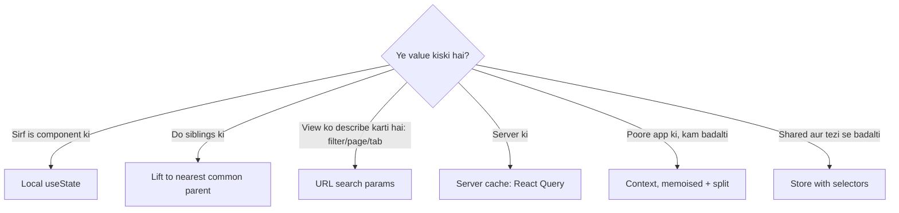

# State Kahan Rakhein: Local, Lifted, Context Ya Store

> **Connects to**: [[100-react-interview-7-points-hinglish]] (point 1 aur 5 ka deep dive), [[152-react-reconciliation-and-keys]] (re-render kaise failta hai), [[33-react-performance-at-scale]] (state galat jagah = bada subtree re-render) aur [[153-useeffect-and-dependency-array]] (state sync karne ke liye effect nahi).

## 1. Scene: "Global State" Wala PR

Naya dashboard. PR mein ek store file hai jisme: logged-in user, theme, orders list, selected order, filter dropdown ka open/close, aur search input ka text.

Sab kuch "global" hai, kyunki "aage kabhi kisi ko chahiye ho sakta hai".

Teen hafte baad: ek dropdown kholne par poora dashboard re-render hota hai; orders list stale dikhti hai kyunki store ko koi refetch nahi karta; aur filter lagane ke baad page refresh karne par filter gayab ho jaata hai.

Teen alag bugs, ek hi wajah: **state galat jagah rakhi gayi.**

Achhi khabar: backend engineer ke paas iska jawab dene ka framework already hai.

## 2. Backend Wala Sawaal, Frontend Par

Backend mein naya data aane par aap poochhte ho:

> Iska **source of truth** kaun hai? Kiske paas iska copy hoga? Copy stale hone par kya hota hai?

Frontend mein bilkul wahi teen sawaal hain:

1. Is value ka **owner** kaun hai -- ye component, do siblings, URL, ya server?
2. Kisko iska copy padhna hai?
3. Agar wo copy purana ho gaya, to pata kaise chalega?

Teesra sawaal hi 90% "global state" ko kharij kar deta hai. Agar data server ka hai, to aapko store nahi, **cache** chahiye -- TTL ke saath, invalidation ke saath.

## 3. Decision Ladder

Upar se shuru karo. Neeche sirf tab jao jab upar wala step **actually** fail ho.

```
1. Local useState                  <- default, jab tak sirf ek component padhta hai
       |
2. Nearest common parent (lift)    <- do siblings ko same value chahiye
       |
3. URL (search params)             <- filters, page, tab, sort, search query
       |
4. Server cache (React Query/SWR)  <- server ka data (orders, user profile, products)
       |
5. Context                         <- app-wide + low churn (theme, locale, current user)
       |
6. Store (Zustand/Redux)           <- shared + high churn client state
```

### Step 1 -- local

Dropdown open/close, input ka text, accordion expanded, hover state. Koi aur isko nahi padhta -> kahin bhi upar nahi jaana chahiye. Store mein daalne ka matlab hai har keystroke par poore app ka subscription jagana.

### Step 2 -- lift, lekin sirf **nearest** common parent tak

```tsx
function OrdersPage() {
  const [selectedId, setSelectedId] = useState<string | null>(null);   // dono bachche ko chahiye
  return (
    <>
      <OrderList selectedId={selectedId} onSelect={setSelectedId} />
      <OrderDetail orderId={selectedId} />
    </>
  );
}
```

Trap: state ko zaroorat se **zyada upar** le jaana. `App` mein rakh diya to ek row select karne par poora app tree re-render hota hai ([[33-react-performance-at-scale]] ka "state lifted too high").

Aur: 2-3 level prop drilling **theek hai**. Context prop drilling ka fix nahi hai -- composition (`children` as prop) usually behtar fix hai, [[152-react-reconciliation-and-keys]] mein dekha.

### Step 3 -- URL bhi state hai

Ye wo step hai jo log poora skip kar dete hain.

```tsx
const [params, setParams] = useSearchParams();
const status = params.get('status') ?? 'all';
const page = Number(params.get('page') ?? '1');

function setStatus(next: string) {
  setParams((p) => { p.set('status', next); p.set('page', '1'); return p; });
}
```

`useState` ki jagah URL rakhne se **muft** mein milta hai: refresh ke baad filter zinda, link share karne par doosre ko wahi view, browser back button sahi kaam karta, aur support team se "exact URL bhejo" kehna debugging bana deta hai.

Aur ek bug khatam ho jaata hai: `useState` + `useEffect` se URL ko sync karna do source of truth banata hai -- lesson 100 ka point 1, aur [[153-useeffect-and-dependency-array]] ka "effect se state derive mat karo".

### Step 4 -- server data store mein nahi jaata

Sabse important insight:

> Jise log "global state" bolte hain, usme se zyadatar **server data** hoti hai. Server data aapki state nahi hai -- wo server ki state ka **cache** hai.

```tsx
const { data, isPending, error, isFetching } = useQuery({
  queryKey: ['orders', { status, page }],      // request ki identity
  queryFn: ({ signal }) => fetchOrders({ status, page, signal }),
  staleTime: 30_000,                            // 30s tak fresh maano
});
```

Agar aap yahi orders ek Zustand store mein rakhte ho, to aapne ek cache banaya hai jiske paas **na TTL hai, na invalidation, na dedupe, na refetch, na cancellation**. Backend mein aisa cache likhne par review mein reject ho jaata -- wahi [[60-cache-says-100-db-says-20]] wala "cache aur DB alag bol rahe hain" problem hai, bas browser ke andar.

Poori fetching story (race conditions, stale-while-revalidate, cache key) lesson 155 mein hai.

### Step 5 -- Context ka asli scope

Context **dependency injection** hai, state management nahi. Uske liye sahi cheezein: theme, locale, logged-in user, feature flags, ek router instance, ek i18n instance. Common property: poore app ko chahiye, **aur bahut kam badalta hai**.

### Step 6 -- store sirf high-churn shared client state ke liye

Jab state (a) kai jagah se padhi jaati hai, (b) tezi se badalti hai, aur (c) server ki nahi hai: multi-step wizard ka draft jo routes ke across chalta hai, ek editor/canvas document, realtime presence/cursors, ek complex undo stack. Yahan Zustand/Redux ka asli faida **selector-based subscription** hai, jo context nahi deta.

## 4. Context Trap

Ab wo trap jo har "context se kaam ho jaayega" PR mein milta hai.

```tsx
type AppCtx = {
  user: User | null; setUser: (u: User | null) => void;
  theme: 'light' | 'dark'; setTheme: (t: 'light' | 'dark') => void;
};
const AppContext = createContext<AppCtx | null>(null);

function App() {
  const [user, setUser] = useState<User | null>(null);
  const [theme, setTheme] = useState<'light' | 'dark'>('light');
  const [tick, setTick] = useState(0);        // koi bhi unrelated state

  return (
    <AppContext.Provider value={{ user, setUser, theme, setTheme }}>  {/* BUG */}
      <Dashboard />
    </AppContext.Provider>
  );
}
```

Isme **do alag bugs** hain, aur interview mein dono bolna chahiye:

**Bug A -- naya object literal.** `value={{ ... }}` har `App` render par **naya reference** banata hai. `tick` badalne par bhi, jiska context se koi lena-dena nahi, **har consumer** re-render hota hai. Aur `React.memo` yahan bachata **nahi** hai: memo props compare karta hai, par context consumer ke **andar** padha jaata hai ([[152-react-reconciliation-and-keys]] ka memo section).

**Bug B -- context mein selector nahi hota.** `useMemo` laga do, phir bhi: `user` badla to `theme` padhne wala sidebar bhi re-render hoga. Context ka subscription **poori value** par hai, field par nahi.

### Fix 1 -- value memoise karo (sirf Bug A theek hota hai)

```tsx
const value = useMemo(() => ({ user, setUser, theme, setTheme }), [user, theme]);
// setUser/setTheme useState se already stable hain, isliye dep mein nahi
```

### Fix 2 -- contexts ko split karo (Bug B ka asli fix)

Do tarah ka split, dono karo:

```tsx
// (a) domain ke hisaab se alag
<ThemeContext.Provider value={theme}>
  <UserContext.Provider value={user}>{children}</UserContext.Provider>
</ThemeContext.Provider>

// (b) state aur dispatch alag
const StateCtx = createContext<State | null>(null);
const DispatchCtx = createContext<React.Dispatch<Action> | null>(null);

function Provider({ children }: { children: React.ReactNode }) {
  const [state, dispatch] = useReducer(reducer, initial);
  return (
    <DispatchCtx.Provider value={dispatch}>   {/* dispatch kabhi nahi badalta */}
      <StateCtx.Provider value={state}>{children}</StateCtx.Provider>
    </DispatchCtx.Provider>
  );
}
```

`useReducer` ka `dispatch` identity stable hoti hai, isliye jo component sirf **likhta** hai (ek "Add to cart" button) wo state badalne par kabhi re-render nahi hoga. Ye pattern ka poora point hai.

### Fix 3 -- store with selectors

```tsx
const theme = useAppStore((s) => s.theme);          // sirf theme badle to re-render
const addItem = useAppStore((s) => s.addItem);      // function reference stable
```

Store har component ko **apne chune hue slice** par subscribe karta hai. Yahi wo cheez hai jiske liye store ko context se upgrade kehna justified hai -- "global" hona nahi.

## 5. Table: Kaunsi State Kahan

| State | Kahan rakho | Kyun |
|---|---|---|
| Input text, dropdown open, hover, accordion | Local `useState` | Koi doosra isko padhta hi nahi |
| Selected row + uska detail panel | Nearest common parent | Do siblings ko chahiye, isse upar nahi |
| Filters, page, sort, search query, active tab | URL search params | Refresh/share/back muft; ek hi source of truth |
| Orders, profile, products, kuch bhi jo API se aaya | Server cache (React Query/SWR) | Owner server hai; TTL + invalidation + dedupe chahiye |
| Theme, locale, current user, feature flags | Context | Poore app ko chahiye, kabhi-kabhaar badalta hai |
| Wizard draft, editor document, presence, undo stack | Store with selectors | Shared **aur** high-churn; per-field subscription chahiye |
| Totals, formatted labels, filtered/sorted views | Kahin nahi -- calculate karo | Duplicate truth = stale bug (lesson 100, point 1) |

## 6. Common Galtiyan

- "Aage kabhi chahiye hoga" soch kar local state ko store mein daalna.
- Server data ko store/context mein rakhna -- aapne bina policy ka cache likh diya.
- Filters ko `useState` mein rakh kar `useEffect` se URL mein sync karna (do source of truth).
- Ek bada "AppContext" jisme sab kuch ho -- har field ka change poore app ko re-render karta hai.
- Provider mein inline object literal.
- Context ko prop drilling ka fix maanna, jabki composition kaafi tha.
- `React.memo` se context re-render rokne ki koshish.

## 7. Flow



## 🧠 Remember

> Pehle poochho "iska owner kaun hai" -- aur yaad rakho ki jo "global state" lagti hai wo zyadatar **server ka data** hai, jiske liye store nahi **cache** chahiye; aur context ek dependency injection tool hai, isliye uski value ka ek bhi field badalna **har** consumer ko re-render karta hai.

## Quick Self-Test

1. Filters ko `useState` ke bajaye URL mein rakhne se kaunse teen behaviours muft milte hain?
2. "Most global state is actually server data" -- is line ko cache ki bhaasha mein explain karo (TTL, invalidation, dedupe).
3. Provider mein `value={{ user, theme }}` likhne se kya hota hai, aur `useMemo` lagane ke **baad** bhi kaunsa problem bacha rehta hai?
4. `React.memo` context-driven re-render ko kyun nahi rok sakta?
5. State aur dispatch ko alag context mein rakhne ka exact faida kya hai?
6. State ko "zaroorat se zyada upar" lift karne ka performance cost kya hai?
