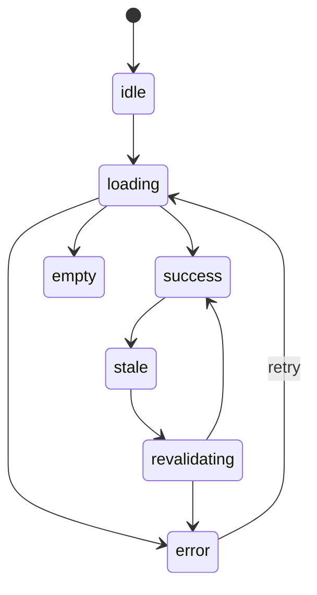

# Data Fetching Mein Race Conditions Aur AbortController

> **Connects to**: [[100-react-interview-7-points-hinglish]] (point 5 ka deep dive), [[153-useeffect-and-dependency-array]] (cleanup aur stale closure), [[140-promises-internals-and-async-await]] (resolve order), [[13-hidden-latency-bottleneck]] (cancel karne se server ka kaam bachta hai) aur [[84-infinite-scroll-pagination-at-scale]] (paginated fetching). | [[149-core-web-vitals]] (layout shift and CLS)

## 1. Bug: Search Box Jo Galat Result Dikhata Hai

Ek product search. User type karta hai `iphone`. 6 requests jaati hain (`i`, `ip`, `iph`, `ipho`, `iphon`, `iphone`). Input mein `iphone` likha hai, par list mein `ip` ke results dikh rahe hain.

```tsx
function Search() {
  const [q, setQ] = useState('');
  const [results, setResults] = useState<Product[]>([]);

  useEffect(() => {
    fetch(`/api/search?q=${encodeURIComponent(q)}`)
      .then((r) => r.json())
      .then(setResults);            // BUG: jo baad mein aaya wo jeetta hai
  }, [q]);

  return (<><input value={q} onChange={(e) => setQ(e.target.value)} /><List items={results} /></>);
}
```

Timeline:

| Time | Event |
|---|---|
| 0ms | `ip` type hua -> request **A** jaati hai (cold query, 900 rows scan) |
| 80ms | `iphone` type hua -> request **B** jaati hai (cache hit) |
| 300ms | **B** aati hai -> `setResults(iphone results)` -- UI sahi |
| 900ms | **A** aati hai -> `setResults(ip results)` -- UI galat ho gaya |

Aur ye bug local par kabhi reproduce nahi hota, kyunki local server har request 5ms mein deta hai.

## 2. Kyun: Response Order Ki Koi Guarantee Nahi Hai

Backend engineer ke liye ye line kaafi honi chahiye:

> Request order aapke control mein hai. Response order kisi ke control mein nahi.

Wajah kaafi hain: har query ka cost alag (`ip` ka result set bada), HTTP/2 multiplexing par streams independent complete hote hain, HTTP/1.1 par browser ki 6-connection limit queue banati hai, server par kai workers parallel chal rahe hain, retry/proxy/network jitter alag.

Aur `setResults` ek **shared cell** hai. Do writers, bina version check ke -> **last write wins**. Ye frontend ka exactly wahi problem hai jo [[10-clock-skew-last-write-wins]] mein distributed writes ke saath dekha tha. Promise order ka bhi koi rule nahi hai: Promise jab settle hoti hai tab uska `.then` queue hota hai, aapke firing order mein nahi ([[140-promises-internals-and-async-await]]).

Fix ka asli idea: **response ko uski request se bind karo, aur sirf latest request ka response accept karo.**

## 3. Fix 1 -- `ignore` Flag (Canonical React Jawab)

```tsx
useEffect(() => {
  let ignore = false;                              // is effect run ka apna variable

  fetch(`/api/search?q=${encodeURIComponent(q)}`)
    .then((r) => r.json())
    .then((data) => { if (!ignore) setResults(data); });

  return () => { ignore = true; };                 // cleanup: purana run disqualify
}, [q]);
```

Kaam kaise karta hai: `q` badalne par React **pehle purana cleanup** chalata hai, phir naya effect ([[153-useeffect-and-dependency-array]]). Purana cleanup us purane run ke `ignore` ko `true` kar deta hai. Jab A ki response 900ms par aati hai, uska closure `ignore === true` dekhta hai aur chup-chaap chala jaata hai.

Dhyaan do: yahi [[138-closures-and-scope-real-bugs]] ka closure hai, par **deliberately** use kiya gaya -- har effect run ka apna `ignore` binding hai, isliye runs ek doosre ko gandha nahi karte.

Ye correctness ke liye kaafi hai, par request network par chalti hi rehti hai.

## 4. Fix 2 -- AbortController (Request Actually Cancel Karo)

```tsx
useEffect(() => {
  const ac = new AbortController();

  (async () => {
    setStatus('loading');
    try {
      const res = await fetch(`/api/search?q=${encodeURIComponent(q)}`, { signal: ac.signal });
      if (!res.ok) throw new Error(`HTTP ${res.status}`);
      setResults(await res.json());
      setStatus('success');
    } catch (err) {
      if ((err as Error).name === 'AbortError') return;   // ye normal hai, error nahi
      setError(err as Error);
      setStatus('error');
    }
  })();

  return () => ac.abort();
}, [q]);
```

Teen baatein jo interview mein alag karti hain:

**(a) `AbortError` ko error ki tarah treat na karo.** Abort karna aapka apna faisla tha. Agar aap use Sentry/logs mein bhejte ho, to dashboard fake errors se bhar jaayega aur asli error chhup jaayega.

**(b) Browser side par ye slot free karta hai.** HTTP/1.1 par browser ek origin par ~6 parallel connections rakhta hai. 6 zinda stale requests ka matlab hai saatvi (jo user ko *actually* chahiye) **queue mein** baithi hai. Abort karne se latest request turant nikalti hai.

**(c) Server side par faida real hai, par guarantee nahi.** Socket band hone par Node ko `req` par `aborted`/`close` milta hai -- lekin jo DB query already chal rahi hai wo apne aap nahi rukti. Downstream cancellation ke liye signal propagate karna padta hai:

```js
// Node (Express) -- cancellation ko aage pass karo
app.get('/api/search', async (req, res) => {
  const ac = new AbortController();
  req.on('close', () => ac.abort());                 // client chala gaya
  try {
    const rows = await searchProducts(req.query.q, { signal: ac.signal });
    res.json(rows);
  } catch (err) {
    if (err.name === 'AbortError') return;           // response bhejne ki zarurat nahi
    throw err;
  }
});
```

Isi liye abort sirf UI correctness nahi, **capacity** ka tool bhi hai: jo kaam kisi ko nahi chahiye, usse worker, connection pool aur DB CPU bachta hai ([[13-hidden-latency-bottleneck]]).

## 5. Fix 3 -- Debounce (Request Hi Na Bhejo)

Do upar wale fix *galat* response se bachate hain. Debounce **request** hi kam karta hai.

```tsx
const [q, setQ] = useState('');
const [debouncedQ, setDebouncedQ] = useState('');

useEffect(() => {
  const id = setTimeout(() => setDebouncedQ(q.trim()), 300);
  return () => clearTimeout(id);                  // har keystroke par purana timer cancel
}, [q]);

// fetch sirf debouncedQ par, aur 2 characters se chhota hai to bhejo hi nahi
```

`iphone` par 6 requests ke bajaye 1-2 jaati hain. Saath mein minimum length check -> `i` jaisi useless broad query server par kabhi nahi jaati.

**Teeno saath use hote hain, kyunki teeno alag problem solve karte hain:**

| Tool | Kya solve karta hai |
|---|---|
| Debounce | Kitni requests jaayengi (load) |
| AbortController | Jo gayi par bekaar ho gayi (server work + connection slot) |
| `ignore` flag | Correctness ka final backstop (abort race ko bhi cover karta hai) |

Ek bonus React tool: `useDeferredValue(q)` -- isse input turant update hota hai aur bhaari list ka render low-priority ho jaata hai. Ye **rendering** lag ka fix hai, network race ka nahi. Dono alag problem hain ([[33-react-performance-at-scale]]).

## 6. Ek Fetch Ki Imaandaar State Machine

Interview mein log "loading, error, success" bolte hain. Production mein states zyada hain:



- **empty** `success` se alag hai: 0 results ka UI ("koi product nahi mila, filter hatao?") spinner ya error se bilkul alag hota hai.
- **stale** = data purana hai par dikhane layak hai.
- **revalidating** = background mein refetch chal raha hai **jabki purana data screen par hai**. Isi ki wajah se pagination par screen blank nahi hoti.

Aur TypeScript mein inhe discriminated union banao, taaki "loading ke saath data" jaisa invalid combo compile hi na ho (lesson 100, point 7 -- aur [[147-typescript-at-the-runtime-boundary]] yaad dilata hai ki API ka data runtime par validate karna padta hai, type assert karna kaafi nahi):

```ts
type Query<T> =
  | { status: 'loading' }
  | { status: 'error'; error: Error; requestId?: string }
  | { status: 'success'; data: T; isStale: boolean };
```

## 7. Isliye React Query Exist Karta Hai

Ab ginti karo: ignore flag + abort + debounce + 5 states + retry + "do components ne same data maanga to ek hi request" + "tab wapas focus hua to refresh". Ye **har screen** par dobara likhna hai.

React Query / SWR exactly yahi deti hain, aur har piece ka backend equivalent hai:

| Frontend | Backend equivalent |
|---|---|
| **Cache key** (`['orders', { status, page }]`) | Cache key = endpoint + normalized params ([[63-query-faster-second-time]]) |
| **Dedupe** -- same key ke 3 components, 1 request | Request coalescing / single-flight ([[83-redis-down-database-stampede]]) |
| **staleTime** | TTL -- kitni der tak fresh maanein |
| **gcTime** | Eviction -- memory se kab hatayein |
| **Invalidation** mutation ke baad | Cache invalidate on write ([[60-cache-says-100-db-says-20]]) |
| **Retry + backoff** | Wahi retry policy jo aap HTTP client mein likhte ho |

**Stale-while-revalidate** ek line mein: cached data **turant** dikhao, saath hi background mein fresh maango, aa jaaye to chup-chaap swap kar do. Perceived latency ~0, aur data thodi der purana reh sakta hai -- yahi trade-off backend caching mein bhi accept karte ho.

```tsx
const { data, isPending, isFetching, error } = useQuery({
  queryKey: ['search', debouncedQ],
  queryFn: ({ signal }) => searchApi(debouncedQ, signal),   // signal built-in: cancellation free
  enabled: debouncedQ.length >= 2,
  staleTime: 30_000,
  placeholderData: (prev) => prev,                           // purana data rakho, blank nahi
});
```

Note `queryFn` ko `signal` milta hai -- library khud `AbortController` manage karti hai. Aur race condition **structurally** khatam hai: UI us key ka data render karta hai jo abhi active hai, isliye purani key ki response kis bhi order mein aaye, wo galat screen par nahi dikh sakti.

## 8. Loading UI: Layout Shift Ka Chhota Bug, Bada Impact

```tsx
if (isPending) return <Spinner />;     // poora page gayab, phir wapas -> content jump
```

Problems: content ki jagah badalti hai (layout shift), aur fast response par spinner 50ms ke liye flash karta hai. Behtar rules:

- Content ki **jagah reserve** karo -- same height/shape ka skeleton, taaki kuch na khiske.
- Spinner 150-200ms ke **delay** ke baad dikhao; usse pehle aa gaya to kuch na dikhao.
- Refetch par purana data screen par rakho aur ek chhota inline indicator do (`isFetching`), poora page replace na karo.
- Pehle load par response ka size bhi dekho -- 20 rows dikhane ke liye 10,000 na maango ([[82-return-10000-show-20]], [[48-huge-json-payloads]]).

## 9. Error Boundary vs Inline Error State

| Chahiye | Tool |
|---|---|
| Ek widget ka fetch fail hua, baaki page kaam karna chahiye | **Inline error state** + "Retry" button |
| Render ke dauran unexpected exception (undefined ka property padha) | **Error boundary** |

Ek gotcha jo interview mein poochha jaata hai: error boundary **render/lifecycle** mein throw hui error pakadta hai. `fetch` ki rejection ya event handler mein throw hui error use **nahi** milti -- wo React ke render cycle ke bahar hai. Isliye async error ko boundary tak le jaane ke liye use render ke dauran throw karna padta hai (React Query ka `throwOnError` yahi karta hai).

Aur error UI mein server ka **request id** dikhao (`Support ko ye code bhejein: {requestId}`) -- us ek string se backend log mein poori chain mil jaati hai ([[02-debugging-random-500-errors]]). Browser ke `TypeError: Failed to fetch` ko bhi pehchano: status 0, koi body nahi -- ye usually network down, DNS, ya **CORS/preflight** failure hota hai, server ka 500 nahi; aur retry isko kabhi theek nahi karega ([[07-cors-error-fix]]).

## 10. Retry Sirf Idempotent Reads Par

Backend rule bilkul waisa hi apply hota hai:

- **GET** -- safe aur idempotent. Retry karo, exponential backoff + jitter ke saath (sab clients ek hi second par retry karein to aapne khud ek spike bana diya).
- **POST/PATCH/DELETE** -- blind retry nahi. Pehli request server tak pahunch ke timeout ho sakti hai; retry ka matlab do orders. Retry sirf **idempotency key** ke saath ([[32-payment-idempotency-double-click]], [[19-idempotent-consumer-duplicate-events]]).
- **4xx retry na karo** -- 400/401/403/404 retry karne se kuch nahi badlega, bas load badhega. Retry 5xx, 429 (`Retry-After` honor karo) aur network errors par.

React Query ka default yahi rule encode karta hai: queries 3 baar retry hoti hain, **mutations 0 baar**. Ye ek achhi interview line hai.

## 11. Common Galtiyan

- `useEffect` mein fetch, bina cleanup -- ye lesson ka pehla bug.
- `AbortError` ko real error ki tarah log karna, jisse dashboard fake errors se bhar jaaye.
- Sirf debounce laga ke "race fix ho gaya" maan lena (debounce chance kam karta hai, khatam nahi).
- `loading`/`error`/`success` tak rukna -- `empty` aur `stale` miss karna.
- POST ko blind retry karna, bina idempotency key; aur 4xx retry karna.
- `Failed to fetch` ko server error samajh kar backend logs mein dhoondhna -- request wahan pahunchi hi nahi.

## 🧠 Remember

> Request order aapka hai, response order kisi ka nahi -- isliye `setState` ko ek shared cell maano aur sirf **latest** request ka response accept karo; `ignore` flag correctness deta hai, `AbortController` server ka kaam bachata hai, debounce request hi kam karta hai, aur ye teeno + cache key + TTL + stale-while-revalidate milakar wahi hai jo React Query hai.

## Quick Self-Test

1. Local par ye race condition kyun reproduce nahi hoti, aur production mein kyun hoti hai?
2. `ignore` flag exactly kis React guarantee par kaam karta hai?
3. Abort karne se server ka kaam kaise bachta hai -- aur kis haalat mein nahi bachta?
4. `empty` state ko `success` se alag rakhna kyun zaroori hai? UI mein kya fark aata hai?
5. Stale-while-revalidate ka trade-off ek line mein batao, backend caching ki bhaasha mein.
6. Ek `fetch` fail hui -- error boundary ne use kyun nahi pakda?
7. GET retry karna theek hai par POST nahi -- kyun, aur POST ko retryable kaise banate hain?
