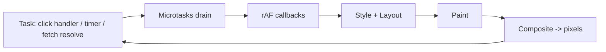

# Browser Ka Event Loop vs Node Ka

> **Connects to**: [[137-event-loop-phases-and-microtasks]] (Node ke chhe phases aur microtask queues -- ye uska browser-side counterpart hai) aur [[51-fast-api-slow-page]] (80ms API, 4.8s page -- jank usi timeline ka last hissa hai). | [[148-browser-rendering-pipeline]] (where rendering fits)

## 1. Pehle 30 Second Ka Recall

[[137-event-loop-phases-and-microtasks]] se teen cheezein yaad karo, kyunki poora ye lesson unke upar khada hai: (1) **ek thread** aapka JS chalata hai, (2) ek **task queue** (macrotasks) hai jisse loop ek-ek callback uthata hai, (3) har task ke baad **microtask queue poori drain** hoti hai (`process.nextTick` phir promises).

Browser mein ye teeno **same** hain. Core idea identical hai -- spec mein bhi same "event loop" hai. Farak **furniture** ka hai: browser ke loop mein ek extra, non-negotiable kaam hai jo Node mein bilkul nahi hota.

## 2. Woh Extra Kaam: Rendering

Node ka loop I/O ke liye bana hai. Browser ka loop **screen** ke liye bana hai. Har frame par browser ko ye pipeline chalana padta hai:

```
task (aapka JS)
  -> microtasks drain
  -> requestAnimationFrame callbacks
  -> style recalculation
  -> layout (reflow)
  -> paint
  -> composite  (ye GPU par ja sakta hai)
  -> [screen par pixel]
```

Aur ye pipeline **usi single main thread par** chalti hai jahan aapka JS chalta hai (composite ke alawa).



Iska seedha matlab: **aapka JS aur screen ka update ek hi resource ke liye compete kar rahe hain.** Node mein ek slow function latency badhata hai; browser mein wo screen **freeze** kar deta hai.

## 3. Frame Budget: 16.7 ms

60 fps ka matlab hai 60 frames per second, yaani per frame **1000/60 = ~16.7 ms**. Us 16.7 ms mein browser ko **sab** karna hai: aapka JS, style, layout, paint, composite. Practically aapke JS ke paas ~8-10 ms hai.

| Display | Frame budget |
|---|---|
| 60 Hz | ~16.7 ms |
| 90 Hz | ~11.1 ms |
| 120 Hz (modern phones) | ~8.3 ms |

Ab 50 ms ka ek synchronous task lo:

```
Budget:  |16.7|16.7|16.7|
Aapka:   |<------- 50 ms sync JS ------->|
Frames:   X    X    X        <- teen frames miss, screen freeze
```

**Yahi "jank" hai**: animation atak jaati hai, scroll chipak jaata hai, typing mein characters late aate hain, button press 200 ms baad respond karta hai. User ise "slow app" bolta hai, aur aapka backend 80 ms par bilkul theek hai ([[51-fast-api-slow-page]]).

Formal naam: **long task** = main thread par 50 ms se zyada chalne wala task. Yahi **INP** (Interaction to Next Paint) kharab karta hai, kyunki INP naapta hai: user ne tap kiya -> screen par uska result dikhne tak kitna time laga. Agar us waqt main thread 300 ms ke task mein busy hai, to aapka handler chhoo bhi nahi paayega screen ko.

Naapne ke liye:

```javascript
// Long tasks ko production mein observe karo -- guess mat karo
new PerformanceObserver((list) => {
  for (const entry of list.getEntries()) {
    if (entry.duration > 50) {
      console.warn('long task', entry.duration, entry.attribution?.[0]?.name);
      // RUM endpoint par bhejo -- ye browser ka 'monitorEventLoopDelay' hai
    }
  }
}).observe({ type: 'longtask', buffered: true });
```

Ye seedha [[137-event-loop-phases-and-microtasks]] ke `monitorEventLoopDelay` ka browser equivalent hai. Dono ek hi cheez naap rahe hain: **main thread kitni der occupied raha.**

## 4. Teen APIs Jo Node Mein Nahi Hain

### 4.1 `requestAnimationFrame` -- paint se pehle

`rAF` callback **agle paint se theek pehle** chalta hai. Visual update ki sahi jagah yahi hai, `setTimeout` nahi:

```javascript
// X setTimeout: paint ke saath sync nahi. Kabhi do updates ek frame mein,
//   kabhi ek frame mein zero -> stutter.
setTimeout(() => el.style.transform = `translateX(${x}px)`, 16);

// OK rAF: exactly ek update per frame, aur tab ke background mein jaane par
//    browser ise PAUSE kar deta hai (battery + CPU bachta hai).
function step(ts) {                       // ts = high-res timestamp
  el.style.transform = `translateX(${x(ts)}px)`;
  handle = requestAnimationFrame(step);
}
handle = requestAnimationFrame(step);
// cleanup zaroori hai, warna leak: cancelAnimationFrame(handle)
```

Ek related trap jo interview mein achha lagta hai -- **layout thrashing**:

```javascript
// X Read-write-read-write: har offsetHeight read browser ko FORCE karta hai ki pending
//   styles ke saath layout ABHI calculate kare. 100 items = 100 layouts = 80 ms ek frame mein.
items.forEach(el => { el.style.height = el.offsetHeight + 10 + 'px'; });

// OK Batch: pehle saare reads, phir saare writes
const hs = items.map(el => el.offsetHeight);                      // read phase
items.forEach((el, i) => el.style.height = hs[i] + 10 + 'px');    // write phase
```

### 4.2 `requestIdleCallback` -- jab thread khaali ho

Non-urgent kaam (analytics flush, prefetch, cache warm, logging) ke liye:

```javascript
requestIdleCallback((deadline) => {
  // deadline.timeRemaining() batata hai kitna ms bacha hai is idle period mein
  while (deadline.timeRemaining() > 1 && queue.length) process(queue.shift());
}, { timeout: 2000 });   // timeout: agar idle kabhi na mile to force chalao
```

Safari mein support historically weak raha hai -- fallback `setTimeout` rakho, ya `scheduler.postTask` use karo (`priority: 'background'`).

### 4.3 `setTimeout(fn, 0)` ~4 ms par clamp hota hai

Node mein `setTimeout(fn, 0)` minimum 1 ms ban jaata hai ([[137-event-loop-phases-and-microtasks]]). Browser mein rule alag aur sakht hai: HTML spec kehta hai ki **5 levels se zyada nesting** ke baad timeout minimum **4 ms** ho jaata hai.

```javascript
let n = 0;
function tick() {
  n++;
  setTimeout(tick, 0);   // pehle ~5 iterations fast, uske baad har call ~4 ms
}
tick();
// Matlab: setTimeout ke recursive loop se aap max ~250 iterations/second kar paaoge
```

Plus: **background tab** mein timers 1000 ms tak throttle ho jaate hain (aur freeze bhi ho sakte hain). Isliye browser mein timer-driven polling reliable clock nahi hai -- jo expect kar rahe ho ki tab background mein bhi chalta rahega, wo `Web Worker` ya server-side logic mein hona chahiye.

## 5. Long Task Ko Todo

Problem: 5,000 rows ko client-side format karna hai, aur wo 400 ms le raha hai. UI freeze.

### Fix 1: Chunking (yield karo)

```typescript
// Kaam ko tukdon mein todo aur beech mein thread WAPAS browser ko do,
// taaki wo paint kar sake aur pending clicks handle kar sake.
async function processInChunks<T>(items: T[], fn: (x: T) => void) {
  const CHUNK_MS = 5;                 // ek frame ke budget se kam
  let start = performance.now();
  for (const item of items) {
    fn(item);
    if (performance.now() - start >= CHUNK_MS) {
      await yieldToMain();
      start = performance.now();
    }
  }
}

function yieldToMain(): Promise<void> {
  // Modern Chrome: scheduler.yield() -- yield karta hai PAR aapke continuation ko
  // priority deta hai, yaani queue ke peeche nahi jaata. Ye setTimeout se behtar hai.
  const s = (globalThis as any).scheduler;
  if (s?.yield) return s.yield();
  return new Promise((r) => setTimeout(r, 0));   // fallback: task queue ke peeche
}
```

Important nuance: **`await Promise.resolve()` yield NAHI karta.** Promise ek **microtask** hai, aur microtasks usi task ke andar, paint se pehle drain hoti hain. Infinite microtask chain poore page ko permanently freeze kar deti hai:

```javascript
// Page hamesha ke liye frozen -- paint kabhi nahi hoga, tab close karna padega.
// Node mein ye event loop ko bhookha rakhta hai; browser mein ye SCREEN maar deta hai.
function spin() { Promise.resolve().then(spin); }
spin();
```

Yield karne ke liye aapko **naya task** chahiye (`setTimeout`, `scheduler.yield`, `MessageChannel`), microtask nahi. Yahi `queueMicrotask` vs `setTimeout` ka asli farak hai.

### Fix 2: CPU kaam Web Worker mein bhejo

Chunking latency chhupata hai, kaam kam nahi karta. Asli CPU kaam (parsing a 20 MB JSON, image processing, crypto, diffing, search index) **doosre thread** par jaana chahiye. Web Worker = browser ka `worker_threads`.

```typescript
// main.ts
const worker = new Worker(new URL('./parse.worker.ts', import.meta.url), { type: 'module' });

worker.postMessage({ csv });          // structured clone -- copy hoti hai, shared nahi
worker.onmessage = (e) => setRows(e.data.rows);   // main thread free raha
worker.onerror = (e) => reportError(e.message);   // error handling bhoolna mat

// parse.worker.ts -- yahan DOM nahi hai, par fetch/crypto/IndexedDB hain
self.onmessage = (e: MessageEvent) => {
  const rows = heavyParse(e.data.csv);   // 400 ms, par KISI frame ko nahi rokta
  self.postMessage({ rows });
};
```

Trade-offs (ye hi interview mein poochha jaata hai):

| Point | Reality |
|---|---|
| Worker mein DOM hai? | **Nahi**. Sirf compute. Result main thread par render hota hai. |
| Data kaise jaata hai | `postMessage` -> **structured clone** = copy. Bada payload copy karna khud costly hai. |
| Zero-copy possible? | Haan -- `ArrayBuffer` transfer (`postMessage(buf, [buf])`) ya `SharedArrayBuffer` (cross-origin isolation headers chahiye). |
| Kab worth hai | Kaam > ~50-100 ms, aur frequent. Chhote kaam ke liye worker ka setup+copy overhead hi jeet jaayega. |

Ye exactly [[137-event-loop-phases-and-microtasks]] ki `worker_threads` wali advice hai, same reasoning, dusra runtime.

## 6. Node vs Browser -- Translation Table

| Node | Browser equivalent | Note |
|---|---|---|
| `process.nextTick(fn)` | `queueMicrotask(fn)` (closest) | Browser mein nextTick ki alag higher-priority queue **nahi** hai -- sirf ek microtask queue |
| `Promise.then` microtask | **same** | Spec level par identical concept |
| `setTimeout(fn, 0)` -> min 1 ms | `setTimeout(fn, 0)` -> **min 4 ms after 5 nestings**, background tab mein 1000 ms | Dono mein "0" jhooth hai |
| `setImmediate(fn)` (check phase) | koi direct equivalent nahi; `requestAnimationFrame` (pre-paint) ya `MessageChannel` trick | `setImmediate` browser mein non-standard hai, use mat karo |
| `setInterval` | **same**, par background throttling ke saath | Animation ke liye `rAF` |
| **poll phase** (I/O wait) | event dispatch (click, scroll, message, fetch resolve) | Browser ka "I/O" user aur network hai |
| **Rendering: nahi hai** | **rAF -> style -> layout -> paint -> composite** | Yahi asli structural farak |
| `worker_threads` | **Web Worker** | Dono real OS threads, dono message-passing |
| `cluster` (multi-process) | koi equivalent nahi (ek tab = ek main thread) | Tab-level parallelism browser deta hai, aap nahi |
| **libuv thread pool** (fs, dns, `crypto.pbkdf2`) | **koi exposed thread pool nahi** -- browser internally threads use karta hai (network, decode, compositor) par aap use nahi kar sakte | Isliye browser mein CPU kaam = Web Worker, aur koi shortcut nahi |
| `monitorEventLoopDelay` | `PerformanceObserver({ type: 'longtask' })` | Dono "main thread blocked" naapte hain |
| `fs` blocking (`readFileSync`) | `localStorage` reads/writes, `document.cookie` -- **synchronous** aur blocking | `localStorage` ka bada read main thread blocker hai ([[156-browser-storage-and-frontend-auth]]) |
| Blocking ka blast radius | **saare connections** ki latency badhti hai | **ek user ki screen** freeze hoti hai |

Last row sabse interesting hai. Blast radius ulta hai: Node mein ek slow function **1000 users** ko affect karta hai; browser mein **1 user** ko, par wo use **dekh** leta hai. Server-side degradation metrics mein chhup jaati hai; client-side degradation turant complaint banti hai.

## 7. React Isi Problem Ko Kaise Handle Karta Hai

Ek connection jo interview mein weight rakhta hai: React 18 ka concurrent rendering **exactly** isi problem ka solution hai. Ek bada render tree ek hi sync task mein render karna = long task = dropped frames. Isliye `startTransition` (update ko low priority do aur beech mein yield karo, taaki typing responsive rahe), `useDeferredValue` (heavy list stale value par rakho jab tak input settle na ho) aur virtualization (10,000 rows ki jagah 20 render karo, [[33-react-performance-at-scale]]) -- teeno ek hi baat kar rahe hain: **main thread ko 50 ms se zyada occupy mat karo.**

## 8. Common Galtiyan

- **`await Promise.resolve()` ko yield samajhna** -- wo microtask hai, paint se pehle drain hoti hai, kuch yield nahi hota.
- **`setTimeout` se animate karna** -- `rAF` use karo; paint ke saath sync bhi hoga aur background tab mein pause bhi.
- **`rAF` cleanup bhool jaana** (`cancelAnimationFrame`) -- unmount ke baad bhi loop chalta rehta hai.
- **Loop mein `offsetHeight`/`getBoundingClientRect` padhna** -- forced synchronous layout, har iteration par.
- **"Node single-threaded hai" ko browser par copy-paste karna** -- browser mein **main thread** ek hai, par network, decode, compositor aur workers alag threads hain.
- **Har chhoti cheez Web Worker mein bhejna** -- clone + setup cost se ulta slow.
- **Sirf laptop par test karna** (DevTools mein CPU throttling 4x on karo, tab jank dikhega), aur **background tab ke timer par bharosa** karna -- wo throttled ya frozen hota hai.

## 9. Interview Mein Kaise Bolna Hai

*"Core same hai: ek thread, ek task queue, aur har task ke baad microtasks poori drain. Farak ye hai ki browser ke loop mein rendering bhi hai -- rAF, style, layout, paint, composite -- aur wo bhi usi main thread par. 60 fps par poora frame budget ~16.7 ms hai, to 50 ms ka synchronous task teen frames gira deta hai, aur yahi jank aur kharab INP hai. Isliye browser-specific APIs hain: `rAF` visual updates ke liye kyunki wo paint se pehle chalta hai, `requestIdleCallback` non-urgent kaam ke liye, aur dhyaan rakho ki `setTimeout(0)` nesting ke baad 4 ms par clamp hota hai aur background tab mein throttle. Long task todne ke do tareeke hain: chunk karke `scheduler.yield` ya `setTimeout` se yield karna -- `await Promise.resolve()` yield nahi karta kyunki wo microtask hai -- aur asli CPU kaam Web Worker mein bhejna, jo Node ke `worker_threads` ka counterpart hai. Node mein libuv ka thread pool fs/dns/crypto offload kar deta hai; browser mein aisa koi exposed pool nahi, isliye Worker hi raasta hai. Measure karne ke liye Node mein `monitorEventLoopDelay`, browser mein longtask PerformanceObserver -- dono ek hi cheez naapte hain."*

## 🧠 Remember

> Dono runtimes mein aapka code **ek** thread par chalta hai, isliye ek slow synchronous function sab kuch rok deta hai -- farak sirf blast radius ka hai: Node mein saare users ki latency, browser mein ek user ka **frozen screen**, kyunki rendering usi loop mein hai aur 60 fps par poora budget 16.7 ms hai. Yield karne ke liye naya **task** chahiye (`scheduler.yield`/`setTimeout`), microtask nahi -- aur asli CPU kaam Web Worker mein jaata hai.

## Quick Self-Test

1. 60 fps par frame budget kitna hai, aur 50 ms ka sync task exactly kya todta hai?
2. `await Promise.resolve()` main thread ko yield kyun nahi karta, par `await scheduler.yield()` karta hai?
3. Animation ke liye `setTimeout(fn, 16)` ki jagah `rAF` kyun -- do concrete fayde batao.
4. `setTimeout(fn, 0)` Node mein aur browser mein kitne ms ban jaata hai, aur browser mein wo clamp kab lagta hai?
5. Node ke libuv thread pool ka browser equivalent kya hai, aur iska aapke design par kya asar padta hai?
6. Ek hi slow function Node mein aur browser mein -- kiska blast radius bada hai aur kaunsa jaldi report hota hai?
