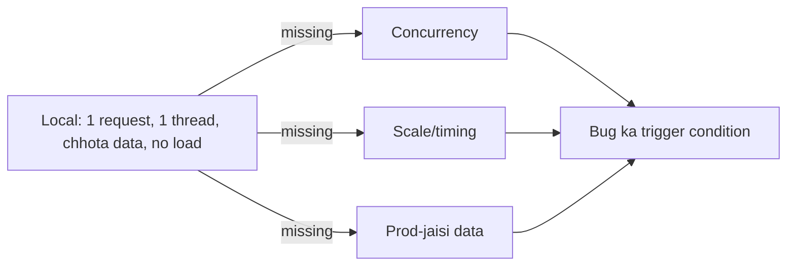

# 1-in-1000 Bug Jo Local Par Reproduce Hi Nahi Hota

> **Connects to**: [[02-debugging-random-500-errors]] (clean logs ka matlab hai failure kahin aur log ho rahi hai), [[26-duplicate-email-race-condition]] aur [[113-dev-fast-prod-slow-1m-rows-hinglish]] (dev aur prod ka environment alag kyun hota hai) aur [[163-async-tests-fake-timers-flaky]] (timing-based flaky test ka wahi root cause).

## 1. Sabse Pehla Trap: "Reproduce Karo, Phir Fix Karo"

Jo bug 1000 mein 1 baar aata hai, wo **by definition** aisi condition maangta hai jo local machine par bani hi nahi hoti -- ek specific timing, ek specific data shape, ek specific concurrent load. Use local par "reproduce" karne ki koshish karna wrong starting point hai. Asli approach ulta hai:

> Reproduce karne ki jagah, **pehle se maujood evidence collect karo** -- jab bug dobara aaye, data tumhare paas already ho, guess na karna pade.

Ye mindset shift hi poore answer ka core hai -- interviewer yahi sunna chahta hai.

## 2. Pehla Sawaal: "1 in 1000" Ka Shape Kya Hai?

Har intermittent bug random nahi hota -- usme ek pattern hota hai jo abhi dikh nahi raha. Pehle classify karo:

| Sawaal | Kyun important hai |
|---|---|
| Kya ek hi endpoint/function hai, ya random jagah? | Ek jagah = code-specific bug. Random jagah = infra-level (pool, memory, network) |
| Kya specific user/data pattern hai? (bada payload, specific input, specific user_id) | Data-dependent edge case -- [[26-duplicate-email-race-condition]] jaisa |
| Kya time ka pattern hai? (raat 2 baje, traffic peak par) | Resource contention, scheduled job overlap -- [[93-cpu-spike-every-night-217am]] jaisa |
| Kya rate traffic ke saath badalti hai? (1000 req/sec par 1-in-1000, 10 req/sec par 1-in-100000) | Concurrency/race condition ka strong signal |
| Kya ek baar fail hoke dusri baar pass hota hai same request retry par? | Timing-dependent -- data corrupt nahi, timing galat |

"1 in 1000" khud ek clue hai: itna rare ki ek developer ka manual testing kabhi nahi pakdega, par itna common ki **production load** usse easily expose kar deta hai. Yahi signature classic **race condition ya resource exhaustion** ka hota hai.

## 3. Kyun Local Par Reproduce Nahi Hota



Local environment mein jo cheezein maujood nahi hoti, unhi mein bug chhupa hota hai:

- **Concurrency**: local par ek request ek time par chalti hai. Prod mein 500 requests same row/cache-key/counter ko ek saath touch karte hain -- wahi race window khulta hai.
- **Timing**: local par network 0ms hai (same machine). Prod mein DB call 2ms leti hai, cache call 1ms, aur beech ka wahi **gap** hi race condition ki jagah hai.
- **Scale**: connection pool, GC pause, memory pressure -- sab tabhi dikhte hain jab load real ho ([[113-dev-fast-prod-slow-1m-rows-hinglish]] wala exact issue, dev vs prod environment farak).
- **Data shape**: prod data mein outlier hota hai jo local seed data mein kabhi nahi hota -- null field jo kabhi expect nahi kiya, ek user ke paas 50,000 rows.

Isliye local par "main ise 1000 baar chala kar dekhta hoon" waste of time hai -- jo condition missing hai, wo 1000 baar bhi nahi aayegi.

## 4. Jab Reproduce Nahi Kar Sakte, To Kya Karo -- 4 Step Plan

### Step 1: Evidence ko behtar banao (observability, code nahi)

Debugging shuru karne se pehle, taaki *agle* occurrence par data mil jaaye:

```javascript
// request ke shuru mein -- ek id jo har layer mein jaaye
app.use((req, res, next) => {
  req.id = req.headers['x-request-id'] || crypto.randomUUID();
  res.setHeader('x-request-id', req.id);
  next();
});

// har log line mein wahi id -- taaki LB, app, DB logs ek saath grep ho sakein
logger.info({ requestId: req.id, userId: req.user?.id, path: req.path }, 'request start');
```

- **Correlation ID** har layer mein (load balancer -> app -> DB) ([[02-debugging-random-500-errors]]).
- **Structured logging** -- `catch (e) {}` jaisa silent swallow illegal karo; har error ka stack trace + context log ho.
- **Sampling, not guessing**: agar bug rate 0.1% hai, to sabhi requests log karna expensive hai -- isliye failed requests ka **100% capture** (error-triggered detailed logging), success requests ka sirf sample.
- **APM/tracing tool** (Datadog, Sentry, New Relic) -- automatic stack trace + request timeline, manual grep se kahin tez.

### Step 2: Jab bug dobara aaye, ek data point collect karo

Pehli baar ka maksad fix karna nahi, **evidence gather** karna hai:

- Us specific `requestId` ka poora trace -- kahan time gaya, kaunsa branch liya.
- Request ka exact input (sanitized) -- payload size, headers, user state.
- Us waqt ka system state: concurrent request count, pool usage, memory, CPU.
- Timestamp -- deployment ke kitni der baad, traffic pattern kya tha.

Ek occurrence ka data bhi pattern confirm kar sakta hai (jaise Step 2 ke table se).

### Step 3: Hypothesis bano, phir usko test karo -- production-jaisi staging mein

```
Hypothesis: "Connection pool (size 10) peak load (50 req/sec) par exhaust ho raha hai,
             10001th request timeout hoke silently fail hoti hai."
```

Ab isko **load test** se validate karo -- `k6` ya `autocannon` se staging par wahi concurrency replicate karo:

```javascript
// k6 script: 50 virtual users, 30s -- exact prod-jaisi concurrency
import http from 'k6/http';
export const options = { vus: 50, duration: '30s' };
export default function () {
  http.get('https://staging.example.com/api/orders');
}
```

Agar hypothesis sahi hai, load test mein bhi wahi ~0.1% failure rate dikhega -- ab reproduce ho gaya, **controlled environment mein**. Yahi asli "reproduction" hai -- random retry nahi, targeted load simulation.

### Step 4: Agar load test bhi fail ho -- code review with suspicion list

Jab tools se evidence na mile, to code mein specifically yeh dhoondo (yahi list interview mein sabse zyada marks deti hai):

| Suspect | Kya dekhna hai |
|---|---|
| **Shared mutable state** | Module-level variable, in-memory cache jo request ke beech share hota hai bina lock ke |
| **Race condition** | "Check-then-act" pattern bina transaction/lock -- `if (!exists) create()` ([[26-duplicate-email-race-condition]]) |
| **Unhandled promise rejection** | Async error jo kahin catch nahi hota, worker process crash kar deta hai sirf us request ke liye |
| **Connection pool limit** | `pool.max` se kam par ek request timeout hoti hai, dikhti hai "random 500" ki tarah |
| **Retry without idempotency** | Client retry karta hai, dusri baar alag state milta hai |
| **Clock/timezone edge** | `Date.now()` boundary pe (midnight, DST) ek specific window mein bug |
| **GC pause / event loop block** | Node mein CPU-heavy sync code event loop ko thoda der block karta hai, bas us waqt ka request timeout khata hai |

## 5. Production Reality

- **Feature flag se kill switch**: agar root cause clear nahi hai par impact samajh aa gaya, to us path ko turant disable/fallback karne ka switch rakho -- fix dhoondne ka time milta hai bina user ko impact kiye.
- **Canary deploy + metrics**: fix ko 100% traffic par mat daalo, 5% par daal kar error rate dekho -- agar rate same 0.1% raha, hypothesis galat thi.
- **Postmortem mein rate likho, severity nahi sirf**: "0.1% requests fail" ka matlab 10,000 req/day par 10 users affected -- chhota number lagta hai, par agar wo payment path hai to acceptable nahi.
- **Monitoring ka alert threshold**: 0.1% error rate normal "noise" threshold se niche ho sakta hai -- isliye alert 5xx rate ke **absolute count** par bhi rakho, sirf percentage par nahi.

## 6. Common Galtiyan

- Local machine par bug ko "1000 baar for loop mein chala kar" dhoondna -- jo condition missing hai wo aise nahi aayegi.
- Sirf application logs dekhna, load balancer/infra layer check na karna.
- Root cause bina confirm kiye "fix" push karna aur hoping failure rate chala jaaye -- agle week phir aata hai.
- Observability add karne se pehle hi "fix" try karna -- agli baar bhi wahi blind guessing.
- Flaky test ki tarah is bug ko bhi "retry logic laga do" se chhupa dena -- symptom hide hota hai, cause nahi ([[163-async-tests-fake-timers-flaky]]).

## 🧠 Remember

> 1-in-1000 bug ko local par "reproduce karne" ki koshish mat karo -- jo concurrency/timing/scale missing hai wo kabhi aayegi hi nahi. Pehle evidence collect karne layak banao (correlation id, structured logs, 100% error capture), jab ek occurrence mile usse hypothesis banao, phir prod-jaisi concurrency ke saath staging par load test se us hypothesis ko controlled tareeke se reproduce karo.

## Quick Self-Test

1. "1 in 1000" ka failure rate traffic badhne par "1 in 100" ho jaata hai -- ye kis tarah ke bug ki taraf point karta hai?
2. Local machine par bug reproduce na hone ki teen reasons batao.
3. Evidence collect karne ke liye code change karne se pehle, kaunsi do cheezein sabse zyada value deti hain?
4. Hypothesis ko "controlled tareeke se reproduce" karne ka practical tareeka kya hai?
5. Root cause clear na hone par bhi production impact kaise rokte hain?
