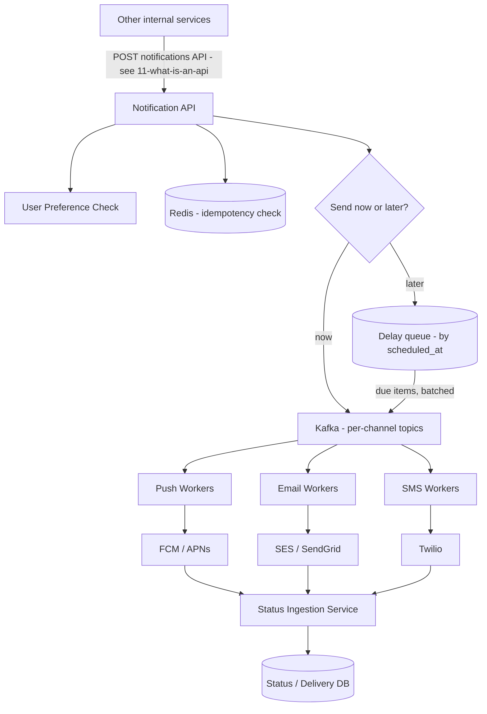

# System Design: A Notification System Like OneSignal

## 1. Requirements

**Functional:**
- Send Push, Email, and SMS notifications.
- Support millions of users.
- Send immediately, or schedule for a future time.
- Support bulk/campaign notifications (one trigger fans out to millions of recipients).
- Retry failed deliveries.
- Avoid sending duplicate notifications.
- Respect user preferences and opt-outs.
- Track delivery, failure, and read status per notification.
- Handle traffic spikes during campaigns.
- Provide an API for other internal services to trigger notifications.

**Non-functional:**
- High throughput -- millions of notifications completing within a bounded campaign window.
- Reliability -- a triggered notification should not silently vanish; at minimum, its failure must be visible.
- Low latency for "send now" -- should feel near-instant, not minutes later.
- Elastic scalability for campaign bursts, without those bursts degrading normal "send now" traffic.
- Idempotency -- retries and at-least-once delivery must not turn into duplicate messages to the user.

## 2. Scale Estimation

Assume 50M total users, a large campaign targeting 10M of them, expected to complete within 30 minutes: 10,000,000 divided by 1800 seconds is about 5,600 notifications per second, sustained, just for that one campaign, on top of continuous individually-triggered notifications. Design the pipeline for a peak combined throughput in the tens of thousands of notifications per second. Storing delivery history at that volume (say 1 billion records per month at roughly 500 bytes each) is roughly 500 GB per month -- needs time-based partitioning and archival, not one unbounded table.

## 3. High-Level Architecture

## 4. Request Flow

1. A calling service sends a request to the Notification API with an idempotency key, target user(s) or segment, channel(s), content/template, and an optional scheduled time.
2. The API checks the idempotency key against Redis (skip if already processed), checks the user's opt-out preferences, and either enqueues to the "send now" topic or the delay structure.
3. For a bulk campaign, the API does not expand millions of recipients synchronously inside the request -- it enqueues one "campaign job," and a background fan-out worker expands it into individual per-user jobs at a steady, controlled rate, writing them into the channel queues.
4. Channel-specific worker pools (Push, Email, SMS) consume their queue with bounded concurrency matching each provider's own rate limits, call the external provider, and apply retry-with-backoff-and-jitter on transient failures -- the same pattern as [[14-cascading-failure-recovery]] -- up to a max attempt count, then route to a dead-letter queue with alerting.
5. Providers send delivery and read webhooks back to a status ingestion service, which updates each notification's status.
6. The triggering service or an internal dashboard queries delivery, read, and failure status via the API.

## 5. Data Model

| Entity | Key fields |
|---|---|
| Notification | id, idempotency_key, user_id/segment_id, channel, template_id, scheduled_at, status, created_at |
| DeliveryAttempt | notification_id, attempt_number, provider, status, error, attempted_at |
| UserPreference | user_id, channel, opted_in |
| Campaign | id, segment definition, schedule, status, total_count, sent_count, failed_count |

## 6. Deep Dive

**Idempotency**: the dedup key (a hash of user_id, template_id, and trigger_event_id) is checked with a Redis SETNX before enqueueing -- if it already exists, skip. This converts the queue's "at-least-once" delivery guarantee into "effectively-once" from the user's point of view, without needing a slower, fully strict database transaction for every send.

**Scheduling for "send later"**: reuses the exact delay-queue pattern from [[03-ttl-deletion-at-scale]] -- scheduled items live in a time-ordered structure (a Kafka delayed topic, or a table polled continuously in small batches), and a worker pulls due items steadily. Never a single giant cron sweep at the top of the hour -- that reproduces the same avalanche problem taught there.

**Fan-out for bulk campaigns**: expanding "10 million recipients" must happen asynchronously in the background, streaming jobs into the queue at a controlled rate -- never synchronously inside the triggering API call, which would time out and risk a memory blowup.

**Retry and circuit breaking per provider**: if FCM starts failing, back off and slow down instead of hammering it with the full campaign volume; give each channel its own worker pool and rate limiter (a Bulkhead, from [[14-cascading-failure-recovery]]) so an email-provider outage cannot stall Push or SMS.

## 7. Bottlenecks

- External provider rate limits (FCM, APNs, SES, Twilio all cap how fast you can send) -- the system must throttle to match, never exceed, or it gets throttled or blocked externally.
- Fan-out expansion for very large campaigns, if done synchronously or without pagination.
- Hot Kafka partitions if jobs are not spread evenly -- partition by a hash of user_id to distribute load.

## 8. Scaling

Each channel's worker pool scales independently (Push, Email, and SMS have different provider limits and payload sizes) -- this connects to [[06-ec2-autoscaling]]: stateless workers behind an auto-scaling policy keyed on queue depth, not just CPU. The ingestion API itself is stateless and scales the same way. The queue scales via partitioning.

## 9. Reliability

Queue-based delivery gives at-least-once semantics; idempotency at the worker level converts that into effectively-once for the end user. Notifications that exhaust retries go to a dead-letter queue with alerting, so failures are visible rather than silently dropped -- never fail hard and vanish.

## 10. Consistency

Delivery and read status can be eventually consistent -- a small delay before a dashboard reflects "delivered" is harmless. User opt-out preference checks are the exception: these should read from a low-latency, frequently-refreshed source, because sending to someone who just unsubscribed is a trust and compliance problem, not just a UX nit.

## 11. Security

Authenticate calling services (API keys or mTLS on the trigger API -- this contract is exactly what [[11-what-is-an-api]] describes). Sanitize notification content to prevent injection into email/SMS templates. Respect regulatory requirements (unsubscribe links, opt-out enforcement). Rate-limit the ingestion API itself so a single misbehaving internal caller cannot trigger a self-inflicted traffic spike -- the same load-shedding instinct from [[04-handling-traffic-spike-15k-rps]].

## 12. Trade-offs

Queue-based async delivery adds a small amount of latency to "send now" (hundreds of milliseconds to a couple of seconds) versus a direct synchronous call to the provider -- but buys reliability, retryability, and protection from traffic spikes, which is almost always worth it at this scale. Storing full delivery history indefinitely is expensive; time-based partitioning plus archiving old records to cold storage (the mirror image of the partition-drop idea in [[03-ttl-deletion-at-scale]]) keeps this bounded.

## 13. Final Mental Model

A notification system is fundamentally a durable, rate-limited, retryable pipeline between "something wants to tell a user something" and "an external provider that will actually deliver it." Decouple every stage with queues, so a slow or spiky stage never takes the others down with it.

## 14. Quick Self-Test

1. Why must bulk campaign fan-out happen asynchronously instead of inside the triggering API request?
2. Why does user opt-out status need stronger consistency guarantees than delivery/read status?
3. How does idempotency turn "at-least-once" queue delivery into "effectively-once" from the user's perspective?
4. Why does each channel (Push/Email/SMS) need its own worker pool and rate limiter instead of sharing one?
