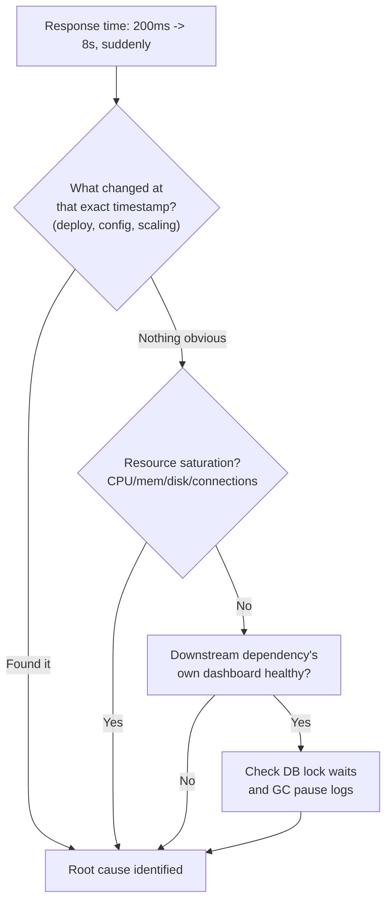

# API Response Time Suddenly Jumps From 200ms to 8 Seconds - What Do You Check First?

> **Similar-question flag**: this overlaps with [[02-debugging-random-500-errors]] (the systematic top-down checklist) and [[13-hidden-latency-bottleneck]] (I/O-wait hiding behind healthy CPU/memory). Rather than re-running that whole checklist, this lesson focuses on the one word that changes your first move - **"suddenly"** - and adds two causes those lessons didn't cover: GC pauses and database lock contention.

## 1. Story

Your API's response time has been a steady 200ms for weeks. Today, without warning, it jumps to 8 seconds and stays there.

## 2. Why "Suddenly" Changes Everything

[[13-hidden-latency-bottleneck]] was about a *chronic*, always-been-this-way 3-second response - the fix there was architectural (parallelize sequential calls). This is different: a **step-function change** at a specific moment means something concrete happened right at that moment. That reframes the first move entirely:

**Check what changed, before you check what's broken.** Look at the deploy log, infrastructure change log, feature-flag toggle history, and scaling events, and line them up against the exact timestamp of the jump. A huge fraction of "sudden" incidents are explained in the first two minutes this way - a deploy, a config change, a certificate rotation, a scaling-down event, a cron job that just started running.

## 3. If Nothing Obviously Changed, Walk Down From There

1. **Resource saturation** - did CPU, memory, disk I/O, or open connections suddenly max out at that same timestamp?
2. **Downstream dependency latency** (the [[13-hidden-latency-bottleneck]] check) - open the dashboard for *their* service, not just yours; a dependency's own incident shows up as your latency spike.
3. **Connection pool saturation** - if the pool to your database or a downstream service is exhausted, new requests queue waiting for a free connection, producing exactly this kind of spike (the same pool-exhaustion idea from [[16-synchronized-connection-pool-expiry]], here triggered by load rather than synchronized expiry).
4. **Two causes worth naming explicitly, because they're easy to miss:**

**Term: GC pause (stop-the-world pause)** - in managed-runtime languages (Java, .NET, and others), memory pressure or a growing heap can trigger a long garbage-collection pause that freezes request processing for seconds at a time. This produces exactly the "sudden latency spike" signature, and it can happen while CPU and memory graphs still look broadly "fine" on a coarse dashboard, because the spike is a short, deep freeze rather than sustained high usage.

**Term: Lock contention** - a single slow or stuck query holding a row- or table-level lock in the database can make many otherwise-fast, completely unrelated queries queue up behind it. This doesn't necessarily show as high CPU either - it shows as elevated *wait time*, visible only in database-specific views (e.g. `pg_stat_activity` in Postgres, `SHOW ENGINE INNODB STATUS` in MySQL), not in generic infrastructure dashboards.

## 4. Mental Model

> A *sudden* jump points you at a *recent event*. A *chronic* slow endpoint points you at *architecture*. Ask "what changed?" before you ask "what's broken?" - and only reach for a code profiler after infrastructure, dependencies, and the database have all been ruled out.

## 5. Flow

## 6. Production Reality

Most incident responders open the deploy/change log before touching a single graph - it's usually the fastest path to an answer, and it's why "what changed recently" is often the very first question asked in an incident channel, before any dashboard is even shared.

## 7. Common Mistakes

- Jumping straight to profiling application code - this is almost always the *last* resort, not the first, because the fastest wins come from correlating with a recent change, then infrastructure, then dependencies, then the database.
- Assuming healthy CPU/memory rules out GC pauses or lock contention - both can hide behind coarse, averaged resource graphs entirely.

## 8. 🧠 Remember

> A sudden latency jump is a symptom of a recent event, not a mystery to solve from scratch - check what changed first, then resource saturation, then downstream dependencies, then database-level locks and GC pauses, before ever opening a profiler.

## 9. Quick Self-Test

1. Why does "suddenly" change your first diagnostic step compared to a latency problem that's always been slow?
2. Why might CPU and memory graphs look normal even during a GC-pause-caused latency spike?
3. How could a single slow query cause many unrelated-looking requests to also become slow?
