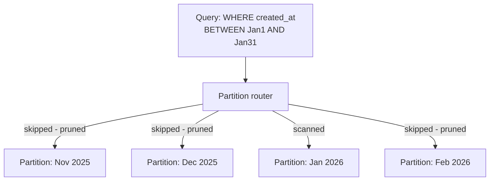

# What Is Database Partitioning?

## 1. Story

A `orders` table grows to 500 million rows. Queries that used to take 20ms now take 4 seconds, even with indexes. Backups take all night. A migration that adds a column locks the whole table for an hour. Everything about this one giant table has become slow and risky to touch.

## 2. The Problem

Databases are built to handle large tables, but "large" has practical limits: indexes get deeper and slower to traverse, a single lock can block a huge share of daily traffic, a full table scan (even a rare one, like a reporting query) becomes enormously expensive, and maintenance operations (backups, index rebuilds, schema changes) that used to take seconds now take hours.

## 3. The Solution

**Term: Database Partitioning** - splitting one logical table into multiple smaller physical pieces ("partitions"), while the application (and often the database itself) can still query it as if it were one table. Each partition holds a subset of the rows, grouped by some rule.

The three common partitioning strategies:

- **Range partitioning** - split by a range of values, most commonly time (e.g. one partition per month or per hour - this is exactly the technique used in [[03-ttl-deletion-at-scale]], where an entire expired partition is dropped in one O(1) operation instead of deleting rows one by one).
- **Hash partitioning** - apply a hash function to a key (e.g. `user_id`) and assign the row to one of N partitions based on the hash result - this spreads rows evenly regardless of any natural ordering, useful when there's no good range key or when range partitioning would create uneven ("hot") partitions.
- **List partitioning** - split by an explicit set of values (e.g. one partition per country code, or per subscription tier).

## 4. Mental Model

> Partitioning is filing one enormous cabinet's worth of documents into several labeled drawers instead of one drawer. Looking for a specific memo from March? Only the March drawer needs to be opened - the other eleven never get touched.

**Term: Partition pruning** - when a query includes a filter on the partitioning key (e.g. `WHERE created_at BETWEEN ...` on a table range-partitioned by `created_at`), the database can skip scanning partitions that couldn't possibly contain matching rows entirely, rather than scanning the whole table. This is *why* partitioning speeds up queries, not just why it organizes storage more neatly.

## 5. How It Works / Flow



## 6. Code Example

```sql
-- Range partitioning by month (PostgreSQL syntax)
CREATE TABLE orders (
  id BIGINT,
  user_id BIGINT,
  created_at TIMESTAMP,
  amount NUMERIC
) PARTITION BY RANGE (created_at);

CREATE TABLE orders_2026_01 PARTITION OF orders
  FOR VALUES FROM ('2026-01-01') TO ('2026-02-01');

-- A query filtering on created_at only ever touches the relevant partition(s)
SELECT * FROM orders WHERE created_at >= '2026-01-15' AND created_at < '2026-01-20';

-- Dropping an entire old partition is instant - no row-by-row DELETE needed,
-- the exact technique from the WhatsApp Status lesson
DROP TABLE orders_2025_11;
```

## 7. Partitioning vs. Sharding - A Common Mix-Up

**Partitioning** typically means splitting one table into multiple pieces that still live on the *same* database instance (or the same cluster, depending on the engine) - the database itself understands and manages the split. **Sharding** usually means distributing data across *entirely separate database instances/servers*, each unaware of the others, with the application (or a routing layer) deciding which shard to query. In practice, the terms sometimes overlap (some engines call cross-node splits "partitions" too), but the distinction between "still one database, split internally" and "spread across independent database servers" is the one worth knowing precisely for an interview.

## 8. Production Reality

Choosing the partitioning key well matters enormously: a bad choice creates a **hot partition** - one partition receiving disproportionately more reads/writes than the others, which defeats the entire point (you've just made one "sub-table" the new bottleneck). Time-based partitioning is popular exactly because most write-heavy systems naturally spread writes evenly across time.

## 9. Trade-offs

| | Benefit | Cost |
|---|---|---|
| Smaller physical pieces | Faster scans, cheaper maintenance (backup/reindex per partition) | More moving parts to manage |
| Partition pruning | Queries on the partition key get dramatically faster | Queries *not* filtering on the partition key may need to scan every partition, sometimes slower than an unpartitioned table |
| Dropping old partitions | O(1) bulk deletion (see [[03-ttl-deletion-at-scale]]) | Requires the schema to be designed with partitioning in mind from early on |

Cross-partition queries and joins across partitions can be more expensive than the equivalent query on a single unpartitioned table, since the database (or application) may need to touch and merge results from multiple pieces.

## 10. Common Mistakes

- Partitioning by a key that doesn't match how the data is actually queried - if most queries don't filter on the partition key, pruning never kicks in and you gain none of the speed benefit while still paying the added complexity cost.
- Choosing a partitioning key that creates a hot partition (e.g. partitioning by a boolean flag where 95% of rows share the same value).
- Treating partitioning as a substitute for indexing - they solve different problems and are normally used together, not as alternatives.

## 11. 🔗 Connection to Other Concepts

This is the general concept behind the specific technique used in [[03-ttl-deletion-at-scale]] (time-based partitions, dropped instead of deleted) and mentioned again in [[17-notification-system-design]] for archiving old delivery history.

## 12. 🧠 Remember

> Partitioning splits one table into smaller physical pieces so queries can skip the pieces they don't need (pruning) and bulk operations like deletion become instant - but only if the partition key actually matches how the data is queried and written.

## 13. Quick Self-Test

1. What is partition pruning, and why is it the actual reason partitioning speeds up queries?
2. What's the practical difference between partitioning and sharding?
3. Why can a poorly chosen partitioning key make things worse instead of better?
