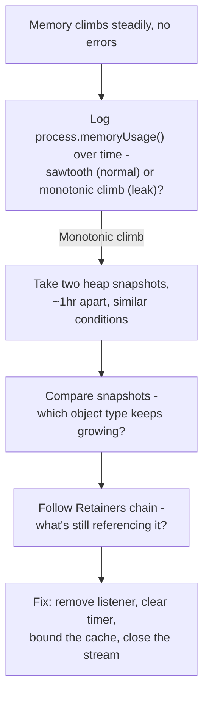

# Finding a Node.js Memory Leak With No Errors and No Pattern

## 1. Story

An Express API's memory climbs steadily from 200MB to 2GB over 24 hours, then crashes. The process restarts, climbs again, crashes again. The logs show nothing - no errors, no stack traces. There's no correlation with traffic: it leaks the same way whether load is high or low.

## 2. The Problem

Every debugging lesson so far in this curriculum ([[02-debugging-random-500-errors]], [[20-sudden-latency-spike-checklist]]) starts from a symptom that *announces itself* - an error, a slow response. A memory leak announces nothing. Nothing ever throws. The application just quietly consumes more and more memory until it's forcibly killed - so log-searching, the instinct from those other lessons, finds nothing here by design.

The traffic-independence is itself the biggest clue: if the leak grew proportionally with request count, you'd suspect something tied to handling requests. Growing regardless of load points at something that accumulates **over time or over a small number of trigger events**, not proportionally with volume - a background timer, a growing global cache, or listeners that were only ever added a handful of times but never removed.

## 3. Why This Happens in a Garbage-Collected Runtime

**Term: Reachability** - V8's garbage collector doesn't free memory because your code is "done" with it logically; it frees memory only when there is **no remaining reference path** to that object from a root (global variables, active closures, event emitter listener lists, timers). A memory leak in Node.js is never "memory that was never freed" in the C/C++ sense - it's memory that's still **technically reachable** because of a reference somewhere that you forgot you were keeping, even though your code has logically moved on.

## 4. The Step-by-Step Process

**Step 1 - Confirm it's an actual leak, not just V8 being V8.** Log `process.memoryUsage()` periodically (`rss`, `heapUsed`, `heapTotal`, `external`). A healthy app often shows a sawtooth pattern (memory climbs, garbage collection reclaims it, repeat) - that's normal. A leak shows **heapUsed climbing across GC cycles without ever coming back down** to its previous baseline.

**Step 2 - Take heap snapshots and compare them.** Run with `node --inspect` and connect Chrome DevTools' Memory tab (or use the `heapdump` package / `v8.writeHeapSnapshot()`), and take two snapshots under similar conditions, an hour or more apart. Use the **Comparison** view to see exactly which object types have a growing, non-zero "retained" count between the two snapshots - this narrows "somewhere in my app" down to a specific constructor/object type.

**Step 3 - Follow the retainer chain.** For the object type that's growing, DevTools shows the **Retainers** view - the actual chain of references keeping that object reachable. This answers *why* garbage collection can't free it: often a global array, a `Map` that's never pruned, or an `EventEmitter`'s internal listener array.

**Step 4 - Check the systematic list of Node/Express-specific leak sources**, especially since "no traffic pattern" points away from per-request code paths that scale with volume:

- **Unbounded in-memory caches** - a plain object or `Map` used as a cache with no eviction policy and no TTL, growing forever as new keys appear.
- **Event listeners added but never removed** - e.g. attaching a listener to a shared or long-lived `EventEmitter` (or `process`) inside a request handler or a per-connection callback; each occurrence adds one more listener that's never cleaned up. Node even warns about this with `MaxListenersExceededWarning` - worth grepping logs for, even though it's a warning, not an error.
- **Timers that are never cleared** - a `setInterval` created inside a function that runs more than once (e.g. once per incoming connection) without a matching `clearInterval`, so each call adds a new timer running forever.
- **Closures capturing large objects** - a callback closes over a big buffer/array, and that closure itself gets stored somewhere long-lived (a cache, a socket handler), keeping the large object alive indefinitely.
- **Unclosed streams/sockets/buffers** - these often show up as growth in `external` memory rather than `heapUsed`, which is a specific enough signal to point straight at native/Buffer-backed resources instead of plain JS objects.

## 5. Mental Model

> A memory leak isn't "memory that's too high" - it's memory that keeps climbing because something is still holding a reference the code has logically finished with. Find it with heap snapshot comparisons and retainer chains, not log searches, because a leak, almost by definition, never logs an error.

## 6. Flow



## 7. Code Example

```javascript
// LEAK: a new listener is added on every request and never removed
app.get('/status', (req, res) => {
  sharedEmitter.on('update', () => res.write('tick')); // grows forever
});

// LEAK: a new interval is created per connection, never cleared
io.on('connection', (socket) => {
  setInterval(() => socket.emit('ping'), 5000); // never cleared on disconnect
});

// FIX: bounded, self-cleaning
io.on('connection', (socket) => {
  const interval = setInterval(() => socket.emit('ping'), 5000);
  socket.on('disconnect', () => clearInterval(interval)); // cleaned up properly
});

// FIX: a bounded cache instead of an ever-growing plain object
const LRU = require('lru-cache');
const cache = new LRU({ max: 500, ttl: 1000 * 60 * 10 }); // bounded size + TTL
```

## 8. Production Reality

Container orchestrators and process managers (Kubernetes, PM2) restarting a crashed process on OOM is exactly why the symptom looks like "climbs, crashes, restarts, climbs again" - the restart masks the leak's user-facing impact but does nothing to fix it. This is the same distinction as [[14-cascading-failure-recovery]]'s "root cause fixed vs. system actually recovered," just inverted: here the *symptom* clears (via restart) while the *root cause* is completely untouched.

## 9. Common Mistakes

- Treating "no errors in the logs" as evidence nothing is wrong - a memory leak is exactly the category of bug that produces zero errors while still being fatal.
- Treating automatic restarts as a fix rather than a temporary mask that hides the real problem while memory pressure and restart frequency quietly get worse over time.
- Debugging by reading application code top-to-bottom looking for the leak, instead of starting from heap snapshot comparisons - with a large codebase this is far slower than letting the retainer chain point directly at the culprit.

## 10. 🧠 Remember

> A memory leak isn't memory that's too high - it's memory that keeps climbing because something is still holding a reference the code logically doesn't need anymore. Find it with heap snapshot comparisons and retainer chains, not log searches, because a leak almost never logs an error.

## 11. Quick Self-Test

1. Why does "no errors in the logs" not rule out a serious bug in this specific case?
2. What's the difference between memory usage that looks high but is a normal sawtooth pattern, versus memory usage that indicates an actual leak?
3. Why doesn't restarting the process on crash count as fixing the problem?
4. Name two Node.js-specific causes of a memory leak that have nothing to do with request volume.
