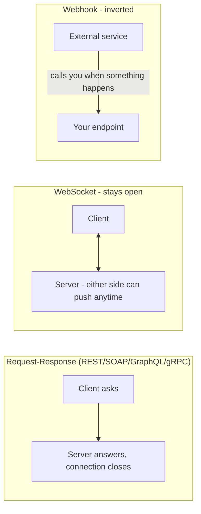

# REST, SOAP, GraphQL, gRPC, WebSocket, Webhook - What's Actually Different?

> **Builds on**: [[11-what-is-an-api]] established that REST/GraphQL/gRPC are just different **styles** of exposing the same underlying concept - a contract between client and server. This lesson is the full comparison that mention deferred.

## 1. Story

"Just use this API" turns out to mean six genuinely different things depending on which system you're talking to - a payment provider's REST API, an old enterprise system's SOAP interface, a modern frontend's GraphQL endpoint, two internal microservices talking gRPC, a chat app's WebSocket connection, and a CI system pinging you with a webhook. All of them are "APIs" in the sense from [[11-what-is-an-api]] - contracts for asking and receiving - but the shape of that contract, and the problem it's optimized for, differs a lot.

## 2. The Six Styles

**REST** - resources identified by URLs, manipulated with standard HTTP verbs (GET/POST/PUT/DELETE), typically JSON payloads. Simple, cacheable (leans on HTTP caching semantics), the default choice for public APIs and straightforward CRUD.

**SOAP** - a strict, XML-based protocol with a formal contract (WSDL) defining every operation and message shape ahead of time. Verbose and rigid compared to REST, but that rigidity brought strong tooling and formal validation - still common in older enterprise systems (banking, insurance, government) that adopted it before REST became dominant.

**GraphQL** - a single endpoint where the client specifies exactly which fields it needs in the request itself, and gets back exactly that shape - no more, no less. Solves REST's common "over-fetching" (getting a whole user object when you needed just the name) and "under-fetching" (needing three separate REST calls to assemble one screen).

**gRPC** - a binary, strongly-typed protocol (built on HTTP/2 and Protocol Buffers) optimized for fast server-to-server communication, commonly used between internal microservices where both sides are code you control and raw speed/type-safety matters more than human-readability.

**WebSocket** - unlike the request-response pattern of the others, this keeps a single connection **open** in both directions, so either side can push data at any time without the other having to ask again. The right fit for chat apps, live scoreboards, real-time collaborative editing - anything where the server needs to speak first.

**Webhook** - inverts the usual client-initiates-the-call pattern: instead of you polling a service asking "did anything happen yet?", the service calls **you** the moment something happens (a payment completes, a CI build finishes). It's still just an HTTP request-response contract underneath - the inversion of who calls whom is the whole idea.

## 3. Mental Model

| Style | Best for | Core idea |
|---|---|---|
| REST | Public APIs, simple CRUD | Resources + HTTP verbs |
| SOAP | Strict old enterprise contracts | Formal XML contract (WSDL) |
| GraphQL | Frontends needing flexible, precise data shapes | Client specifies exact fields |
| gRPC | Fast internal service-to-service calls | Binary, typed, HTTP/2 |
| WebSocket | Real-time, bidirectional, server-initiated pushes | One connection, stays open |
| Webhook | "Tell me when it happens" instead of polling | Server calls you back |

## 4. Flow

## 5. Production Reality

Most real systems use **more than one of these simultaneously**, matched to the specific problem: a public-facing REST or GraphQL API for external/frontend consumers, gRPC between internal microservices for speed, a WebSocket connection for the live-updating parts of the UI, and webhooks to receive events from third parties (Stripe, GitHub, payment processors) instead of polling them constantly.

## 6. Common Mistakes

- Assuming "API" always means REST - as [[11-what-is-an-api]] establishes, the API is the contract; REST is just one popular shape for it.
- Using WebSockets for something that's really just occasional request-response (adds connection-management complexity for no benefit) - or the reverse, polling repeatedly for something a webhook would deliver instantly and far more efficiently.

## 7. 🧠 Remember

> These aren't competing "better or worse" options - they're different shapes of the same underlying idea (a contract for asking and receiving), each optimized for a different pattern: simple CRUD, formal enterprise contracts, precise data-fetching, fast internal calls, bidirectional real-time, or "tell me when it happens."

## 8. Quick Self-Test

1. Why does GraphQL solve both over-fetching and under-fetching, and what causes those problems in plain REST?
2. Why is a webhook not a fundamentally different protocol, just an inverted usage of the same request-response idea?
3. When would gRPC be the wrong choice, even though it's the fastest option on this list?
