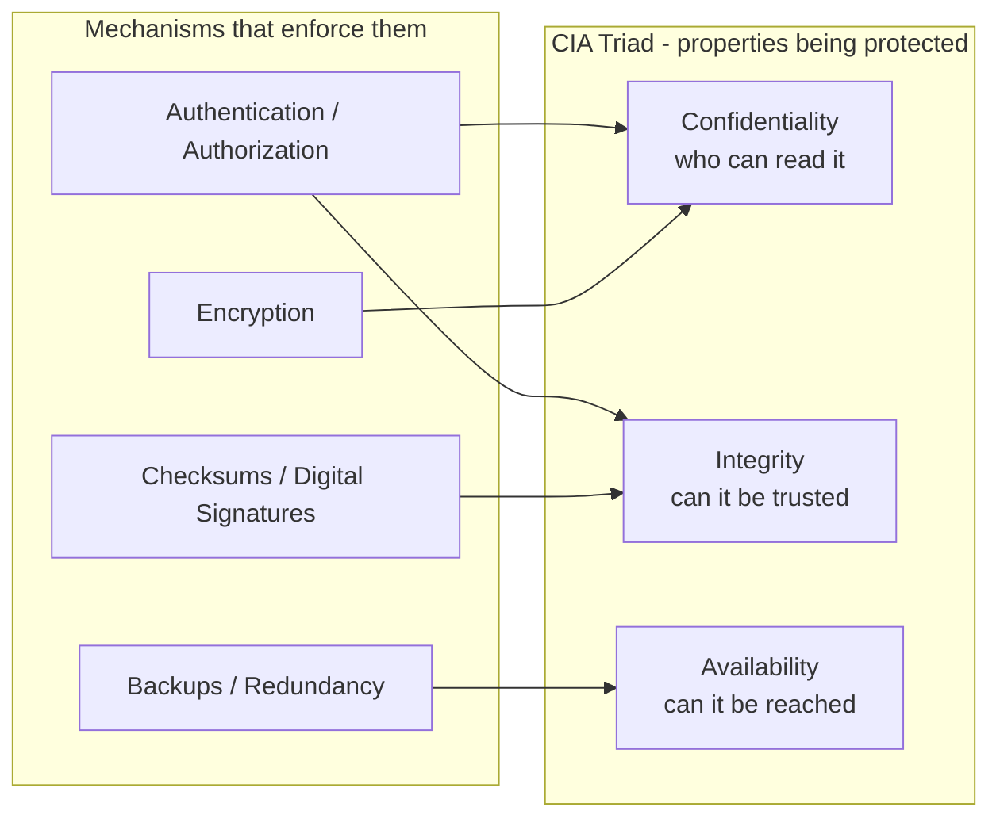

# The CIA Triad: Confidentiality, Integrity, Availability

## 1. Story

Security+ question of the day: an attacker modifies a database record without authorization. Which part of the CIA triad was compromised?

A. Confidentiality
B. Integrity
C. Availability
D. Authentication

**Answer: B, Integrity.** Modifying data without authorization is precisely what Integrity protects against. Confidentiality would be violated by *reading* data they shouldn't see (not changing it). Availability would be violated by *denying access* to data or systems (not altering content). Authentication isn't part of the CIA triad at all - it's a *mechanism* that helps protect all three, which is exactly why it's the tempting wrong answer.

## 2. The Solution - The Three Pillars

**Confidentiality** - only authorized parties can *read* the data. Violated by: an unencrypted database being read by an attacker, a misconfigured S3 bucket exposing files publicly, a leaked API key granting read access it shouldn't.

**Integrity** - data is accurate and hasn't been *tampered with*, by accident or attack. Violated by: an attacker modifying a database record, a man-in-the-middle altering a payment amount in transit, corrupted data from a bug that silently changes stored values.

**Availability** - authorized parties can actually *access* the system/data when they need to. Violated by: a DDoS attack taking a service offline, a ransomware attack encrypting files so legitimate users can't read them, a hardware failure with no redundancy.

## 3. Mental Model

> Confidentiality = who can **read** it. Integrity = can it be **trusted/unaltered**. Availability = can it be **reached** when needed. Every security control maps to protecting one or more of these three - and every incident can be classified by which one(s) it broke.

## 4. Why "Authentication" Is the Tempting Wrong Answer

Authentication (proving who you are) and authorization (proving what you're allowed to do) are both **mechanisms** used to *enforce* confidentiality and integrity - they're not a fourth pillar sitting alongside the other three. A weak authentication system is a *cause* that can lead to a confidentiality or integrity breach, not a category of breach itself. This distinction (mechanism vs. the property it protects) is exactly what a well-designed multiple-choice security question is testing.

## 5. Flow

## 6. Production Reality

Real incidents rarely violate just one pillar cleanly - a ransomware attack usually violates Availability (systems locked/offline) and often Confidentiality too (data exfiltrated before encryption, for double-extortion). Thinking in terms of the triad helps scope an incident response: "what's actually been broken here, and what controls map to fixing each part."

## 7. 🧠 Remember

> Confidentiality is about who can read it, Integrity is about whether it can be trusted, Availability is about whether it can be reached - authentication is a tool that protects these, not a fourth member of the triad.

## 8. Quick Self-Test

1. Why is unauthorized modification an Integrity violation and not a Confidentiality one?
2. Why isn't Authentication considered part of the CIA triad itself?
3. Give an example of a single incident that could violate two of the three pillars at once.
