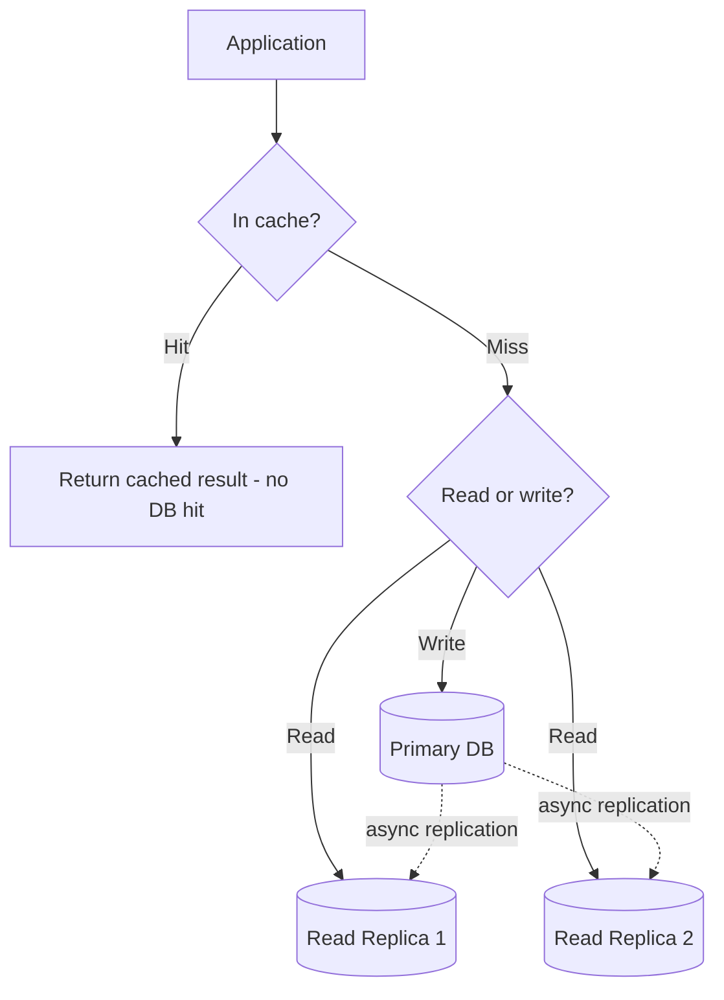

# Scaling Database Reads Without a Bigger Instance

> **Connects to**: [[21-database-partitioning]] (partitioning/sharding vocabulary) and [[15-simple-vs-scalable-architecture]] (add each piece only when a real metric justifies it - this lesson is the concrete "when read load is that metric" case).

## 1. Story

A database is drowning in read traffic. Performance keeps degrading. "Just increase the instance size" (vertical scaling) works for a while, but it has a ceiling, gets expensive fast, and doesn't address *why* read load is so high in the first place. The question: how do you scale reads without simply throwing a bigger box at it?

## 2. The Solution - Several Techniques, Usually Combined

**Read replicas** - stand up one or more read-only copies of the database (leader-follower replication), and route `SELECT` queries to the replicas while writes still go to the primary. This directly multiplies read capacity, since each replica can serve queries independently. Trade-off: replicas are usually asynchronously replicated, so reads from them can be **slightly stale** - fine for a product feed, not fine for "did my payment just succeed."

**A caching layer (Redis)** - put a cache in front of the database for data that's read far more often than it changes (the same pattern from [[04-handling-traffic-spike-15k-rps]]'s "check cache hit rate" and [[15-simple-vs-scalable-architecture]]'s Architecture B). A cache hit never touches the database at all - this is usually the single highest-leverage fix when a small set of records get read disproportionately often.

**Indexing and query optimization** - a missing index can force a full table scan on every read; adding the right index can turn a query that scans millions of rows into one that touches a few dozen. This is often overlooked because "the database is healthy" (per [[13-hidden-latency-bottleneck]]'s theme) doesn't mean every individual query is efficient.

**Partitioning / sharding** - split the data itself (per [[21-database-partitioning]]) so no single physical piece carries the full read load; sharding in particular spreads both reads and writes across multiple independent database instances entirely.

**CQRS / materialized views** - for read patterns that are expensive to compute from normalized tables (aggregates, joins, reports), precompute and store the read-optimized shape separately, updated asynchronously, so expensive reads become cheap lookups against a pre-built view instead of live joins.

## 3. Mental Model

> Vertical scaling buys you a bigger single box; these techniques instead **reduce how much work each read actually costs**, or **spread reads across more than one box** - and usually you need a mix of both, not a single silver bullet.

## 4. Flow

## 5. How I'd Answer This In an Interview

1. Ask what the read pattern actually looks like: is it a few hot records read constantly (favors caching), or broad, varied reads across the whole dataset (favors replicas/sharding/indexing)?
2. Start with the cheapest fix that matches the pattern - caching and missing indexes are usually far cheaper to add than infrastructure like sharding.
3. Add read replicas for horizontally scaling general read throughput, being explicit about the staleness trade-off for any consumer that reads from them.
4. Reach for sharding or CQRS only once the simpler layers are demonstrably insufficient - the same "don't ship the impressive one by default" instinct from [[15-simple-vs-scalable-architecture]].

## 6. Trade-offs

| Technique | Gain | Cost |
|---|---|---|
| Read replicas | Multiplies read throughput | Replication lag / staleness |
| Caching | Removes DB reads entirely on hits | Cache invalidation complexity, staleness |
| Indexing | Makes existing queries cheap | Slightly slower writes, more storage |
| Sharding | Scales both reads and writes | Cross-shard queries get harder |

## 7. Common Mistakes

- Reaching straight for sharding when a missing index or a cache in front of a few hot records would have solved 90% of the load with far less complexity.
- Routing every read to a replica without checking whether that specific read can tolerate replication lag - some reads (checking your own just-placed order) genuinely need the primary.

## 8. 🧠 Remember

> Scaling reads isn't one technique - it's reducing the cost of each read (caching, indexing) and spreading reads across more machines (replicas, sharding), applied in that order of cheapness, not jumping straight to the most complex option.

## 9. Quick Self-Test

1. Why can a read replica strategy be wrong for certain specific reads, even though it multiplies overall capacity?
2. Why should caching and indexing usually be tried before sharding?
3. What's the difference between what a read replica solves and what a materialized view solves?
