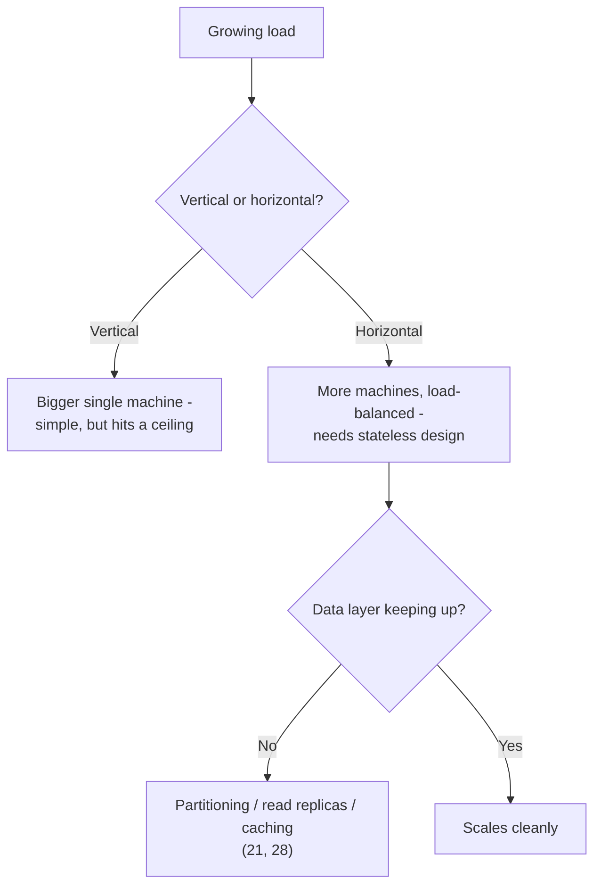

# What Is Scalability, Really?

## 1. Story

"What do you understand by scalability?" sounds like a warm-up question, but a vague answer here ("it means the system can handle more users") signals that everything else you've learned is a bag of disconnected tricks rather than one coherent idea.

## 2. The Solution

**Term: Scalability** - a system's ability to handle a growing amount of work by adding resources, without a proportional (or worse) degradation in performance, reliability, or cost-efficiency. The key word is *proportional*: a system that needs to double its cost to handle 10% more load isn't scaling well, even if it technically survives the load.

## 3. Two Axes of Scaling

**Vertical scaling** (scale up) - give a single machine more resources: more CPU, more RAM, a faster disk. Simple, no architectural change needed, but it has a hard ceiling (there's a biggest machine money can buy) and a single point of failure never goes away.

**Horizontal scaling** (scale out) - add more machines instead of making one bigger, and spread the work across them. This is what makes [[06-ec2-autoscaling]] and [[12-multi-az-availability]] work, and it removes the single-machine ceiling entirely - at the cost of needing the application to be stateless and the data layer to be built for it ([[21-database-partitioning]], [[28-scaling-database-reads]]).

## 4. Scalability Isn't One Thing - It's Every Layer You've Already Studied

This is the connective tissue across nearly this entire curriculum:

- **Compute scalability**: [[06-ec2-autoscaling]] - more stateless instances behind a load balancer.
- **Data scalability**: [[21-database-partitioning]] and [[28-scaling-database-reads]] - splitting data and spreading reads so no single database instance is the ceiling.
- **Concurrency vs. parallelism** ([[01-concurrency-vs-parallelism]]) - scaling a *single* machine's throughput for I/O-bound work (concurrency) versus needing more cores/machines for CPU-bound work (parallelism) are different problems with different fixes.
- **Load shedding under sudden load** ([[04-handling-traffic-spike-15k-rps]]) - scaling isn't just "add more," it's also "protect what you have" while more capacity comes online.
- **Right-sizing, not maximizing** ([[15-simple-vs-scalable-architecture]], [[24-kubernetes-pets-vs-cattle]]) - true scalability includes knowing when *not* to build for a scale you don't have yet, because over-building has its own cost and complexity tax.

## 5. Mental Model

> Scalability isn't "can it survive more load" - it's "can it survive more load by adding resources, at a cost that grows slower than the load does." A system that technically doesn't fall over under 10x traffic, but costs 10x more and needs constant manual intervention, has not actually scaled - it's just been propped up.

## 6. Flow

## 7. Production Reality

Real systems almost always combine both axes: vertical scaling as a quick, cheap first lever (bump the instance size), horizontal scaling as the durable long-term answer once a single machine's ceiling becomes the actual constraint. Scalability work is rarely "done" once - it's revisited every time a new bottleneck (compute, then database reads, then a specific downstream dependency) becomes the binding constraint, which is exactly the ordered discovery process this whole curriculum has walked through one incident at a time.

## 8. Trade-offs

| | Vertical scaling | Horizontal scaling |
|---|---|---|
| Complexity | Low - no architecture change | Higher - needs statelessness, load balancing |
| Ceiling | Hard limit (biggest available machine) | Effectively unbounded |
| Single point of failure | Still there | Removed, if done correctly |
| Cost curve | Grows fast at the high end | Can grow more linearly |

## 9. Common Mistakes

- Treating scalability as purely a compute/instance-count problem while ignoring the data layer, which is very often the actual first thing to buckle (see [[13-hidden-latency-bottleneck]] and [[28-scaling-database-reads]]).
- Confusing "it survived the load test" with "it scales" - surviving once, expensively and manually, isn't the same as scaling proportionally and repeatably.

## 10. 🧠 Remember

> Scalability means handling more work by adding resources, without cost or performance degrading faster than the load grows - and it's never one lever, it's compute, data, and concurrency all scaling together, sized to the load you actually have.

## 11. Quick Self-Test

1. Why is "it didn't crash under 10x load" not sufficient evidence that a system scales?
2. Why does horizontal scaling require the application to be stateless, but vertical scaling doesn't?
3. Name three different lessons from this curriculum that are each solving a different *layer* of the same overall scalability problem.
