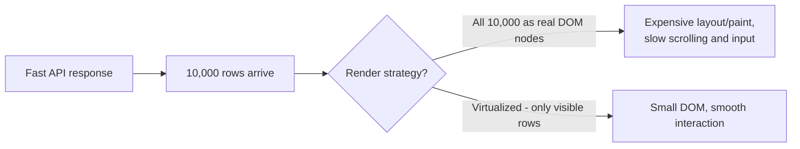

# The Backend Is Fine, But the React UI Gets Slow at 10,000 Users

## 1. Story

A React app is smooth with 100 users. At 10,000, the UI becomes noticeably sluggish - typing lags, scrolling stutters, clicks feel delayed. The backend API response times are checked and confirmed normal. So the problem isn't the server - it's happening entirely inside the browser.

## 2. The Problem

Recall the flow from `User -> Browser -> DOM -> JavaScript -> Network -> API -> Backend`: a slow *network* leg or a slow *API* leg would show up in the API timing numbers already ruled out. That leaves the **DOM** and **JavaScript** legs - meaning the browser itself is doing too much work rendering, re-rendering, or processing something client-side, independent of how fast the server responds.

"10,000 users" here likely means the UI is now rendering data *about* 10,000 items (a table, a list, a dashboard) - not that 10,000 people are using the browser tab at once. That reframes the question: this is a **rendering scale** problem, not a traffic problem.

## 3. What to Investigate First

**DOM node count** - open the Elements panel and check how many actual DOM nodes exist. Rendering 10,000 rows as 10,000+ real DOM elements is expensive for the browser to lay out, paint, and keep in memory, even before React gets involved.

**Unnecessary re-renders** - use the React DevTools Profiler to record an interaction and look at the flame graph: is a large list or a heavy component re-rendering far more often than the data driving it actually changes? Common causes: passing a new inline function or object as a prop on every render (breaks reference equality, defeating `React.memo`), missing or unstable `key` props causing React to re-mount instead of reuse elements, and state lifted too high, so a small change re-renders a huge subtree unnecessarily.

**Expensive work happening inside render** - formatting, filtering, or computing derived values freshly on every render, for every one of 10,000 items, instead of computing once and caching the result.

**Main-thread blocking** - Chrome's Performance tab shows "long tasks" (JavaScript execution blocking the main thread for 50ms+), which is what causes visible input lag and stutter - this is the concrete, measurable signature of "the UI feels slow."

## 4. The Fixes, Matched to the Cause

- **Virtualization/windowing** (e.g. `react-window`, `react-virtualized`) - render only the rows currently visible in the viewport instead of all 10,000 at once. This is usually the single highest-leverage fix for a large list or table, directly cutting DOM node count.
- **Memoization** - `React.memo` for components, `useMemo` for expensive derived values, `useCallback` for function props passed to memoized children - prevents re-renders and re-computation that aren't actually necessary.
- **Pagination or infinite scroll** instead of loading and rendering the entire dataset at once.
- **Move expensive computation out of the render path** - compute once (on data fetch, or memoized) instead of recomputing on every re-render.

## 5. Mental Model

> A backend that responds in 50ms can still produce a UI that feels slow, because "fast API" and "fast rendering" are two completely different problems in two completely different places - the browser has its own scaling limits (DOM size, re-render cost, main-thread work) that have nothing to do with server response time.

## 6. Flow

## 7. Production Reality

React DevTools Profiler and Chrome's Performance panel are the two tools that turn "the UI feels slow" (a vague complaint) into "this specific component re-renders 40 times per keystroke" (an actionable, measurable finding) - the same diagnostic-first instinct as the backend debugging lessons in this curriculum, just pointed at the browser instead of the server.

## 8. Common Mistakes

- Assuming a frontend performance problem must be a network/API problem, and stopping the investigation once API timing looks fine.
- Rendering an entire large dataset directly into the DOM "because it's simpler," without virtualization, and only discovering the cost once real data volume arrives.

## 9. 🧠 Remember

> When the API is fast but the UI is slow, the bottleneck lives in the browser's rendering work, not the network - check DOM node count, unnecessary re-renders, and main-thread blocking time before suspecting the backend at all.

## 10. Quick Self-Test

1. Why does a fast API response time not rule out a frontend performance problem?
2. Why does virtualization reduce rendering cost even though the same amount of data still needs to be fetched?
3. What specifically does passing a new inline function as a prop break, and why does that matter for performance?
