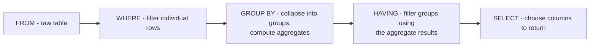

# WHERE and HAVING Both Filter Data - So Why Do We Need Both?

## 1. Story

Both `WHERE` and `HAVING` show up in the same `SELECT` statement, both look like they're filtering rows, and it's genuinely unclear why SQL needs two different keywords for what looks like the same job.

## 2. The Answer: They Filter at Different Stages of Query Execution

SQL doesn't execute in the order it's written. The real execution order is roughly:

`FROM -> WHERE -> GROUP BY -> HAVING -> SELECT -> ORDER BY`

**WHERE** filters individual rows, **before** any grouping/aggregation happens. At this stage, aggregate values like `COUNT()`, `SUM()`, or `AVG()` don't exist yet - there are only raw rows - so `WHERE` cannot reference an aggregate function.

**HAVING** filters **groups**, after `GROUP BY` has already collapsed rows into groups and computed the aggregate values. It exists specifically to filter on the *result* of aggregation, which is information that simply doesn't exist at the `WHERE` stage.

## 3. Code Example

```sql
SELECT department, COUNT(*) AS active_employees
FROM employees
WHERE active = true          -- filters individual rows FIRST, before grouping
GROUP BY department
HAVING COUNT(*) > 10;        -- filters the GROUPS, using the aggregate result
```

Here, `WHERE active = true` removes inactive employees before grouping even happens. Then rows get grouped by department and counted. Only *after* that does `HAVING COUNT(*) > 10` remove entire departments that don't have enough active employees. Trying to write `WHERE COUNT(*) > 10` would fail - `COUNT(*)` doesn't exist yet at the point `WHERE` runs.

## 4. Mental Model

> WHERE asks "should this row even be considered?" before any grouping happens. HAVING asks "should this group survive?" after the grouping and counting is already done.

## 5. Flow



## 6. Production Reality

Filter as much as possible in `WHERE`, not `HAVING`, whenever the condition doesn't actually depend on an aggregate. `WHERE` reduces the row count *before* the (often expensive) grouping and aggregation work happens, so pushing filters earlier is generally better for performance - `HAVING` should only be used for conditions that genuinely require the aggregated value to evaluate.

## 7. Common Mistakes

- Trying to reference an aggregate function inside `WHERE` and getting a syntax/execution error, without understanding *why* it's not allowed.
- Using `HAVING` for a condition that could have been expressed in `WHERE`, unnecessarily forcing the database to group more rows than it needed to before filtering.

## 8. 🧠 Remember

> WHERE filters rows before grouping; HAVING filters groups after aggregation - they exist because aggregate values simply don't exist yet at the point WHERE executes.

## 9. Quick Self-Test

1. Why can't `WHERE` reference the result of `COUNT()` or `SUM()`?
2. Why is filtering in `WHERE` generally more efficient than filtering the same condition in `HAVING`, when possible?
3. Write a query (in words) where a condition genuinely *must* go in `HAVING` and couldn't be expressed in `WHERE`.
