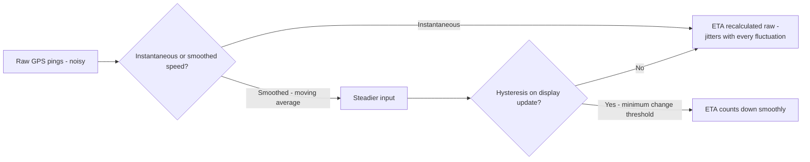

# Why Does a Delivery App's ETA Look "Drunk"? (8 -> 11 -> 7 -> 10 Minutes)

## 1. Story

A delivery app shows 8 minutes. Two minutes later, it says 11. Then 7. Then 10. The location data feeding it is genuinely real-time. So why does the number bounce around instead of counting down smoothly?

## 2. The Problem - Raw Signals Are Noisy, and Nothing Is Smoothing Them

An ETA isn't a direct measurement - it's a **prediction**, recomputed repeatedly from several noisy inputs, and if nothing between the raw computation and the screen smooths that noise out, the user sees every fluctuation in the underlying data as if it were meaningful.

## 3. The Actual Causes

**GPS noise** - real-time location data itself has inherent inaccuracy: multipath signal reflection in dense urban areas ("urban canyon" effect), sampling gaps, and momentary drift. A rider's *reported* position can jump slightly even when their real movement is smooth.

**Instantaneous speed instead of smoothed speed** - if the ETA model extrapolates from the rider's *current* instantaneous speed rather than an average over the last few minutes, a momentary stop at a traffic light produces a much longer projected ETA than reality, and speeding up right after produces a much shorter one - both technically "accurate" snapshots that are individually misleading as predictions.

**Route recalculation volatility** - routing engines often recompute the "best" path repeatedly as conditions change. When two routes have nearly identical cost, the engine can flip between them on successive recalculations, and each flip can shift the ETA by a couple of minutes even though the rider's actual progress barely changed.

**No display-side smoothing or hysteresis** - the model recalculates every few seconds from fresh (noisy) inputs and pushes every new raw number straight to the screen, with no minimum-change threshold or gradual convergence - so the user sees raw jitter instead of a stable, trending number.

## 4. The Fix

- **Smooth the speed input**: use an exponential moving average or a short rolling window of recent speed, not the single most recent GPS ping, before feeding it into the ETA calculation.
- **Add hysteresis to the displayed number**: only update the visible ETA if the new prediction differs from the current one by more than a small threshold, or apply gradual convergence toward the new prediction rather than snapping to it instantly.
- **Prefer route stability in recalculation**: when two routes are close enough in cost, keep the current route rather than flip-flopping, since the ETA cost of switching (a visible jump) often outweighs the marginal routing benefit.
- **Consider showing a range or confidence band** instead of one precise number, which is often a more honest representation of what's actually being predicted.

## 5. Mental Model

> Raw sensor and signal data is always noisy - the presentation layer's job is to smooth it into something a human can trust, not to forward every fluctuation as if it were a meaningful update. An ETA that jitters is a system that skipped the smoothing step, not a system with worse data.

## 6. Flow

## 7. Production Reality

This exact smoothing problem shows up anywhere a system repeatedly re-predicts something from live, noisy inputs and displays it to a human - flight arrival estimates, food delivery ETAs, "time remaining" progress bars for long-running jobs. The fix pattern (smooth the input, add hysteresis to the output) generalizes well beyond delivery apps.

## 8. Common Mistakes

- Assuming more frequent recalculation automatically means a better user experience - recalculating faster with noisy, unsmoothed inputs just means jittering faster and more visibly.
- Treating "the location data is real-time" as proof the system must be correct - real-time doesn't mean noise-free, and the complaint is specifically about *presentation* stability, not raw data accuracy.

## 9. 🧠 Remember

> A jittery ETA isn't a data-accuracy problem, it's a missing-smoothing problem - real-time, noisy inputs need an exponential moving average and display-side hysteresis before they're shown to a human, or every small fluctuation looks like the prediction is unreliable.

## 10. Quick Self-Test

1. Why can real-time, accurate location data still produce a jittery, "wrong-looking" ETA?
2. What's the difference between smoothing the input (speed) and adding hysteresis to the output (displayed ETA), and why might you want both?
3. Name one other real-world system where the same raw-signal-needs-smoothing problem would show up.
