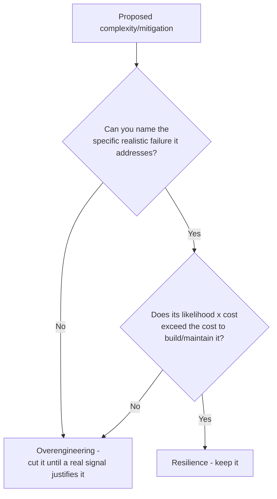

# What's the Difference Between Resilience and Overengineering?

> **Ties together**: the resilience patterns from [[12-multi-az-availability]], [[14-cascading-failure-recovery]], and [[19-idempotent-consumer-duplicate-events]], against the "don't build for scale you don't have" lessons in [[15-simple-vs-scalable-architecture]] and [[24-kubernetes-pets-vs-cattle]]. Both add complexity - the question is what earns that cost.

## 1. The Problem

Both resilience and overengineering look identical from the outside: extra code, extra infrastructure, extra failure-handling paths, more to build and maintain. Someone reviewing a design can't tell them apart just by counting the moving parts - the difference is in *why* the complexity exists.

## 2. The Actual Distinction

**Resilience** is complexity that exists **in direct response to an identified, realistic risk**, sized to that risk's actual likelihood and cost. Multi-AZ deployment ([[12-multi-az-availability]]) exists because AZ outages are a documented, recurring failure mode with real, measurable business cost if unaddressed. A circuit breaker with backoff and jitter ([[14-cascading-failure-recovery]]) exists because retry storms are a well-understood, common failure amplifier. Idempotent consumers ([[19-idempotent-consumer-duplicate-events]]) exist because at-least-once delivery is a guaranteed property of the messaging system being used, not a hypothetical.

**Overengineering** is complexity added for a risk that is **speculative, unlikely, or disproportionate to its cost** - Kubernetes for three containers ([[24-kubernetes-pets-vs-cattle]]), a full CDN-LB-Redis stack for ten thousand total users ([[15-simple-vs-scalable-architecture]]), a distributed transaction protocol for a workload that will never see meaningful concurrent writes. It's solving for a scale or failure mode that doesn't exist yet, at a real ongoing cost paid today.

## 3. The Test

> Ask: **is this complexity justified by an identified risk whose likelihood and cost of failure genuinely exceed the cost of building and maintaining the mitigation?** If yes, it's resilience. If the honest answer is "it might matter someday" or "it looks more serious," it's overengineering.

## 4. Mental Model

> Resilience is insurance you can point to a specific, real incident type for. Overengineering is insurance against a risk you can't actually name with any confidence - paid for anyway, every day, whether or not it ever pays off.

## 5. Flow

## 6. Production Reality

The same piece of infrastructure can be resilience in one company and overengineering in another - Multi-AZ deployment is resilience for a revenue-generating consumer app and likely overengineering for an internal tool with a two-hour acceptable downtime window. Context, not the technique itself, decides which side of the line it's on.

## 7. Common Mistakes

- Treating "we might need it later" as sufficient justification - nearly any complexity can be justified this way, which is exactly why it isn't a real test.
- Cutting genuine resilience because it "isn't being used yet" - a circuit breaker that hasn't tripped yet isn't proof it's unnecessary, it's evidence it's working.

## 8. 🧠 Remember

> Resilience and overengineering look identical in code - the difference is whether the complexity is answering a named, realistic risk whose cost justifies it, or just insuring against anxiety about a scale that hasn't arrived.

## 9. Quick Self-Test

1. Why can the exact same technique (say, Multi-AZ deployment) be resilience in one context and overengineering in another?
2. Why is "we might need it someday" not a valid justification for added complexity?
3. Why is the absence of a triggered failure mode not proof that a resilience mechanism was unnecessary?
