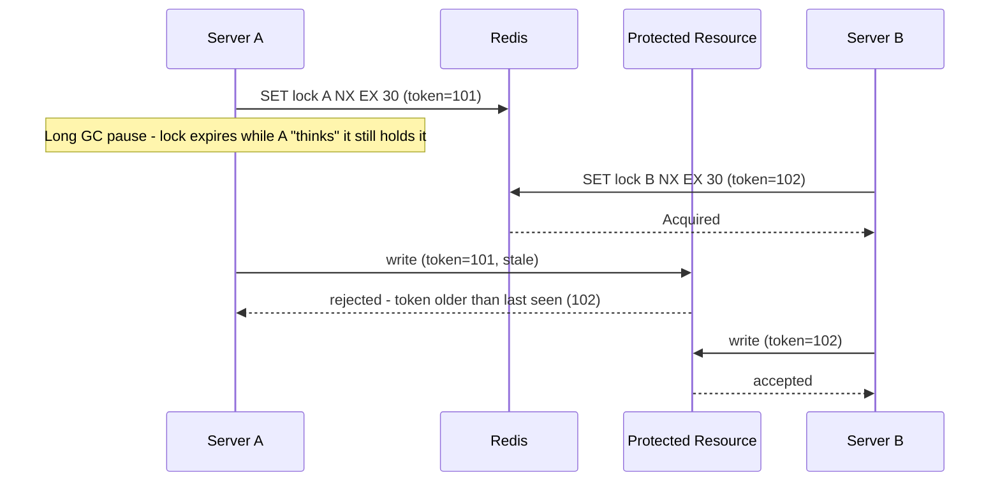

# "We'll Use SETNX in Redis" - The Distributed Lock Questions That Follow

> **Connects to**: [[10-clock-skew-last-write-wins]] (timing assumptions across machines are never perfectly reliable) and [[19-idempotent-consumer-duplicate-events]] / [[32-payment-idempotency-double-click]] (idempotency as the defense-in-depth backstop when a lock's guarantee turns out to be imperfect).

## 1. Story

"We need a distributed lock so two app servers never process the same job at once." "We'll use `SETNX` in Redis." That's a reasonable start - but it's the first sentence of the answer, not the whole answer. Five follow-up questions separate someone who's used the tool from someone who understands what it actually guarantees.

## 2. Working Through Each Question

**"What happens if the lock holder crashes before releasing it?"** Without a safeguard, the lock is held forever and no other server can ever acquire it - a single crash creates a permanent deadlock. The fix: always set the lock key with a **TTL** (`SET key value NX EX <ttl>`), so Redis releases it automatically even if the holder never explicitly does.

**"How long should the TTL be?"** A genuine trade-off with no universal right answer: too short, and a lock can expire while the job is still legitimately running, letting a second server acquire it and process the same job concurrently - the exact scenario this lock was built to prevent. Too long, and a real crash means every other server waits unnecessarily long before the lock frees up.

**"What if the job takes longer than the TTL?"** The standard fix is a **heartbeat/lock renewal**: the holder periodically extends its own lock's TTL while the job is still actively running (a "lease" pattern), instead of picking one fixed TTL and hoping it's long enough. If the holder stops renewing (because it crashed), the lock naturally expires soon after.

**"How do you avoid two servers thinking they both own it?"** Even with renewal, a subtle gap remains: a server can experience a long pause (GC pause, OS scheduling delay, network hiccup) long enough for its lock to expire and be acquired by someone else, then resume and continue believing it still holds the lock - both servers now act as the owner simultaneously. The real fix is a **fencing token**: every time the lock is granted, Redis returns a monotonically increasing number. The *protected resource itself* (the database, the file, the job queue) must check that token and reject any write carrying an older token than the last one it accepted - this moves the actual safety guarantee to the resource being protected, not just trust in the lock.

**"If Redis is briefly partitioned, can two clients both believe they acquired the lock?"** Yes, with a single Redis instance backed by asynchronous replication: a lock could be set on the primary, the primary fails before that write replicates, a replica is promoted to the new primary with no record of the lock, and a second client acquires the "same" lock on the new primary. This is precisely the failure mode that led to the (still debated) **Redlock** algorithm - acquiring the lock across a quorum of independent Redis instances - and even Redlock has well-known critics (notably Martin Kleppmann) who argue it still doesn't provide a hard safety guarantee under certain clock and pause assumptions, similar in spirit to the clock-skew fragility from [[10-clock-skew-last-write-wins]].

## 3. Mental Model

> A Redis lock built only on `SETNX` and a TTL is a **best-effort mutual-exclusion hint**, not an absolute safety guarantee - real safety under crashes, pauses, and partitions requires lease renewal, a fencing token enforced by the protected resource, and honesty about what a single Redis instance can and cannot guarantee during a partition.

## 4. Flow

## 5. Production Reality

For genuinely correctness-critical operations, a lock alone should never be the *only* safety net - pairing it with **idempotency at the operation level** ([[19-idempotent-consumer-duplicate-events]], [[32-payment-idempotency-double-click]]) means that even in the rare case two servers do briefly both believe they own the lock, the actual side effect (charging a card, sending an email) still only happens once. Defense in depth, not a single point of trust.

## 6. Trade-offs

| Approach | Safety | Complexity |
|---|---|---|
| Plain SETNX, no TTL | None - permanent deadlock on crash | Lowest |
| SETNX + TTL | Best-effort, vulnerable to expiry-during-work | Low |
| + Lease renewal | Handles long-running jobs correctly | Medium |
| + Fencing token at the resource | Genuinely safe against stale lock holders | Medium-high |
| Redlock (multi-instance quorum) | Stronger against single-node failure, still debated under certain assumptions | High |

## 7. 🧠 Remember

> `SETNX` alone answers "how do I acquire a lock," not "how do I guarantee only one owner ever acts." Real distributed locking needs a TTL with renewal for correctness during normal operation, and a fencing token enforced by the protected resource for correctness during the failures a lock service can't fully prevent.

## 8. Quick Self-Test

1. Why does a TTL alone not fully solve the "server crashes mid-job" problem?
2. What specific failure does a fencing token protect against that lease renewal alone doesn't?
3. Why is pairing a lock with idempotency at the operation level good practice even when the lock is well-designed?
