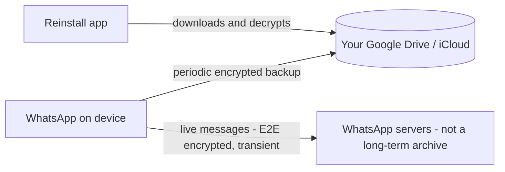

# Delete WhatsApp, Reinstall It, All Chats Come Back - Where Were They Stored?

## 1. Story

Uninstalling an app normally wipes its local data. Reinstalling WhatsApp and watching every chat reappear feels almost magical - until you ask the obvious question: if the app's local storage was wiped, where did all that history actually come from?

## 2. The Problem - It's Not WhatsApp's Own Servers

WhatsApp uses end-to-end encryption for messages, and its own servers are designed to be a **transient relay**, not a long-term archive: a message is typically held only long enough to deliver it, then deleted server-side. That's a deliberate privacy property, not an oversight - but it also means the answer to "where's the history" can't simply be "on WhatsApp's servers."

## 3. The Actual Answer: Your Own Cloud Storage

The chat history lives in an **encrypted backup you already own**: Google Drive on Android, iCloud on iOS - not WhatsApp's own infrastructure at all. WhatsApp periodically uploads an encrypted snapshot of your chat database to that personal cloud account. On reinstall, the app detects an existing backup, downloads it, decrypts it, and restores it locally - which is why chats return, and why they *don't* return if you reinstall on a fresh account with no linked Drive/iCloud backup, or on a different platform (Android backups and iOS backups aren't interchangeable).

## 4. The Interesting Wrinkle: Backup Encryption Is a Separate Mechanism

If messages are end-to-end encrypted for live delivery, how can a backup be restored without WhatsApp (or Google/Apple) being able to read it? The backup uses its **own** encryption path - historically tied to your Google/Apple account credentials, and more recently available with an additional user-set password/key for genuinely end-to-end encrypted backups. This is a distinct key management system from the one used for live message delivery - worth noticing precisely *because* it's easy to assume "end-to-end encrypted app" means every stored copy of your data is protected the same way.

## 5. Mental Model

> "Local," "server-side," and "your own cloud account" are three different storage tiers with three very different lifetimes and trust models - an app being end-to-end encrypted for delivery says nothing on its own about where or how its backups are stored.

## 6. Flow

## 7. Production Reality

This design has a real trade-off: it moves the responsibility (and the storage cost) for message history onto the user's own cloud account rather than the messaging company's infrastructure, which scales far better for a service with billions of users - but it also means losing access to that Google/iCloud account, or switching platforms without transferring the backup correctly, genuinely loses the chat history, since WhatsApp itself was never the durable source of truth.

## 8. Common Mistakes

- Assuming an end-to-end encrypted messaging app must store all of your data, everywhere, with the same encryption guarantees - backup encryption and live-message encryption are commonly separate systems with separate assumptions.
- Assuming "the company's servers" is always the answer to "where is my data stored" - for many consumer apps, the durable copy is deliberately pushed onto infrastructure the user already pays for and controls.

## 9. 🧠 Remember

> The chats didn't come back from WhatsApp's own servers - they came from an encrypted backup sitting in your own Google Drive or iCloud account, restored on reinstall through a separate encryption and key-management path from the one used for live messages.

## 10. Quick Self-Test

1. Why doesn't WhatsApp's own server-side storage explain the chat restore, given its end-to-end encryption design?
2. Why might chat history fail to restore when switching from Android to iOS, even with the same phone number?
3. Why does backup encryption need its own key management, separate from live-message E2E encryption?
