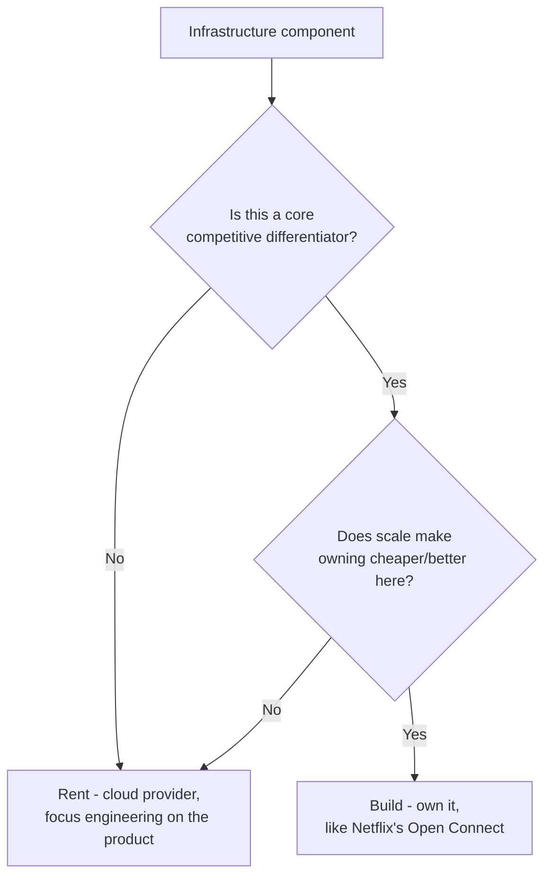

# If Netflix Is Worth Billions, Why Does It Run on AWS?

## 1. Story

Netflix, Spotify, Uber, and Shopify all run substantial parts of their infrastructure on someone else's cloud (AWS, Google Cloud, Azure) rather than building and owning their own data centers - despite being large enough, and valuable enough, to plausibly afford to build their own. Meanwhile Google, Amazon, and Microsoft *do* run their own massive infrastructure. What's actually different?

## 2. The Build-vs-Rent Calculus

**Renting (cloud) wins when:**
- **Elasticity matters more than raw unit cost** - paying for exactly the compute used, scaling up for a traffic spike and back down after, avoids the far larger capital cost of owning enough hardware for peak load that then sits idle most of the time.
- **Infrastructure isn't the actual product** - engineering time spent operating data centers, racking servers, and managing physical networking is engineering time *not* spent on the product that actually generates revenue and differentiation.
- **Speed to market and global reach** - a cloud provider's regions, edge locations, and managed services already exist; building equivalent global reach from scratch takes years.
- **This is the same instinct as [[24-kubernetes-pets-vs-cattle]]** - orchestration/infrastructure complexity is worth adopting only once the operational burden of *not* using it clearly exceeds the cost of adopting it; owning physical infrastructure is the same trade-off one level further down the stack.

**Owning wins when:**
- **The economics flip at extreme, sustained scale** for one *specific* component, and that component is a genuine differentiator. Netflix runs most of its infrastructure on AWS - but built and operates its **own CDN, Open Connect**, specifically for video delivery, because at Netflix's video-egress volume, owning that one piece became cheaper and gave them more control than renting it, even while everything else stays on AWS.
- **Infrastructure IS the core product.** Google, Amazon, and Microsoft build and own massive infrastructure because, for them, that infrastructure isn't overhead - it's the thing they sell (as AWS, Azure, GCP) or the foundation their entire product line depends on at a scale no other vendor could serve them at a reasonable price.

## 3. Mental Model

> "Build vs. rent" isn't one company-wide decision - it's a per-component decision, made separately for each piece of infrastructure, based on whether that specific piece is a genuine competitive differentiator at your specific scale. Most of Netflix rents. The one piece where their scale and product needs diverged sharply from a generic cloud offering, they built.

## 4. Flow

## 5. Production Reality

Most companies never reach the scale where owning any piece of infrastructure beats renting it - which is exactly why cloud adoption is the default, not the exception, even among very large, well-funded companies. The decision to build should be triggered by a measured, specific cost/performance gap at your actual scale, not by a general sense that "we're big enough now to do it ourselves."

## 6. Common Mistakes

- Treating "build vs. rent" as an all-or-nothing, company-wide decision rather than a per-component one.
- Assuming a large, valuable company defaults to owning its infrastructure - most large companies rent almost everything and own only the specific pieces where their scale and needs genuinely diverge from what a generic cloud product offers.

## 7. 🔗 Connection to Other Concepts

The same reasoning from [[15-simple-vs-scalable-architecture]] and [[24-kubernetes-pets-vs-cattle]] applies one layer down the stack: adopt the more complex, more owned option only once a specific, measured need justifies its cost - never by default, and never all at once.

## 8. 🧠 Remember

> Build vs. rent is decided component by component, not company-wide - rent by default for speed and elasticity, and build only the specific piece where scale makes owning it a genuine competitive advantage, the way Netflix owns its CDN but rents nearly everything else.

## 9. Quick Self-Test

1. Why does Netflix run most of its infrastructure on AWS but own its own CDN specifically?
2. Why do Google, Amazon, and Microsoft build their own infrastructure when most large companies don't?
3. Why is "build vs. rent" better framed as a per-component decision than a single company-wide choice?
