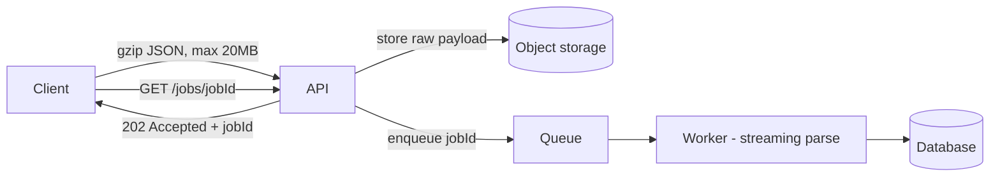

# Designing an API That Accepts 10-20 MB JSON Payloads

## 1. Story

A partner integration starts sending your API product catalogs as one giant JSON body: 10-20 MB per request. At first it works. Then a few partners send at the same time, memory spikes, requests time out halfway through, and the process gets OOM-killed. Nothing in the business logic changed. The payload size did.

## 2. The Problem

A normal API handler does this:

1. Read the **entire** body into memory.
2. `JSON.parse` the whole thing into objects (often 2-5x larger in memory than the raw bytes).
3. Validate it, then process it, all **inside the HTTP request**.

With a 20 MB body, one request can easily hold 50-100 MB of heap. Ten concurrent uploads and a normal-sized server is out of memory. And because processing happens inside the request, the client is stuck waiting for minutes, load balancers hit their timeouts, and one slow request ties up a worker for everyone else.

## 3. The Solution - Stop Treating a Big Payload Like a Small One

**1. Set explicit limits.** Configure a max body size at the load balancer/reverse proxy and in the app (`express.json({ limit: '20mb' })`). Anything bigger gets a fast `413 Payload Too Large` instead of eating memory first.

**2. Accept compressed bodies.** JSON compresses extremely well (often 5-10x). Accept `Content-Encoding: gzip` so the network transfer is small.

**3. Stream-parse instead of loading everything.** **Term: Streaming parser** - reads the JSON piece by piece and emits one record at a time, so memory stays flat no matter how big the file is. If the payload is an array of items, process each item as it arrives instead of holding all of them.

**4. Make it asynchronous.** The API should only *accept* the payload, store it (object storage like S3), put a job on a queue, and immediately return `202 Accepted` with a `jobId`. Workers process it in the background, and the client polls `GET /jobs/{jobId}` or gets a webhook when done. This is the same "decouple slow work from the request" idea from [[17-notification-system-design]].

**5. Better yet - don't send it through the API at all.** For really large data, let the client upload directly to object storage with a pre-signed URL and just tell the API "it's there." That's the full design in [[49-large-file-upload-with-status]].

**6. Question the format.** If partners are sending huge arrays of records, **NDJSON** (one JSON object per line) or batched pagination (1,000 items per request) is often simpler than one giant document.

## 4. Mental Model

> A big payload is not a big request, it's a **job**. Accept it fast, store it somewhere durable, and process it in the background, piece by piece.

## 5. Flow



## 6. Code Example

```javascript
// Accept fast, process later
app.post('/imports', express.raw({ type: 'application/json', limit: '20mb' }), async (req, res) => {
  const jobId = crypto.randomUUID();
  await s3.putObject({ Bucket: 'imports', Key: `${jobId}.json`, Body: req.body });
  await queue.send({ jobId });
  await db.jobs.insert({ id: jobId, status: 'queued' });
  res.status(202).json({ jobId, statusUrl: `/imports/${jobId}` });
});

// Worker: stream-parse so memory stays flat
const { parser } = require('stream-json');
const { streamArray } = require('stream-json/streamers/StreamArray');

async function processImport(jobId) {
  const stream = (await s3.getObject({ Bucket: 'imports', Key: `${jobId}.json` })).Body
    .pipe(parser()).pipe(streamArray());
  for await (const { value: item } of stream) {
    await upsertItem(item); // one record at a time, never the whole file in memory
  }
  await db.jobs.update(jobId, { status: 'done' });
}
```

## 7. Production Reality

- Validate cheaply up front (content type, size, auth), and do deep validation in the worker, reporting row-level errors in the job status.
- Make the import idempotent (the client sends an idempotency key, see [[32-payment-idempotency-double-click]]) so a retry after a timeout doesn't import twice.
- Put per-client rate limits on this endpoint, since a single partner can otherwise flood your workers.

## 8. Trade-offs

Async processing means the client no longer gets an instant "done", it gets a job to track. That is more work for API consumers, but it is the only design that stays stable when payloads and concurrency both grow.

## 9. Common Mistakes

- Just raising the body limit to 50 MB and calling it fixed. The memory and timeout problems are still there, just delayed.
- Parsing the whole payload in the request handler, then processing it synchronously while the client waits.

## 10. 🧠 Remember

> Treat a huge payload as a job, not a request: limit it, compress it, store it, queue it, and stream-parse it in a worker.

## 11. Quick Self-Test

1. Why can a 20 MB JSON body use far more than 20 MB of memory once parsed?
2. Why is returning `202 Accepted` with a job ID better than processing inside the request?
3. When would you skip the API entirely and upload straight to object storage?
