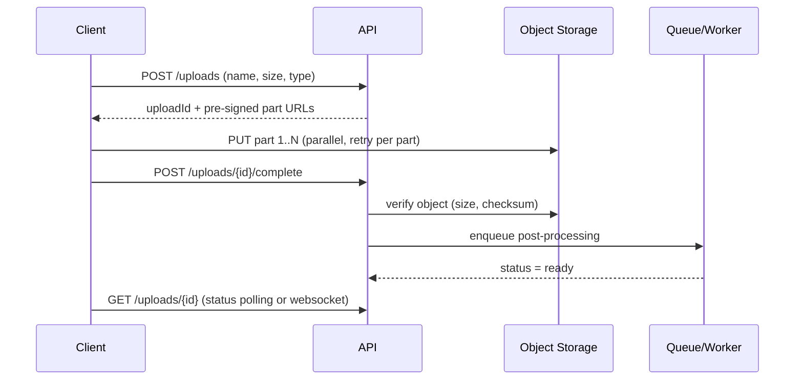

# Large File Uploads With Status Tracking - Why "Upload Through the API" Is Wrong

> **Builds on**: [[48-huge-json-payloads]] (big data should not flow through your API servers) and [[17-notification-system-design]] (async processing with status tracking).

## 1. Story

The interview problem: build a system where users upload large files (videos, datasets, 2 GB design files) and can see the upload status.

The candidate answers: "Frontend uploads the file, API receives it, backend stores it on the server, save the file URL in the DB."

It sounds reasonable. It breaks in at least five ways.

## 2. What's Wrong With the Candidate's Answer

- **API servers become file pipes.** Every byte of a 2 GB file flows through your app server, holding a connection and memory/disk for minutes. A handful of uploads can saturate the whole API tier.
- **Storing on the server's local disk.** The file lives on one machine. The next request might hit another instance behind the load balancer that doesn't have it, autoscaling can delete that instance, and disks fill up. This breaks the stateless-server rule from [[06-ec2-autoscaling]].
- **No resume.** If the network drops at 95%, the user starts over from zero.
- **No real status.** "Track upload status" is impossible if the only state is "the request is still open."
- **Timeouts.** Load balancers and proxies commonly cut long requests (often 60 seconds by default), killing large uploads mid-way.

## 3. The Correct Design

**Step 1 - Ask for permission, not bandwidth.** The client calls the API: "I want to upload `video.mp4`, 2 GB." The API creates an `uploads` record (`status = pending`) and returns a **pre-signed URL**.

**Term: Pre-signed URL** - a temporary, signed link that lets the client upload directly to object storage (S3, GCS, Azure Blob) for a limited time, without your API ever touching the bytes and without exposing storage credentials.

**Step 2 - Upload directly to object storage, in parts.** For big files, use **multipart upload**: the file is split into chunks (for example 10 MB each), uploaded in parallel, and each chunk can be retried independently. A dropped connection means re-sending one chunk, not the whole file. This gives you resume for free.

**Step 3 - Track progress.** The client knows which parts are done, so it can show a real progress bar. The server records state transitions: `pending -> uploading -> uploaded -> processing -> ready` (or `failed`).

**Step 4 - Confirm completion.** When the upload finishes, object storage emits an event (e.g. S3 event notification) or the client calls `POST /uploads/{id}/complete`. The API verifies the object exists (size, checksum) and updates the status.

**Step 5 - Post-process asynchronously.** Virus scan, thumbnails, video transcoding, metadata extraction all run in background workers from a queue, updating the status as they go. The user sees "Processing..." then "Ready".

## 4. Mental Model

> Your API is the **traffic controller**, not the **truck**. It hands out permission slips (pre-signed URLs) and keeps the logbook (status table), while the heavy cargo goes straight from the user to the warehouse (object storage).

## 5. Flow

## 6. Data Model

| Column | Purpose |
|---|---|
| id | upload id |
| user_id | owner |
| object_key | where it lives in storage |
| size, checksum | integrity check on completion |
| status | pending / uploading / uploaded / processing / ready / failed |
| created_at, updated_at | expire abandoned uploads |

## 7. Production Reality

- **Abandoned uploads**: users close the tab mid-upload. Use a lifecycle rule to clean up incomplete multipart uploads and a TTL on `pending` records (same continuous-cleanup idea as [[03-ttl-deletion-at-scale]]).
- **Security**: validate type/size before issuing the URL, keep the URL short-lived, scan files before they become downloadable, and never trust the client-reported size alone.
- **Downloads**: serve files via a CDN or pre-signed GET URLs, not through the API.

## 8. Trade-offs

Direct-to-storage uploads add a few more steps (request URL, upload, confirm) and make the client slightly more complex. In return, the API tier stays small and stateless, uploads survive network drops, and status becomes a real, queryable thing.

## 9. 🧠 Remember

> Never stream large files through your API servers or onto their local disks: hand out pre-signed URLs, let clients upload in resumable parts straight to object storage, and track the lifecycle in a status table.

## 10. Quick Self-Test

1. Name three things that break when files are stored on the API server's local disk.
2. How does multipart upload give you "resume" almost for free?
3. How does the backend learn that an upload directly to S3 has finished?
