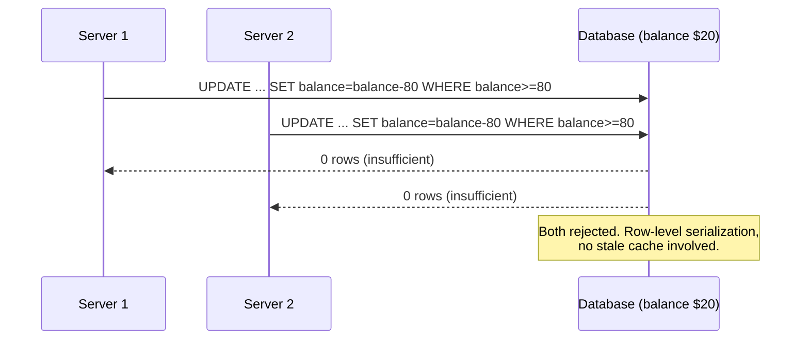

# Cache Says $100, Database Says $20, Two $80 Payments Both Succeed

> **Similar-question flag**: the double payment is the same check-then-act race from [[26-duplicate-email-race-condition]] and [[32-payment-idempotency-double-click]]. What's new here is the **cache**: a stale copy of the balance was used to make a money decision.

## 1. Story

A user has $20 in the database. The cache still says $100 (it wasn't invalidated after an earlier purchase). Two $80 payment requests arrive at two different servers at the same moment. Both read $100 from the cache, both think "enough money," both succeed. The user spent $160 from a $20 balance.

## 2. Two Separate Bugs

**Bug 1 - The cache was used as the source of truth for money.** A cache is a *copy*, and copies go stale: a missed invalidation, a delayed update, a race between "update DB" and "update cache." That's fine for a product description. It's not fine for deciding whether money can move.

**Bug 2 - Check-then-act across two servers.** Even with the correct balance, "read balance -> check -> write new balance" as separate steps lets two requests both pass the check before either writes. This is the TOCTOU race from [[26-duplicate-email-race-condition]].

## 3. The Fix

**1. Never authorize money from the cache.** Read the balance from the database (the primary, not a lagging replica - see [[28-scaling-database-reads]]). Use the cache for displaying the balance, not for deciding.

**2. Make the check and the write one atomic operation.**

```sql
UPDATE accounts
SET balance = balance - 80
WHERE id = 7 AND balance >= 80;
-- Returns 1 row updated -> payment allowed
-- Returns 0 rows updated -> insufficient funds
```

The database applies the two updates one after the other on that row. With the real balance of $20, both are rejected (20 < 80). Even if the balance really were $100, the first would succeed (leaving $20) and the second would then find $20 and be rejected. There's no window where both see "enough."

Alternatives: `SELECT ... FOR UPDATE` inside a transaction (row lock), or optimistic locking with a `version` column that must match on update.

**3. Idempotency key per payment** so a retried request doesn't charge twice ([[32-payment-idempotency-double-click]]).

**4. Better ledger design for real money**: record each movement as an immutable entry and derive the balance, as in [[30-workload-before-conclusion]].

**5. Fix the cache invalidation too** - after a successful write, delete the cache key (don't just update it) so the next read reloads from the DB. But treat that as a UX fix, not the safety guarantee.

## 4. Mental Model

> The cache is a photo of the balance; the database is the bank vault. You can show customers the photo, but you only hand out money after checking the vault - and you check and take the money in one movement, so nobody can slip in between.

## 5. Flow



## 6. 🧠 Remember

> Never make a money decision from a cache, and never split "check balance" and "deduct balance" into separate steps - do both in one atomic conditional update on the source of truth.

## 7. Quick Self-Test

1. Why is using a cached balance acceptable for display but not for authorization?
2. How does `WHERE balance >= 80` inside the `UPDATE` remove the race condition?
3. Even with the correct DB balance, why do separate SELECT-then-UPDATE steps still allow a double spend?
