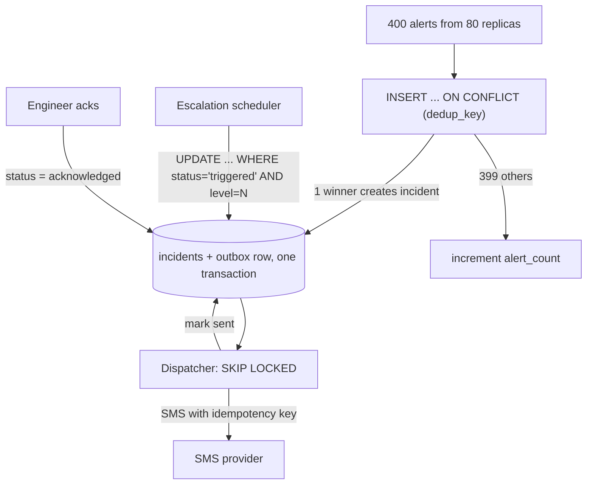

# Design PagerDuty: One Incident, Exactly One Page, Even When Things Crash

> **Connects to**: [[19-idempotent-consumer-duplicate-events]] (at-least-once + idempotency), [[26-duplicate-email-race-condition]] (check-then-act races), [[44-distributed-locking-with-redis]] (why a Redis lock isn't enough under partitions). This question ties all three together.

## 1. Story

A monitoring system sends 50,000 alerts per minute. One service starts failing. The **same alert fires 400 times in 20 seconds from 80 replicas.**

Your system creates an incident and pages the on-call engineer. The SMS is sent. Then, **before** the service records "notification sent" and starts the escalation timer, the process **crashes**.

The alert keeps arriving. Another replica picks it up. It thinks nobody was paged. It pages the secondary, then the manager, then the director. Four people woken up for one incident.

Or worse: the crash happened *before* the SMS went out, and **nobody** gets paged.

## 2. Why the Easy Answers Fail

- **"Use a unique alert key."** Good start, but if 80 replicas *check* for the key at the same time, they all see "not found" and all create one. Checking isn't the same as enforcing.
- **"Put it in Redis with a TTL."** If Redis is partitioned from the notifier or fails over, two workers can both believe they own the incident (see [[44-distributed-locking-with-redis]]).
- **"Check if an incident exists first."** Two requests check at the same instant, both see nothing, both create, both page. Classic check-then-act ([[26-duplicate-email-race-condition]]).

## 3. The Concept Behind It

**Exactly-once delivery is impossible across a crash.** Between "send SMS" and "record that we sent it," a crash can always happen. You can't make those two steps atomic, because the SMS provider isn't inside your database transaction.

What you **can** build:

> **At-least-once delivery + idempotency = effectively-once.**

Make every step safe to retry, make the database the single source of truth for "what state is this incident in," and make the SMS send idempotent. This is the same idea as [[19-idempotent-consumer-duplicate-events]], applied end to end. The tool that connects your database to the outside world safely is the **transactional outbox**.

## 4. The Design

**Step 1 - Dedup at ingest with the database, not a pre-check.**
Compute a **dedup key** from the alert (e.g. `service + check_name + environment`). Insert the incident with a **unique constraint** on `(dedup_key)` for open incidents:

```sql
INSERT INTO incidents (id, dedup_key, status, created_at)
VALUES ($1, $2, 'triggered', now())
ON CONFLICT (dedup_key) WHERE status IN ('triggered','acknowledged')
DO UPDATE SET alert_count = incidents.alert_count + 1, last_seen = now()
RETURNING id, (xmax = 0) AS created;
```

400 alerts from 80 replicas -> **one** row wins the insert; the other 399 just bump a counter. No race, because the database enforces uniqueness atomically.

**Step 2 - Only the winner schedules the page, in the same transaction.**
When the insert actually *created* the incident, write an **outbox row** in the **same transaction**:

```sql
INSERT INTO outbox (id, incident_id, action, target, idempotency_key, status)
VALUES (gen_random_uuid(), $incident, 'page', 'primary_oncall',
        $incident || ':page:level1', 'pending');
```

**Term: Transactional outbox** - instead of calling the SMS provider directly, you write "this message needs to be sent" into your own database in the same transaction as the state change. Either both are saved or neither is. A separate **dispatcher** reads pending outbox rows and does the actual sending.

This fixes "crash before paging": if the incident exists, the page request **exists durably** too. Nobody gets silently skipped.

**Step 3 - Dispatcher sends at least once, with an idempotency key.**
The dispatcher picks pending rows (`SELECT ... FOR UPDATE SKIP LOCKED` so two dispatchers don't grab the same row), sends the SMS **with the idempotency key** `incident:page:level1`, then marks the row `sent`.

If it crashes after sending but before marking `sent`, another dispatcher retries the same row with the **same idempotency key**. The provider (or your own "sent log" keyed by that key) recognizes it and doesn't send a second SMS. That fixes "crash mid-notify double-pages."

**Step 4 - Escalation is state + time, stored in the database.**
Store `escalation_level` and `next_escalation_at` on the incident. A scheduler finds incidents where `status = 'triggered' AND next_escalation_at <= now()` and, in one transaction, bumps the level **only if it's still the level it expected**:

```sql
UPDATE incidents
SET escalation_level = 2, next_escalation_at = now() + interval '10 minutes'
WHERE id = $1 AND status = 'triggered' AND escalation_level = 1
RETURNING id;
```

...and writes the level-2 outbox row in that same transaction. If two schedulers race, only one update matches `escalation_level = 1`. The other gets 0 rows and does nothing.

**Step 5 - Acknowledgement cancels escalation atomically.**
`UPDATE incidents SET status = 'acknowledged' WHERE id = $1 AND status = 'triggered'`. From then on, escalation updates match 0 rows (they require `status = 'triggered'`), so nothing further is paged. Pending outbox rows for higher levels are cancelled in the same transaction.

## 5. Flow



## 6. How This Meets Each Requirement

| Requirement | How |
|---|---|
| 400 alerts -> 1 incident | Unique constraint on dedup key, atomic upsert |
| Someone is definitely paged | Outbox row written in the same transaction as the incident |
| Ack cancels escalation | Escalation updates are conditional on `status = 'triggered'` |
| Crash doesn't double-page | Retries reuse the same idempotency key |
| Crash doesn't drop the page | Pending outbox rows are retried until marked sent |

## 7. Production Reality

- The idempotency key must be honored somewhere real: the SMS/voice provider's idempotency support, or your own `sent_notifications` table with a unique key checked before calling the provider (with the tiny remaining window accepted and monitored).
- Page through **multiple channels** (push, SMS, voice) and alert if the outbox has rows stuck in `pending` - that's your "nobody got paged" detector.
- Keep the dedup window sensible: a resolved incident followed by the same alert 2 hours later should create a **new** incident.

## 8. Mental Model

> You can't make "send the SMS" and "remember you sent it" happen at the same instant. So make the database the single notebook of truth, write "page needed" into it atomically with the incident, and make sending safe to repeat.

## 9. 🧠 Remember

> Exactly-once delivery doesn't exist across crashes - build at-least-once delivery with idempotency keys, enforce uniqueness in the database instead of checking first, and use a transactional outbox so state changes and "messages to send" are saved together.

## 10. Quick Self-Test

1. Why does "check if an incident exists, then create it" fail with 80 replicas?
2. What exactly does the transactional outbox guarantee, and what does it not guarantee?
3. How does a conditional `UPDATE ... WHERE escalation_level = 1` stop two schedulers from double-escalating?
