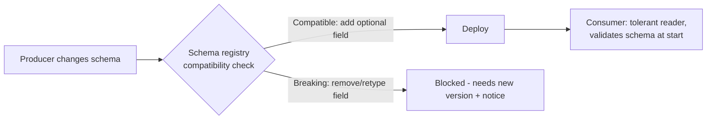

# An Upstream Team Added One Nullable Column and Broke the Pipeline. Who Owns the Failure?

## 1. Story

A production data pipeline fails at 2:17 AM. The code hasn't changed in 3 weeks. It normally processes 120M+ rows without trouble. Logs look clean, CPU and memory are fine.

After hours of debugging: an **upstream team added one nullable column** without telling anyone. The pipeline broke - maybe it used `SELECT *` into a fixed-width target, maybe strict schema validation rejected the unknown field, maybe column positions shifted in a CSV export.

One engineer blames the upstream team for changing the contract. Another blames the pipeline for not handling schema evolution. Both have a point.

## 2. The Honest Answer: Both Own a Part

**The producer owns the contract.** If other teams consume your data, its shape is a public API ([[11-what-is-an-api]]). Changing it without notice is like changing an API's response format without versioning. The producer should publish the schema, classify changes as compatible or breaking, and announce them.

**The consumer owns its own robustness.** Adding an optional (nullable) column is widely considered a **backward-compatible** change. A consumer that crashes on an extra field it doesn't even use is brittle. The consumer should read only the columns it needs, ignore unknown fields, and fail loudly and early (not silently at 2 AM mid-run) when something is truly incompatible.

**The system (both teams) owns the missing guardrail.** The real failure is that nothing checked the change *before* it reached production.

## 3. The Fix: A Data Contract

**Term: Data contract** - an explicit, versioned agreement about the shape and meaning of data between a producer and its consumers: field names, types, nullability, and which changes are allowed.

- **Schema registry + compatibility rules** (e.g. Avro/Protobuf with Confluent Schema Registry): new schema versions are checked against the old ones. Adding an optional field passes; removing or retyping a field is rejected unless it's a new major version.
- **Contract tests in CI**: the producer's pipeline runs the consumers' expectations before deploying a schema change.
- **Schema validation at the boundary**: the consumer validates the incoming schema at the start of a run and alerts immediately, instead of failing halfway through 120M rows.
- **Tolerant reader**: consumers select explicit columns, ignore unknown fields, and handle nulls.
- **Change communication**: an owner, a changelog, and a deprecation period for breaking changes.

## 4. Mental Model

> Data between teams is an API without the API discipline. Treat the schema like a public contract: the producer promises not to break it without warning, the consumer promises not to break over harmless additions, and a machine checks both promises before deploy.

## 5. Flow

## 6. How to Answer in an Interview

"Both, but the more useful answer is that the **system** failed: there was no contract and no automated compatibility check. The producer should treat the schema as a public contract and version breaking changes; the consumer should be a tolerant reader and validate early. Then I'd add a schema registry and contract tests so this class of failure is caught before deploy, not at 2 AM."

That answer avoids blame and fixes the process - which is what senior engineers are expected to do.

## 7. 🧠 Remember

> Schema changes between teams need a data contract: producers version and announce breaking changes, consumers tolerate harmless additions and validate early, and a registry enforces compatibility automatically.

## 8. Quick Self-Test

1. Why is adding a nullable column usually considered backward-compatible, and how could it still break a consumer?
2. What does a schema registry check before allowing a new schema version?
3. Why is "who's to blame" the less useful question in a postmortem?
