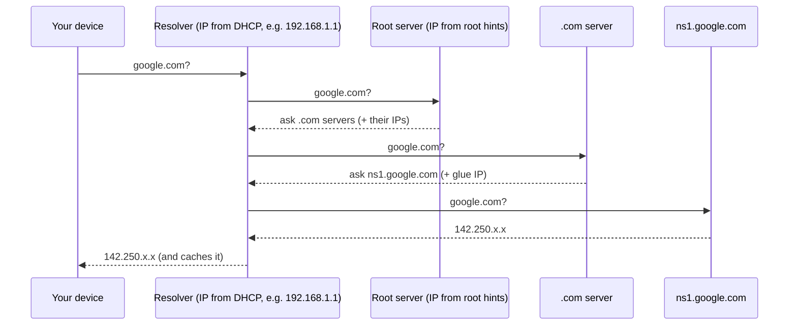

# If DNS Turns Names Into IPs, Who Finds the DNS Server's Address?

## 1. The Puzzle

To visit `google.com`, your computer asks a DNS server "what's the IP of google.com?" But to ask that DNS server anything, you need **its** address. If you needed DNS to find the DNS server, you'd be stuck in a loop forever.

## 2. The Answer: Nobody Translates It - It's Already an IP Address

The loop is broken because **DNS servers are always configured by IP address, never by name**. There are three places this happens:

**1. Your device gets the resolver's IP from the network (DHCP).**
When you join Wi-Fi, the router hands your device an IP, a gateway, **and the IP of a DNS resolver** (often the router itself, e.g. `192.168.1.1`, or your ISP's resolver). You can also set one by hand: `8.8.8.8` (Google), `1.1.1.1` (Cloudflare). On Linux you see it in `/etc/resolv.conf`; on Windows in `ipconfig /all`.

**2. The resolver knows the root servers' IPs from a built-in file.**
Your resolver may not know `google.com`, so it starts at the top: the **13 root server names (a.root-servers.net to m.root-servers.net)**. Their IP addresses ship with the resolver software in a **root hints** file. They almost never change, so hardcoding them works.

**3. Parent zones hand out "glue" IPs for name servers inside their own domain.**
The root says "ask the `.com` servers" and includes their IPs. `.com` says "`google.com` is served by `ns1.google.com`" - but that name is *inside* `google.com`, another loop. So the parent also sends a **glue record**: the IP of `ns1.google.com` directly.

**Term: Glue record** - an IP address the parent zone provides for a name server whose name lives inside the zone it serves, so you can reach it without looking it up first.

## 3. The Full Journey

Every "who do I ask next" step comes with an IP, never just a name.

## 4. Mental Model

> You can't look up the phone number of directory assistance in directory assistance - it's printed on the phone already. DNS works the same way: the resolver's IP comes from your network settings, the root servers' IPs ship with the software, and every referral includes the IP of the next server.

## 5. Why It Matters in Real Life

- **"Internet works but websites don't load"** often means the resolver IP is wrong or unreachable. `ping 8.8.8.8` works but `ping google.com` fails -> it's DNS, not the network ([[08-ec2-no-internet-troubleshooting]]).
- In AWS, the VPC resolver lives at a fixed address (the VPC base +2, e.g. `10.0.0.2`, and `169.254.169.253`), so instances find DNS without any lookup.
- **Caching** at every level (browser, OS, resolver) is why most lookups never reach the root at all.

## 6. 🧠 Remember

> The DNS loop is broken with plain IP addresses: your device learns the resolver's IP from DHCP or manual settings, resolvers ship with the root servers' IPs, and parent zones include glue IPs for name servers inside their own domains.

## 7. Quick Self-Test

1. Where does your laptop get its DNS resolver's IP address from?
2. Why do root server IPs need to be built into resolver software?
3. What problem does a glue record solve?
